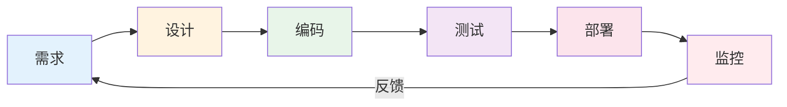
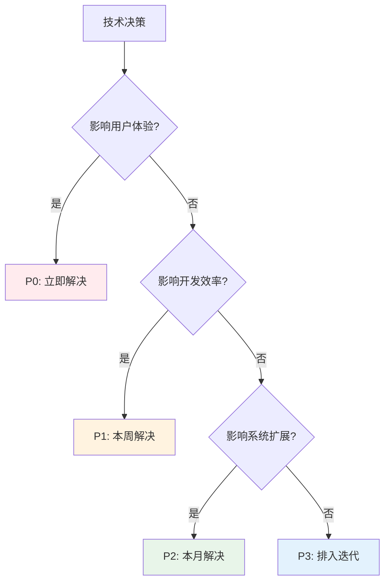
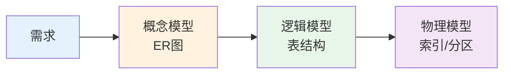
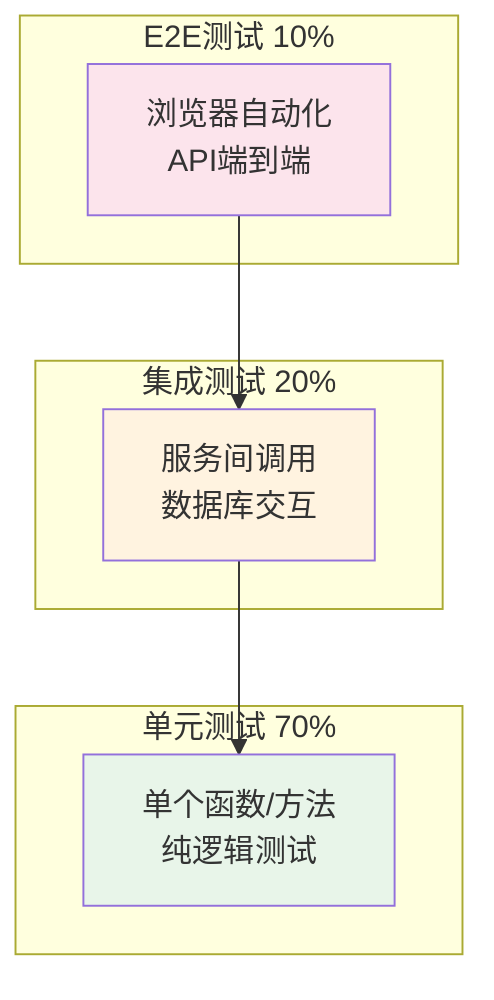
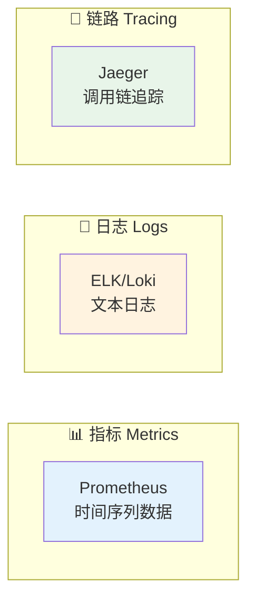

# 03 — 开发全流程方法论

> 核心规律：先设计再编码，测试先行，持续交付
> 一句话：好的流程不是约束，而是质量的保障

---

## 一、核心规律

### 1.1 开发全流程模型



**核心规律：**
- **需求→设计→编码→测试→部署→监控** 是闭环，不是直线
- 每个阶段都有**质量门禁**，不合格不进入下一阶段
- **反馈循环**是关键：监控数据指导下一轮需求

### 1.2 关键思维模型

```
YAGNI（你不需要它）：不要提前实现不需要的功能
KISS（保持简单）：简单的方案往往比复杂的更好
DRY（不要重复）：重复的代码意味着重复的维护成本
AAA（准备→执行→断言）：测试的基本结构
```

---

## 二、需求阶段

### 2.1 需求分析 checklist

```
□ 用户故事是否清晰？（As a ... I want to ... So that ...）
□ 验收标准是否可量化？
□ 边界条件是否明确？（异常/极限/并发）
□ 数据流向是否清楚？（谁产生、谁消费）
□ 接口契约是否对齐？（前后端/服务间）
□ 非功能需求是否明确？（性能/安全/可用性）
```

### 2.2 技术方案决策树



---

## 三、设计阶段

### 3.1 数据库设计原则



**设计检查清单：**
- [ ] 主键是否合理？（自增ID / UUID / 雪花算法）
- [ ] 外键是否需要？（物理外键 vs 应用层约束）
- [ ] 索引是否充分？（查询频繁字段建索引）
- [ ] 冗余是否必要？（反范式设计权衡）
- [ ] 软删除是否实现？（deleted_at字段）

### 3.2 API设计规范

```
RESTful 设计原则：
├── 资源用名词，动作用HTTP方法
├── URL不含动词：GET /users/123（而非 GET /getUser?id=123）
├── 版本控制：/api/v1/users
├── 统一响应格式：{ code, message, data }
└── 分页统一：?page=1&per_page=20
```

---

## 四、编码阶段

### 4.1 编码规范

```
□ 函数/方法不超过50行
□ 参数不超过3个（超过用DTO/对象）
□ 命名见名知意（getUserById而非getById）
□ 单一职责：一个函数只做一件事
□ 提前返回：避免深层嵌套（Guard Clause）
```

### 4.2 Code Review 要点

```
□ 代码是否符合规范？
□ 是否有明显的逻辑错误？
□ 是否有安全隐患？（SQL注入/XSS/越权）
□ 是否有性能问题？（N+1/大事务）
□ 是否有更好的实现方式？
□ 注释是否清晰？（解释为什么，而非是什么）
```

---

## 五、测试阶段

### 5.1 测试金字塔



**核心规律：单元测试越多越好，E2E测试越少越好（贵且慢）**

### 5.2 测试编写原则（AAA）

```
Arrange（准备）→ Act（执行）→ Assert（断言）

test('can create user', function () {
    // Arrange
    $data = ['name' => '张三', 'email' => 'zhangsan@test.com'];
    
    // Act
    $user = User::create($data);
    
    // Assert
    expect($user->name)->toBe('张三');
    expect($user->email)->toBe('zhangsan@test.com');
});
```

---

## 六、部署与监控

### 6.1 部署策略对比

| 策略 | 优点 | 缺点 | 适用场景 |
|------|------|------|---------|
| **直接部署** | 简单 | 有风险 | 内部工具 |
| **蓝绿部署** | 回滚快 | 资源翻倍 | 重要服务 |
| **滚动更新** | 资源省 | 有过渡期 | 大多数场景 |
| **灰度发布** | 风险最低 | 复杂 | 核心业务 |

### 6.2 监控三支柱



> **核心规律：可观测性 = 指标 + 日志 + 链路追踪。三者缺一不可。**

---

## 七、本章总结

> **核心规律：先设计再编码，测试先行，持续交付。流程不是束缚，而是质量的保障。**

### 关键记忆点
- ✅ 需求→设计→编码→测试→部署→监控是闭环
- ✅ 测试金字塔：70%单元 + 20%集成 + 10%E2E
- ✅ YAGNI原则：不要提前实现不需要的功能
- ✅ 监控三支柱：指标 + 日志 + 链路追踪

---

## 延伸阅读

- [01 HTTP与网络基础](./01-HTTP与网络基础.md) — 理解HTTP请求在流程中的位置
- [07 代码规范与风格](./07-代码规范与风格.md) — 编码阶段的具体规范
