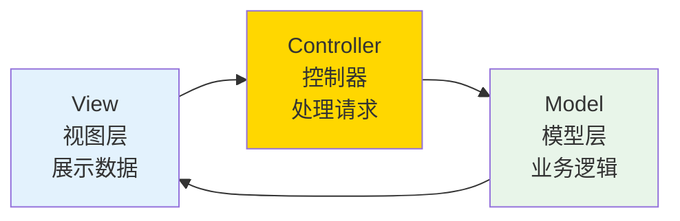
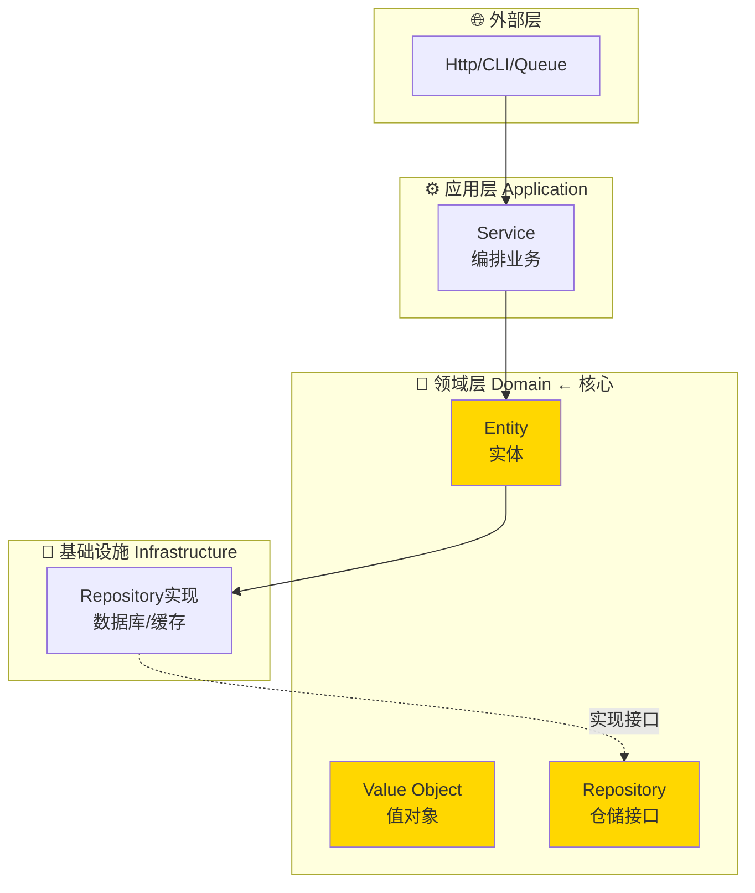
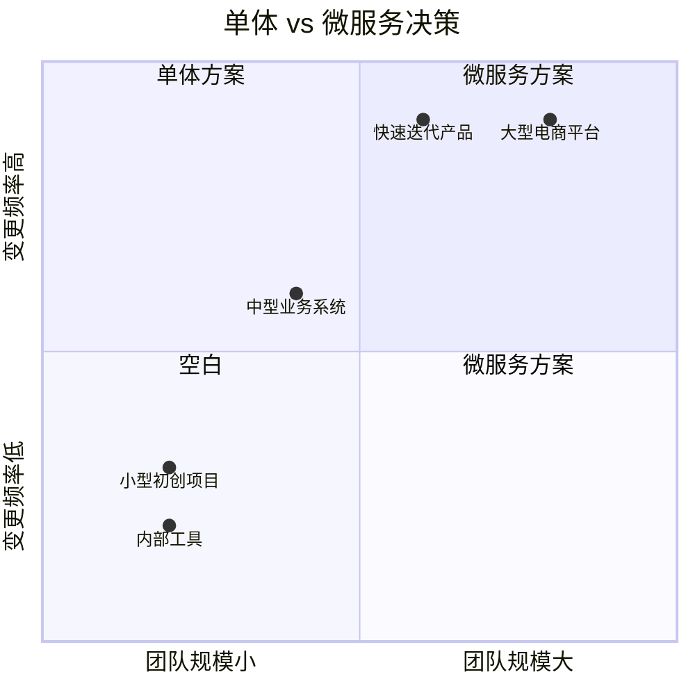

# 05 — 架构设计原则

> 核心规律：高内聚低耦合，关注点分离
> 一句话：好的架构让变更容易，坏的架构让变更痛苦

---

## 一、核心规律

### 1.1 架构演进路径


**核心规律：架构演进是复杂度的转移，不是消除。单体→微服务，复杂度从代码转移到基础设施。**

### 1.2 架构决策四原则

```
1. 业务驱动架构：架构服务于业务，不是反过来
2. 演进式设计：先做对的，再做对的事
3. 简单优于复杂：能用单体的别上微服务
4. 可-evolve：架构要能随业务演进
```

---

## 二、经典架构模式

### 2.1 MVC模式



| 层级 | 职责 | 不应做的事 |
|------|------|-----------|
| **Model** | 数据+业务规则 | 不含HTTP逻辑 |
| **View** | 展示数据 | 不含业务逻辑 |
| **Controller** | 请求路由+参数验证 | 不含业务逻辑 |

### 2.2 DDD领域驱动设计



**DDD核心规律：领域层不依赖任何外部层，外部层依赖领域层。**

### 2.3 分层架构

```
表现层（Controller）→ 业务层（Service）→ 领域层（Domain）→ 基础设施层（Repository）
     ↑                      ↑                  ↑                    ↑
   HTTP请求               业务编排            业务规则            数据持久化
```

---

## 三、架构设计原则（SOLID）

### 3.1 五大原则

| 原则 | 英文 | 一句话 | 反例 |
|------|------|--------|------|
| **单一职责** | SRP | 一个类只做一件事 |  UserController含业务逻辑 |
| **开闭原则** | OCP | 对扩展开放，对修改关闭 | 新增支付方式要改Order类 |
| **里氏替换** | LSP | 子类可替换父类 | 子类破坏了父类契约 |
| **接口隔离** | ISP | 接口要小而专 | 大接口强制实现不用的方法 |
| **依赖倒置** | DIP | 依赖抽象不依赖具体 | Controller直接new Service |

### 3.2 代码示例

```php
// ❌ 违反SRP：一个类做太多事
class OrderService {
    public function create(array $data) { /* 业务逻辑 */ }
    public function sendEmail() { /* 发邮件 */ }      // 不应在这里
    public function calculateTax() { /* 算税 */ }      // 不应在这里
}

// ✅ 符合SRP：职责分离
class OrderService {
    public function create(array $data): Order { /* 仅业务逻辑 */ }
}

class OrderEmailNotifier {
    public function notify(Order $order): void { /* 仅发邮件 */ }
}

class TaxCalculator {
    public function calculate(Order $order): float { /* 仅算税 */ }
}
```

---

## 四、单体 vs 微服务

### 4.1 决策矩阵



### 4.2 微服务拆分边界

```
拆分原则：
├── 业务边界：按领域拆分（订单/用户/商品）
├── 数据边界：每个服务拥有自己的数据库
├── 团队边界：康威定律，组织结构与系统结构一致
└── 部署边界：可独立部署，独立扩缩容
```

---

## 五、本章总结

> **核心规律：架构的本质是管理复杂度。好的架构让新增功能容易，坏的架构让变更痛苦。没有银弹，只有权衡。**

### 关键记忆点
- ✅ 高内聚低耦合是架构的核心目标
- ✅ DDD让领域逻辑与基础设施解耦
- ✅ SOLID是代码质量的五大准则
- ✅ 单体先于微服务，演进而非跳跃

---

## 延伸阅读

- [06 面向对象与设计模式](./04-oop-design-patterns.md) — 设计模式是架构的实现手段
- [14 后端工程化](./09-backend-engineering.md) — Laravel中的DDD实践
