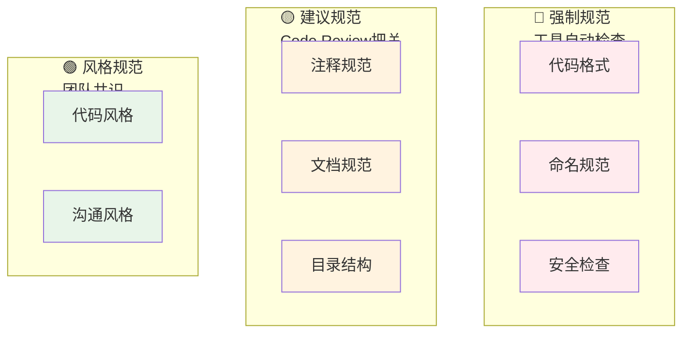

# 07 — 代码规范与风格

> 核心规律：规范的价值在于一致而非对错
> 一句话：统一的规范让团队协作成本降低50%以上

---

## 一、核心规律

### 1.1 规范三原则

```
1. 一致性 > 正确性：团队内统一比个人偏好更重要
2. 自动化 > 人工检查：能自动化的不要依赖人工
3. 简洁性 > 完备性：简单的规范更容易遵守
```

### 1.2 规范分层



---

## 二、PHP规范（PSR）

### 2.1 PSR-12 核心要点

```php
<?php

declare(strict_types=1);  // 必须声明严格类型

namespace AppDomainsCatalog;  // 命名空间一行一个

use AppDomainsCatalogModelsProduct;  // use一行一个

class ProductService
{
    private readonly ProductRepository $repository;

    public function __construct(ProductRepository $repository)
    {
        $this->repository = $repository;
    }

    public function findById(int $id): ?Product
    {
        if ($id <= 0) {
            return null;
        }

        return $this->repository->find($id);
    }
}
```

| 规范 | 要点 |
|------|------|
| **缩进** | 4空格，不用Tab |
| **行长度** | 最多120字符 |
| **花括号** | 左花括号在新行（类/方法） |
| **控制结构** | 关键字后空格，花括号新行 |
| **命名** | 类PascalCase，方法/变量camelCase |

### 2.2 自动化工具

```bash
# Laravel Pint（推荐）
./vendor/bin/pint          # 格式化
./vendor/bin/pint --test   # 检查不修改

# PHPStan（静态分析）
./vendor/bin/phpstan analyse

# PHPMD（代码异味检测）
vendor/bin/phpmd app/text xml codesize,controversial,design,naming,unusedcode
```

---

## 三、JavaScript/TypeScript规范

### 3.1 ESLint + Prettier

```json
// .eslintrc.js
module.exports = {
    extends: ['eslint:recommended', 'plugin:vue/recommended'],
    rules: {
        'no-console': process.env.NODE_ENV === 'production' ? 'warn' : 'off',
        'no-debugger': process.env.NODE_ENV === 'production' ? 'warn' : 'off',
    },
};

// .prettierrc
{
    "semi": false,
    "singleQuote": true,
    "tabWidth": 2,
    "trailingComma": "es5"
}
```

### 3.2 命名规范

```javascript
// ✅ 正确
const userName = '张三';           // camelCase
const isActive = true;             // 布尔加is/has/can前缀
const userList = [];               // 集合加List后缀
function getUserById(id) {}        // 动词开头

// ❌ 错误
const user_name = '张三';          // snake_case
const flag = true;                 // flag太模糊
const list = ['张三'];             // 缺少类型暗示
```

---

## 四、Git提交规范

### 4.1 Commit Message格式

```
<type>(<scope>): <subject>

type类型：
  feat:     新功能
  fix:      修复bug
  docs:     文档更新
  style:    代码格式（不影响逻辑）
  refactor: 重构
  test:     测试相关
  chore:    构建/工具相关

示例：
  feat(auth): 添加OAuth2登录支持
  fix(order): 修复库存扣减并发问题
  refactor(cart): 重构购物车Service层
```

### 4.2 Branch命名

```
feature/新功能名称      # 新功能开发
fix/问题描述           # Bug修复
refactor/重构内容      # 代码重构
docs/文档内容          # 文档更新
hotfix/紧急修复        # 线上紧急修复
```

---

## 五、注释规范

### 5.1 原则

```
✅ 写什么：
   - 为什么（Why），而非做什么（What）
   - 复杂逻辑的设计理由
   - 不可显而易见的决策

❌ 不写什么：
   - 显而易见的重复代码
   - 已过时的注释
   - 每行都注释（过度注释）
```

### 5.2 PHPDoc标准

```php
/**
 * 计算订单总金额
 *
 * @param  array  $items  订单项列表
 * @param  float  $taxRate 税率（0-1之间）
 * @return float 总金额（含税费）
 * @throws InvalidPriceException 当价格为负数时
 */
function calculateTotal(array $items, float $taxRate = 0.0): float
{
    // ...
}
```

---

## 六、文档规范

### 6.1 README结构

```markdown
# 项目名称

## 简介
简短描述（2-3句话）

## 技术栈
- PHP 8.2 + Laravel 11
- MySQL 8.0 + Redis 7

## 快速开始
\`\`\`bash
git clone <repo>
composer install
php artisan migrate --seed
\`\`\`

## API文档
[链接]

## 贡献指南
[链接]
```

### 6.2 API文档规范（OpenAPI）

```yaml
openapi: 3.0.3
info:
  title: 用户管理 API
  version: 1.0.0
paths:
  /api/users:
    get:
      summary: 获取用户列表
      parameters:
        - name: page
          in: query
          schema:
            type: integer
            default: 1
      responses:
        '200':
          description: 成功
```

---

## 七、本章总结

> **核心规律：规范的价值在于一致而非对错。统一规范 + 自动化工具 enforcement = 高质量代码库。**

### 关键记忆点
- ✅ PSR-12是PHP编码标准的基础
- ✅ 用工具（Pint/ESLint） enforcement规范
- ✅ 注释解释为什么，不解释是什么
- ✅ Git提交信息要清晰可追溯

---

## 延伸阅读

- [05 架构设计原则](./03-architecture-design-principles.md) — 架构层面的规范
