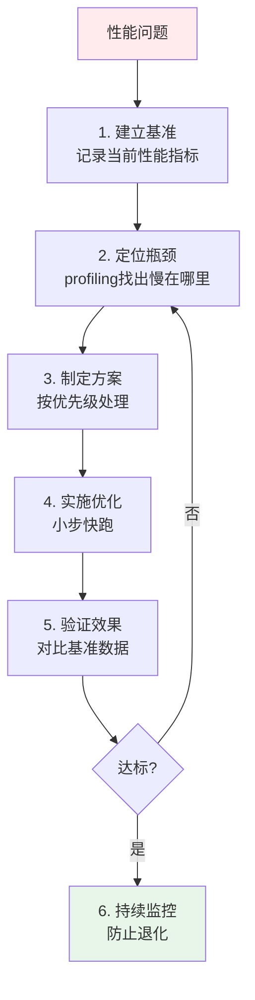
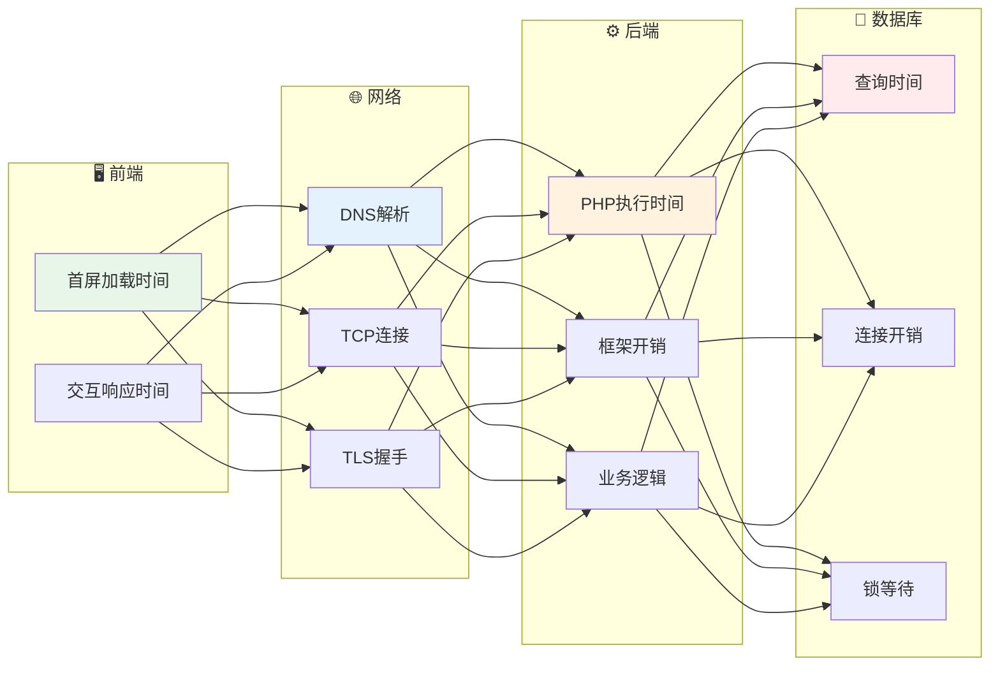

# 08 — 性能优化方法论

> 核心规律：先测量再优化，用数据说话
> 一句话：优化是持续的过程，不是单次任务

---

## 一、核心规律

### 1.1 优化决策树



### 1.2 优化三原则

```
1. 先测量，再优化 — 不要凭感觉
2. 一次只优化一个变量 — 便于定位效果
3. 优化是持续过程 — 没有终点
```

---

## 二、性能瓶颈定位

### 2.1 分层排查法



### 2.2 常用 profiling 工具

| 层级 | 工具 | 用途 |
|------|------|------|
| **PHP** | Blackfire / Xdebug | 函数级性能分析 |
| **PHP** | opcache_get_status() | OPcache状态 |
| **MySQL** | EXPLAIN / mysqldumpslow | 慢查询分析 |
| **Redis** | redis-cli --stat | 实时监控 |
| **系统** | top / htop / iostat | 资源监控 |
| **全链路** | Laravel Telescope | 请求级追踪 |

---

## 三、前端性能优化

### 3.1 关键指标

| 指标 | 含义 | 健康值 |
|------|------|--------|
| **FCP** | 首次内容绘制 | < 1.8s |
| **LCP** | 最大内容绘制 | < 2.5s |
| **FID** | 首次输入延迟 | < 100ms |
| **CLS** | 累积布局偏移 | < 0.1 |

### 3.2 优化手段

```
加载优化：
├── 代码分割（Route-level lazy loading）
├── Tree Shaking（移除未使用代码）
├── 图片优化（WebP + 懒加载）
└── CDN加速静态资源

渲染优化：
├── 减少Reflow/Repaint
├── 虚拟列表（长列表）
├── Web Worker（耗时计算）
└── requestAnimationFrame（动画）
```

---

## 四、后端性能优化

### 4.1 PHP优化

| 优化点 | 方法 | 效果 |
|--------|------|------|
| **OPcache** | 启用OPcache | JIT编译，字节码缓存 |
| **PHP-FPM** | 调优进程数 | 并发能力提升 |
| **代码** | 避免N+1查询 | 查询次数减少90% |
| **缓存** | Redis缓存热点数据 | DB压力降低80% |

### 4.2 数据库优化

```
查询优化 Checklist：
□ EXPLAIN分析执行计划
□ 避免SELECT *，指定字段
□ 合理使用索引（最左前缀）
□ 避免在索引列上用函数
□ 大结果集分页用游标替代OFFSET
□ 批量操作用chunk()分批处理
```

---

## 五、缓存优化

### 5.1 缓存层次

```
L1: CPU缓存（纳秒级）
L2: Redis/内存缓存（微秒级）← 应用层主要使用
L3: 本地缓存APCu（毫秒级）
L4: 数据库（毫秒级）
L5: 磁盘/对象存储（秒级）
```

### 5.2 缓存策略

| 策略 | 适用场景 | 风险 |
|------|----------|------|
| **Cache-Aside** | 读多写少 | 首次查询穿透 |
| **Write-Through** | 强一致性要求 | 写入性能较低 |
| **Write-Behind** | 高写入吞吐 | 数据可能丢失 |
| **Refresh-Ahead** | 热点数据 | 需要提前预热 |

---

## 六、本章总结

> **核心规律：性能优化是持续的过程。建立「监控→分析→优化→验证」的闭环，用数据驱动决策。**

### 关键记忆点
- ✅ 先测量再优化，不要凭感觉
- ✅ 瓶颈可能在任何一层，逐层排查
- ✅ 缓存是最有效的优化手段之一
- ✅ 监控是防止退化的关键

---

## 延伸阅读

- [10 缓存系统设计](../../data-fundamentals/02-cache-system-design.md) — 缓存深入
- [09 数据库设计](../../data-fundamentals/01-database-design.md) — 数据库优化深入
