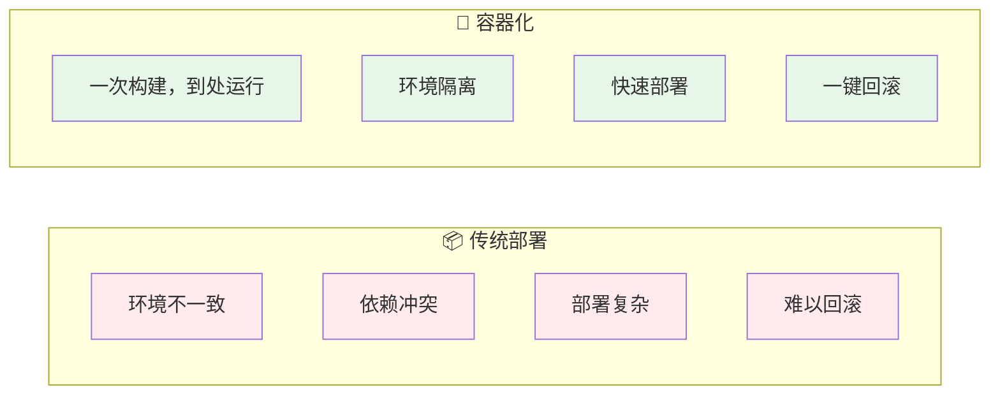
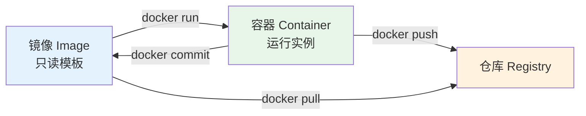
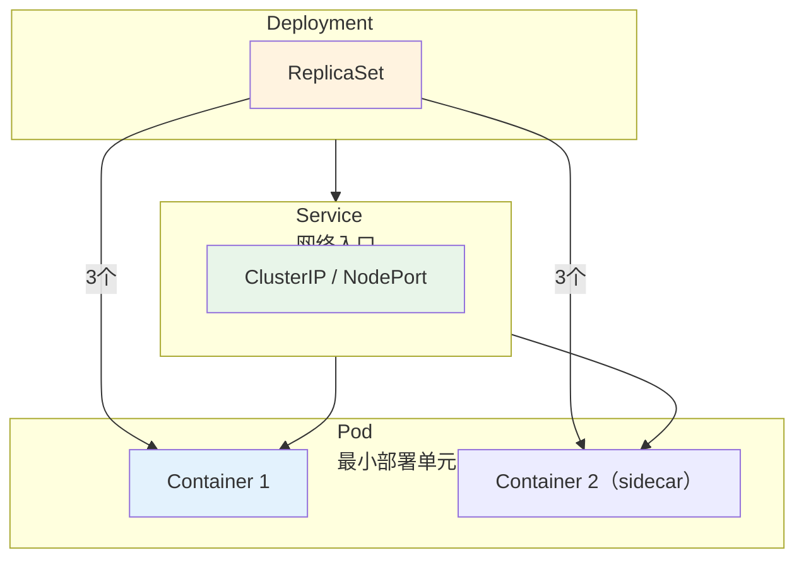
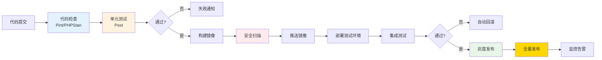

# 12 — 容器化与CI/CD

> 核心规律：自动化消除人为错误，可重复即可靠
> 一句话：不能重复部署的系统，就不是生产系统

---

## 一、核心规律

### 1.1 容器化价值



### 1.2 CI/CD核心价值

```
CI（持续集成）：
├── 自动构建 + 自动测试
├── 快速发现缺陷
└── 提高代码质量

CD（持续部署）：
├── 自动化部署流程
├── 减少人为错误
└── 快速交付价值
```

---

## 二、Docker核心

### 2.1 核心概念



### 2.2 Dockerfile最佳实践

```dockerfile
# 使用官方基础镜像
FROM php:8.2-fpm-alpine

# 合并RUN指令，减少层数
RUN apt-get update && apt-get install -y \
    libpng-dev \
    libjpeg-dev \
    && docker-php-ext-configure gd --with-jpeg \
    && docker-php-ext-install gd pdo_mysql

# 复制依赖文件，利用缓存
COPY composer.* /app/
RUN composer install --no-dev --optimize-autoloader

# 复制应用代码
COPY . /app
RUN chown -R www-data:www-data /app/storage

EXPOSE 9000
CMD ["php-fpm"]
```

### 2.3 Docker Compose

```yaml
version: '3.8'
services:
  app:
    build: .
    volumes:
      - .:/app
    depends_on:
      - mysql
      - redis
    environment:
      - DB_HOST=mysql
      - REDIS_HOST=redis

  mysql:
    image: mysql:8.0
    volumes:
      - mysql_data:/var/lib/mysql
    environment:
      MYSQL_ROOT_PASSWORD: secret

  redis:
    image: redis:7-alpine

volumes:
  mysql_data:
```

---

## 三、Kubernetes核心

### 3.1 核心概念



### 3.2 常用资源对象

| 资源 | 用途 | 示例 |
|------|------|------|
| **Pod** | 最小运行单元 | 单个容器 |
| **Deployment** | 无状态服务部署 | Web应用 |
| **StatefulSet** | 有状态服务部署 | MySQL集群 |
| **Service** | 网络暴露 | ClusterIP/NodePort |
| **Ingress** | 七层路由 | 域名→Service |
| **HPA** | 自动扩缩容 | CPU>80%扩容 |

---

## 四、CI/CD流水线设计

### 4.1 标准流水线



### 4.2 GitHub Actions示例

```yaml
name: CI/CD
on: [push, pull_request]

jobs:
  test:
    runs-on: ubuntu-latest
    steps:
      - uses: actions/checkout@v4
      - run: composer install --no-dev
      - run: ./vendor/bin/pint --test
      - run: ./vendor/bin/phpstan analyse
      - run: ./vendor/bin/pest --compact

  deploy:
    needs: test
    if: github.ref == 'refs/heads/main'
    runs-on: ubuntu-latest
    steps:
      - name: Deploy to K8s
        run: kubectl rollout restart deployment/app
```

---

## 五、部署策略

### 5.1 策略对比

| 策略 | 优点 | 缺点 | 适用场景 |
|------|------|------|---------|
| **直接部署** | 简单 | 有风险 | 内部工具 |
| **蓝绿部署** | 回滚快 | 资源翻倍 | 重要服务 |
| **滚动更新** | 资源省 | 过渡期不稳定 | 大多数场景 |
| **灰度发布** | 风险最低 | 复杂 | 核心业务 |

### 5.2 回滚策略

```
回滚原则：
├── 每次部署前打标签（git tag + docker tag）
├── 保留最近3个版本镜像
├── 自动化回滚脚本
└── 回滚时间 < 5分钟
```

---

## 六、本章总结

> **核心规律：自动化是DevOps的核心。凡是重复三次以上的操作，都应该自动化。可重复的部署才是可靠的部署。**

### 关键记忆点
- ✅ Docker = 标准化交付单元，解决环境一致性问题
- ✅ K8s = 容器编排平台，解决规模化部署问题
- ✅ CI/CD = 自动化流水线，解决人工错误问题
- ✅ 灰度发布 = 风险控制最佳实践

---

## 延伸阅读

- [devops/01~11](./devops/) — 现有DevOps专题内容
- [08 性能优化方法论](./08-性能优化方法论.md) — 性能监控与优化
