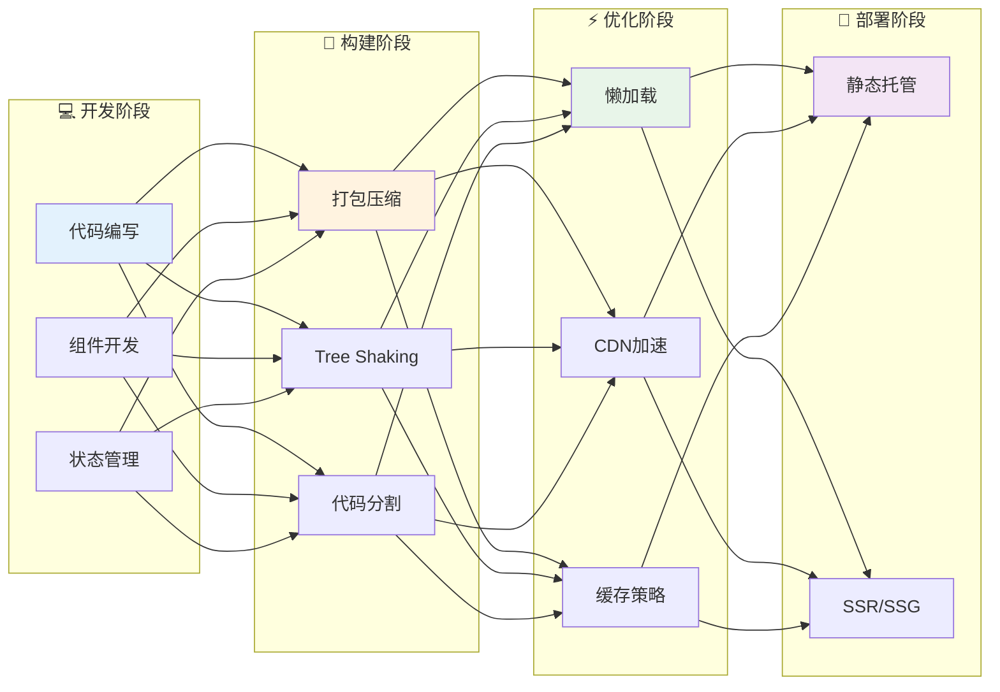
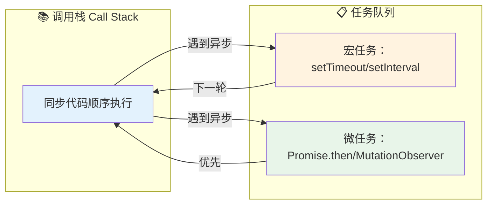
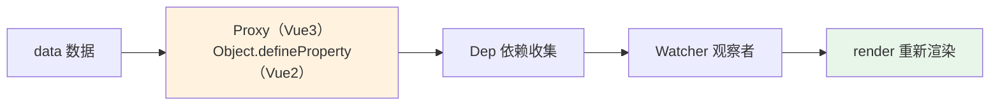
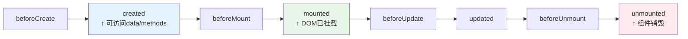

# 13 — 前端工程化

> 核心规律：组件化复用，构建优化加载
> 一句话：前端工程化是让复杂变简单的系统方法

---

## 一、核心规律

### 1.1 前端工程化全景



### 1.2 关键指标

| 指标 | 含义 | 健康值 |
|------|------|--------|
| **FCP** | 首次内容绘制 | < 1.8s |
| **LCP** | 最大内容绘制 | < 2.5s |
| **FID** | 首次输入延迟 | < 100ms |
| **CLS** | 累积布局偏移 | < 0.1 |
| **TTI** | 可交互时间 | < 3.8s |

---

## 二、JavaScript核心

### 2.1 执行机制



### 2.2 闭包与原型链

```javascript
// 闭包：函数记住并访问其作用域
function createCounter() {
    let count = 0;
    return {
        increment: () => ++count,
        getCount: () => count,
    };
}

// 原型链：对象继承
class Animal {
    speak() { return '...'; }
}
class Dog extends Animal {
    speak() { return '汪！'; }
}
```

---

## 三、CSS核心

### 3.1 盒模型

```
标准盒模型（W3C）：width = content
IE盒模型（怪异）：width = content + padding + border

box-sizing: content-box  ← 标准
box-sizing: border-box   ← 推荐（元素总宽不变）
```

### 3.2 布局方案

| 方案 | 适用场景 | 特点 |
|------|----------|------|
| **Flexbox** | 一维布局（行/列） | 弹性、对齐方便 |
| **Grid** | 二维布局（行+列） | 复杂网格布局 |
| **Float** | 旧项目兼容 | 浮动清除麻烦 |
| **Position** | 定位元素 | absolute/fixed/sticky |

---

## 四、Vue.js核心

### 4.1 响应式原理



### 4.2 生命周期



---

## 五、前端性能优化

### 5.1 加载优化

```
□ 代码分割（Route-level lazy loading）
□ Tree Shaking（移除未使用代码）
□ 图片优化（WebP + 懒加载 + 响应式）
□ CDN加速静态资源
□ HTTP/2多路复用
```

### 5.2 渲染优化

```
□ 减少Reflow/Repaint（批量DOM操作）
□ 虚拟列表（长列表只渲染可见区域）
□ Web Worker（耗时计算移出主线程）
□ requestAnimationFrame（动画帧同步）
```

---

## 六、前后端协作

### 6.1 API设计规范

```
RESTful设计原则：
├── 资源用名词，动作用HTTP方法
├── URL不含动词：GET /users/123
├── 版本控制：/api/v1/users
├── 统一响应格式：{ code, message, data }
└── 分页统一：?page=1&per_page=20
```

### 6.2 跨域解决方案

| 方案 | 实现 | 适用场景 |
|------|------|---------|
| **CORS** | 后端设置响应头 | 生产环境 |
| **反向代理** | Nginx proxy_pass | 开发环境 |
| **JSONP** | 仅GET请求 | 旧浏览器兼容 |

---

## 七、本章总结

> **核心规律：前端工程化的本质是将复杂性问题转化为可管理的模块。组件化解决复用，构建解决性能，工程化解决协作。**

### 关键记忆点
- ✅ JavaScript异步机制：调用栈→微任务→宏任务
- ✅ Vue3响应式基于Proxy，Vue2基于Object.defineProperty
- ✅ 性能优化：代码分割 + 懒加载 + CDN + 缓存
- ✅ 前后端协作：API契约先行，Mock数据并行开发

---

## 延伸阅读

- [frontend/01~10](./frontend/) — 现有前端专题内容
- [08 性能优化方法论](./08-性能优化方法论.md) — 性能优化深入
