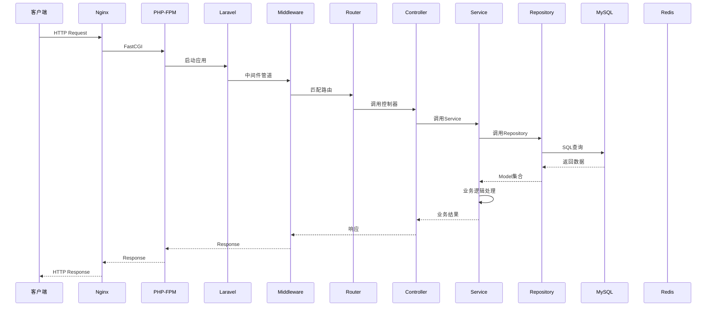
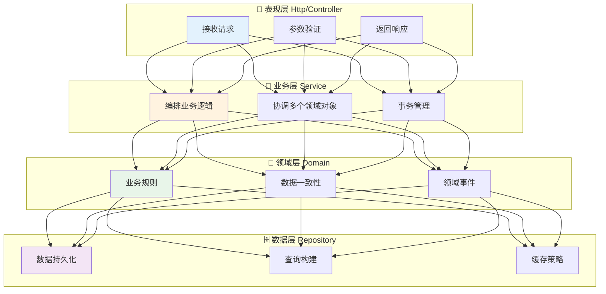
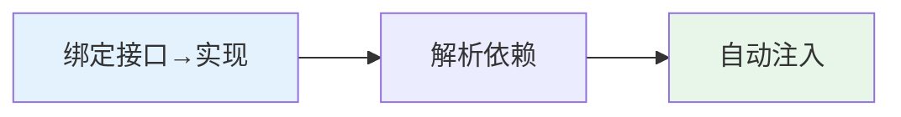

# 14 — 后端工程化

> 核心规律：Service层封装业务，Repository层封装数据
> 一句话：好的后端架构让业务逻辑清晰可测，让数据访问统一可控

---

## 一、核心规律

### 1.1 请求完整链路



### 1.2 分层职责



---

## 二、Laravel架构深入

### 2.1 服务容器



```php
// 绑定
$app->bind(OrderInterface::class, OrdersEloquentRepository::class);

// 解析（自动注入依赖）
$orderRepository = $app->make(OrderInterface::class);

// 单例
$app->singleton(CacheRepository::class);
```

### 2.2 中间件管道

```
请求进入 → [Auth] → [RateLimit] → [Log] → Controller → [Log] → [Cache] → 响应返回
              ↑                                      ↓
           请求前处理                              响应后处理
```

### 2.3 Eloquent ORM

```php
// 查询作用域
class Product extends Model {
    public function scopeActive($query) {
        return $query->where('is_active', true);
    }
}

Product::active()->wherePrice('<', 100)->get();

// 预加载（避免N+1）
$orders = Order::with('items.product')->get();

// 批量操作
Product::chunk(100, function($products) {
    foreach ($products as $product) {
        $product->update(['status' => 'archived']);
    }
});
```

---

## 三、代码组织规范

### 3.1 目录结构

```
app/
├── Domains/              # 业务域
│   └── Catalog/
│       ├── Models/       # 实体
│       ├── Services/     # 业务逻辑
│       ├── Repositories/ # 数据访问
│       └── Events/       # 领域事件
├── Http/
│   ├── Controllers/      # 控制器（薄层）
│   ├── Middleware/       # 中间件
│   └── Requests/         # 请求验证
├── Services/             # 共享服务
└── Policies/             # 授权策略
```

### 3.2 命名规范

```php
// ✅ 正确
class UserService          # PascalCase
class CreateUserRequest    # 动词+名词
class UserCreatedEvent     # 过去分词表示已发生
function getUserById()     # 动词开头
$isActive = true           # 布尔加is前缀

// ❌ 错误
class user_service         # snake_case
class Handle               # 太泛
class Order                # 应该是DomainObject
function handle($id)       # 动词模糊
```

---

## 四、常见反模式

### 4.1 贫血模型

```php
// ❌ 坏示例：Model只有数据，没有行为
class Order {
    public $status;
    public $total;
}

class OrderService {
    public function cancel(Order $order) {
        $order->status = 'cancelled';
        $order->save();
    }
}

// ✅ 好示例：Model包含业务行为
class Order {
    public function cancel(): void {
        if ($this->status !== 'paid') {
            throw new InvalidOrderStateException();
        }
        $this->status = 'cancelled';
        $this->save();
    }
}
```

### 4.2 God Controller

```php
// ❌ 坏示例：Controller包含所有逻辑
class OrderController {
    public function store(Request $request) {
        // 验证...
        // 业务逻辑...
        // 发送邮件...
        // 更新库存...
        // 返回响应...
    }
}

// ✅ 好示例：Controller只负责请求响应
class OrderController {
    public function store(CreateOrderRequest $request, OrderService $service) {
        $order = $service->create($request->validated());
        return response()->json($order, 201);
    }
}
```

---

## 五、本章总结

> **核心规律：后端工程化的核心是分层解耦。每层只关心自己的职责，通过接口与上下游通信。**

### 关键记忆点
- ✅ HTTP请求链路：Nginx→PHP-FPM→Laravel→Middleware→Router→Controller→Service→Repository→DB
- ✅ Service层封装业务逻辑，Repository层封装数据访问
- ✅ 避免贫血模型和God Controller
- ✅ 依赖注入让代码可测试

---

## 延伸阅读
- [05 架构设计原则](./03-architecture-design-principles.md) — 架构层面指导
