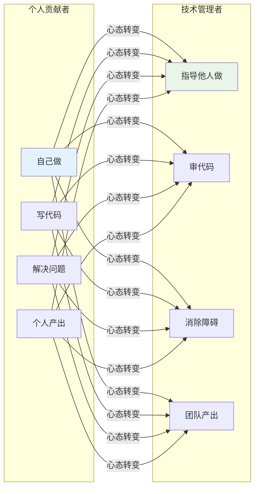
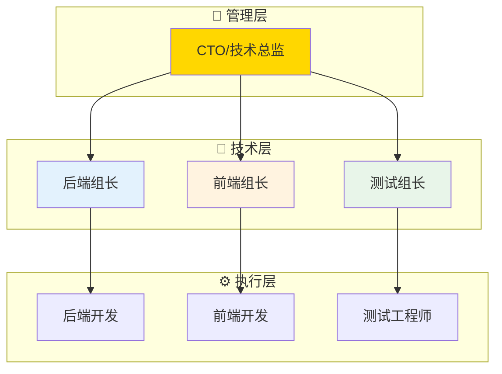
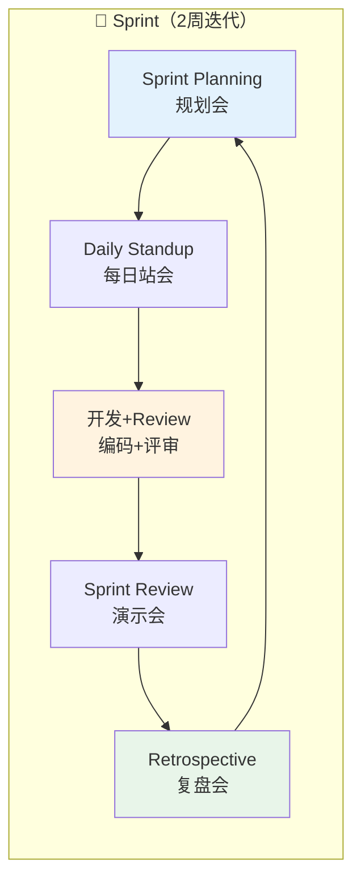
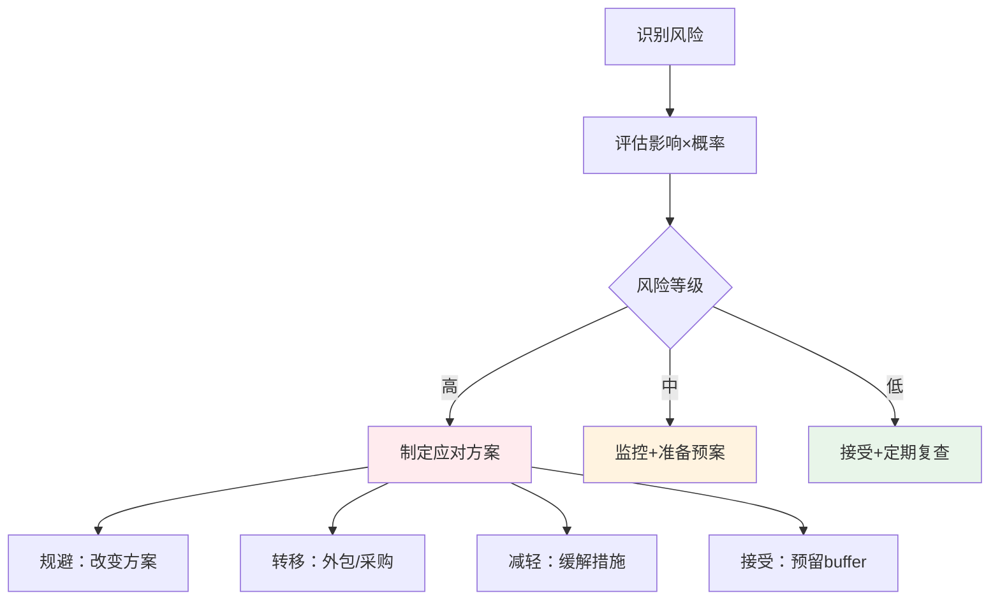
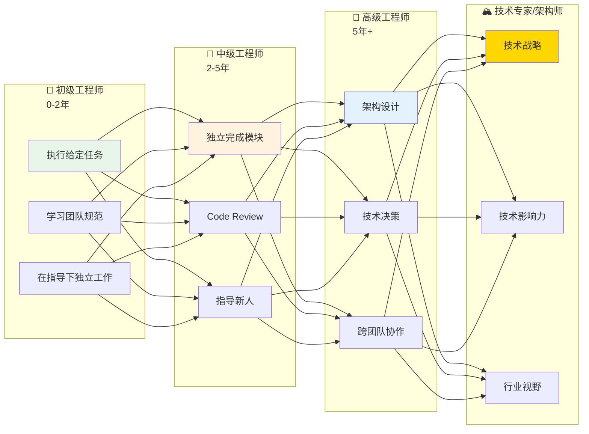

# 19 — 技术团队管理

> 核心规律：管理是通过他人拿结果，不是自己做更多
> 一句话：优秀的技术管理者不是最强的coder，而是最能激发团队潜能的leader

---

## 一、核心规律

### 1.1 角色转变



**核心规律：从"个人贡献"到"通过他人拿结果"，是技术管理者最大的心路历程。**

### 1.2 管理者三大职责

```
1. 定方向 — 技术规划、架构决策、目标拆解
2. 带队伍 — 招聘选拔、培养成长、激励留存
3. 拿结果 — 项目管理、交付质量、复盘改进
```

---

## 二、团队结构设计

### 2.1 常见结构



### 2.2 关键管理动作

| 动作 | 频率 | 目的 |
|------|------|------|
| **1on1面谈** | 每周 | 了解状态、解决困惑 |
| **团队例会** | 每周 | 同步进度、对齐目标 |
| **代码审查** | 持续 | 保证质量、知识传递 |
| **技术评审** | 按需 | 把控架构方向 |
| **绩效评估** | 季度 | 客观评价、制定计划 |

---

## 三、项目管理

### 3.1 敏捷开发流程



### 3.2 任务估算方法

| 方法 | 适用场景 | 优点 | 缺点 |
|------|----------|------|------|
| **故事点** | 敏捷团队 | 相对估算，不受绝对时间限制 | 需要历史数据校准 |
| **T-shirt尺码** | 粗略估算 | 快速，适合早期规划 | 不够精确 |
| **三点估算** | 不确定任务 | 考虑乐观/悲观/最可能 | 需要经验判断 |

### 3.3 风险管理



---

## 四、团队建设

### 4.1 人才成长路径



### 4.2 绩效评估维度

| 维度 | 权重 | 评估标准 |
|------|:----:|----------|
| **业务能力** | 40% | 代码质量、交付准时率、Bug率 |
| **技术深度** | 25% | 技术选型、性能优化、创新方案 |
| **协作能力** | 20% | Code Review质量、知识分享、mentoring |
| **成长潜力** | 15% | 学习能力、主动性、自我驱动 |

---

## 五、沟通与协作

### 5.1 高效会议原则

```
会议黄金法则：
├── 有议程：提前发出会议议程
├── 有时间：控制在30分钟内
├── 有结论：明确行动项和负责人
├── 有记录：会议纪要当天发出
└── 能异步：文字胜过会议
```

### 5.2 反馈模型（SBI）

```
Situation（情境）→ Behavior（行为）→ Impact（影响）

示例：
"在昨天的代码审查中（情境），
你指出了我忽略了边界条件（行为），
这让我意识到了问题，避免了线上故障（影响）。"
```

---

## 六、本章总结

> **核心规律：技术管理的本质是「通过他人拿结果」。优秀的技术管理者不是最强的coder，而是最能激发团队潜能的leader。**

### 关键记忆点
- ✅ 从"自己做"到"指导他人做"是最大转变
- ✅ 管理三大职责：定方向、带队伍、拿结果
- ✅ 敏捷开发：规划→开发→评审→复盘循环
- ✅ 反馈用SBI模型：情境→行为→影响

---

## 延伸阅读

- [leader/01~08](./leader/) — 现有团队管理专题内容
- [20 持续学习与成长](./20-持续学习与成长.md) — 个人成长
- [05 架构设计原则](./05-架构设计原则.md) — 技术决策能力
