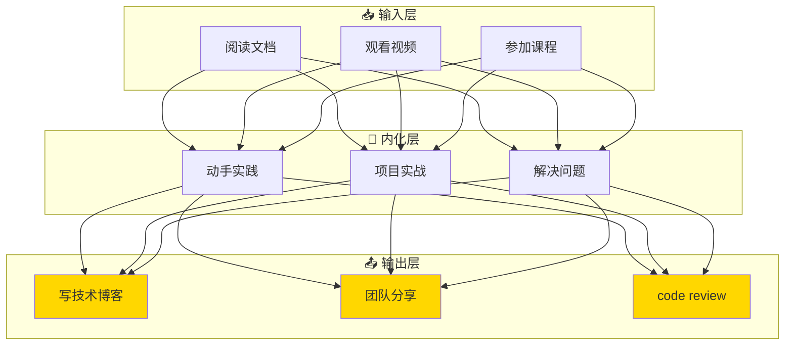
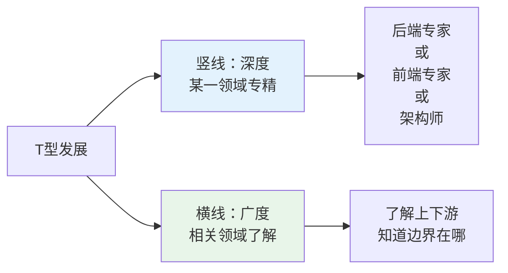
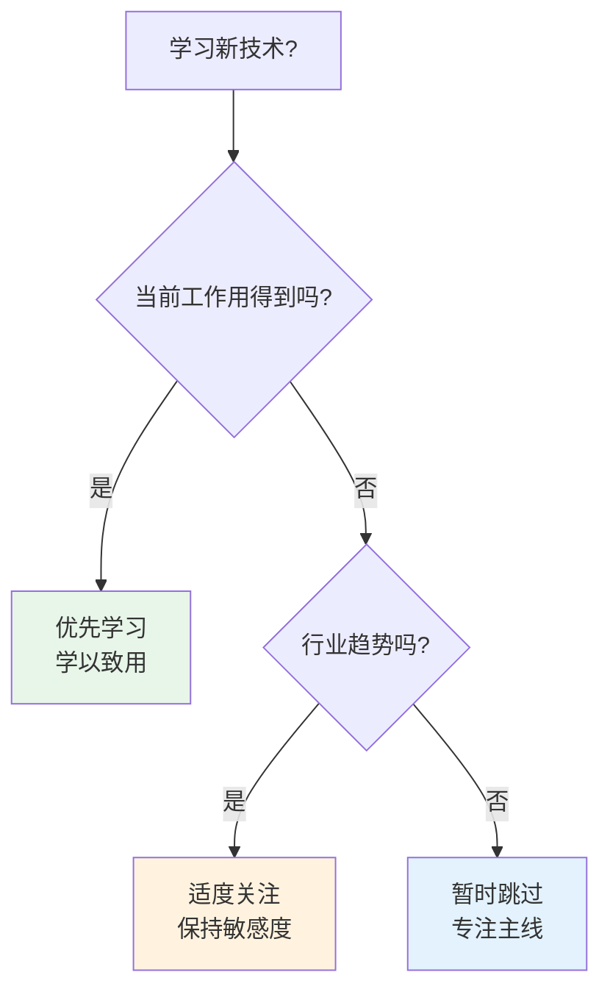
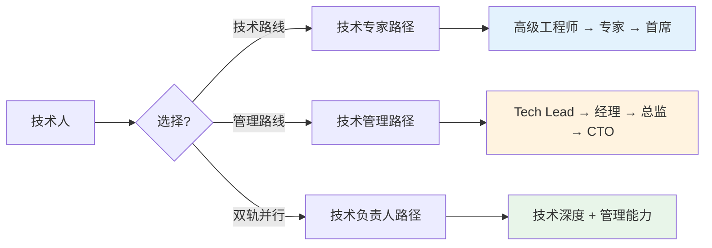

# 20 — 持续学习与成长

> 核心规律：学习曲线决定竞争力，T型发展最稳健
> 一句话：保持好奇心，持续学习，是技术人员唯一的长期护城河

---

## 一、核心规律

### 1.1 学习金字塔



**核心规律：学习的最高效方式不是输入，而是输出。费曼技巧：能教别人，才是真掌握。**

### 1.2 T型发展模型



**核心规律：先深后广。先在某一领域建立深度，再拓展广度。没有深度的广度是肤浅，没有广度的深度是局限。**

---

## 二、学习路径规划

### 2.1 不同阶段的侧重点

| 阶段 | 时间 | 重点 | 策略 |
|------|------|------|------|
| **初级** | 0-2年 | 基础扎实 | 把 fundamentals 学透 |
| **中级** | 2-5年 | 广度拓展 | 接触更多技术领域 |
| **高级** | 5-10年 | 深度+架构 | 成为某一领域专家 |
| **专家** | 10年+ | 影响力 | 技术判断+团队赋能 |

### 2.2 技术选型决策



---

## 三、高效学习方法

### 3.1 费曼技巧

```
1. 选择概念 → 2. 假装教给小白 → 3. 发现漏洞 → 4. 回去学习 → 5. 简化表达
```

### 3.2 刻意练习

```
刻意练习三要素：
├── 明确的目标（具体可衡量）
├── 专注的投入（全神贯注）
└── 及时的反馈（知道哪里需要改进）
```

### 3.3 知识管理

```
输入 → 处理 → 输出 → 反馈 → 迭代

工具推荐：
├── 笔记：Obsidian / Notion / Logseq
├── 代码：GitHub Gist / Snippets
├── 知识库：自建Wiki / Confluence
└── 思维导图：XMind / draw.io
```

---

## 四、技术视野拓展

### 4.1 信息渠道

| 类型 | 渠道 | 频率 |
|------|------|------|
| **官方文档** | 各框架官网 | 按需 |
| **技术博客** | Medium / 知乎 / 个人博客 | 每日 |
| **社交媒体** | Twitter / V2EX / 掘金 | 每日 |
| **Newsletter** | Hacker News / InfoQ | 每周 |
| **社区** | GitHub / Stack Overflow | 按需 |
| **课程** | Udemy / Coursera / 极客时间 | 每月 |

### 4.2 避免信息过载

```
信息摄入原则：
├── 源头优先：读一手资料（官方文档 > 博客 > 视频）
├── 主题聚焦：不要什么都看，聚焦主线
├── 输出驱动：学完要输出（笔记/博客/代码）
└── 定期清理：取关低质量信息源
```

---

## 五、职业发展规划

### 5.1 技术路线 vs 管理路线



### 5.2 核心竞争力构建

```
技术人的核心竞争力 = 技术深度 × 业务理解 × 沟通能力

技术深度：
├── 某一领域的专家级知识
├── 快速学习新领域的能力
└── 技术判断力（什么场景用什么技术）

业务理解：
├── 理解业务价值
├── 知道技术如何赋能业务
└── 能与业务方有效沟通

沟通能力：
├── 清晰表达技术观点
├── 倾听和理解他人
└── 跨团队协作能力
```

---

## 六、本章总结

> **核心规律：学习是技术人员唯一的长期护城河。保持好奇心，持续学习，T型发展，输出驱动。**

### 关键记忆点
- ✅ 费曼技巧：能教别人，才是真掌握
- ✅ T型发展：先深后广，深度立身，广度拓展
- ✅ 刻意练习：明确目标 + 专注投入 + 及时反馈
- ✅ 信息摄入：源头优先，主题聚焦，输出驱动

---

## 延伸阅读

- [leader/08](./leader/08_个人成长与领导力提升.md) — 个人成长专题
- [03 开发全流程方法论](./03-开发全流程方法论.md) — 方法论学习
