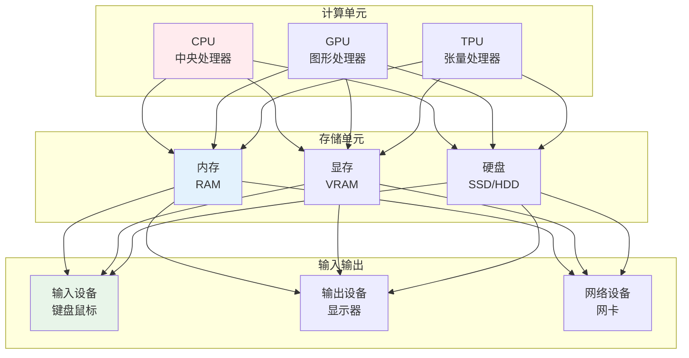
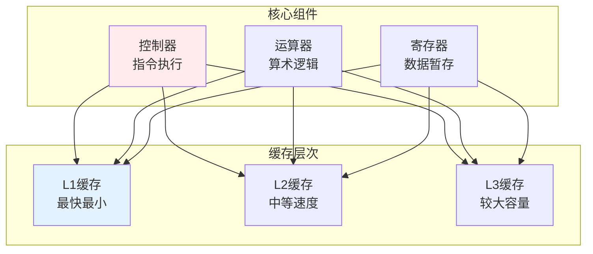
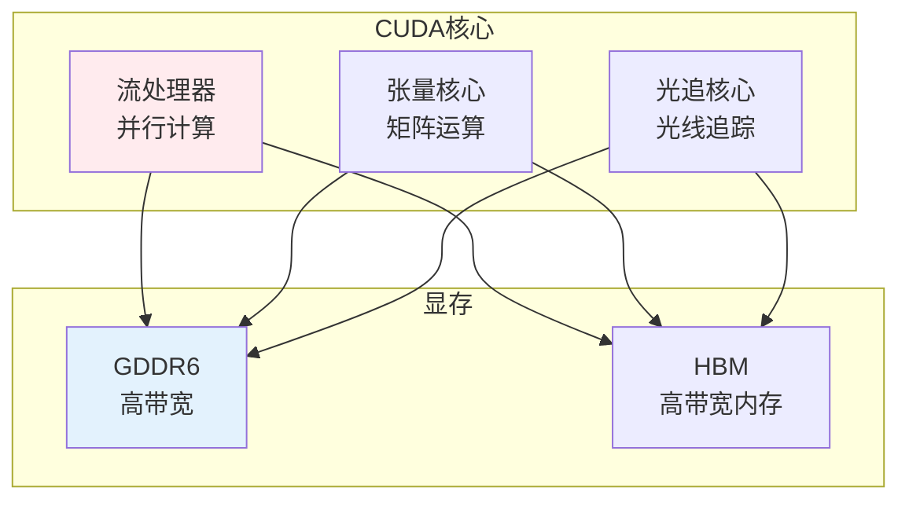
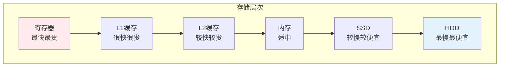

# 硬件基础

> **核心观点**：硬件是计算机系统的物理基础，理解硬件原理是优化计算性能的关键。

---

## 📊 硬件体系



---

## 🖥️ 中央处理器

### CPU架构



### 指令集架构

| 架构 | 特点 | 应用 |
|------|------|------|
| x86 | 复杂指令集 | 个人电脑 |
| ARM | 精简指令集 | 移动设备 |
| RISC-V | 开源架构 | 新兴应用 |

### 并行计算

```
并行计算类型：
1. 数据并行：同一操作多数据
2. 流水线并行：不同操作重叠
3. 多核并行：多个处理器核心
4. 分布式并行：多台计算机
```

---

## 🎮 图形处理器

### GPU架构

| 特点 | CPU | GPU |
|------|-----|-----|
| 核心数 | 少（4-64） | 多（数千） |
| 频率 | 高（3-5GHz） | 较低（1-2GHz） |
| 缓存 | 大 | 小 |
| 适用 | 串行任务 | 并行任务 |

### GPU计算



### GPU选型

| 型号 | 适用场景 | 特点 |
|------|----------|------|
| NVIDIA RTX | 游戏、AI | 光追、AI加速 |
| NVIDIA A100 | 数据中心 | 大规模并行 |
| AMD Radeon | 游戏、专业 | 性价比 |

---

## 💾 存储系统

### 存储层次



### 内存技术

| 技术 | 特点 | 应用 |
|------|------|------|
| DDR4 | 主流内存 | 个人电脑 |
| DDR5 | 新一代内存 | 高端系统 |
| HBM | 高带宽内存 | GPU显存 |
| LPDDR | 低功耗内存 | 移动设备 |

---

## 🔌 接口与总线

### 常见接口

| 接口 | 速度 | 应用 |
|------|------|------|
| USB 3.0 | 5Gbps | 外设连接 |
| Thunderbolt | 40Gbps | 高速外设 |
| PCIe 4.0 | 16GT/s | 显卡、SSD |
| SATA III | 6Gbps | 硬盘 |

---

## 🎯 核心结论

### 硬件选择原则

1. **匹配需求**：根据任务选择硬件
2. **平衡配置**：避免瓶颈
3. **考虑扩展**：预留升级空间
4. **能效比**：性能与功耗平衡
5. **成本效益**：预算与性能平衡

### 硬件发展趋势

```
硬件发展四大趋势：
1. 异构计算：CPU+GPU+专用芯片
2. 存算一体：减少数据搬运
3. 量子计算：突破经典极限
4. 边缘计算：本地化处理
```

---

## 📚 参考文献

1. 《计算机组成原理》- 唐朔飞
2. 《计算机体系结构》- 张晨曦
3. 《深入理解计算机系统》- Randal Bryant
4. 《GPU编程与CG语言之禅》
5. 《高性能计算》- Barry Wilkinson
6. 《计算机硬件技术基础》
7. 《数字逻辑设计》
8. 《处理器架构设计》