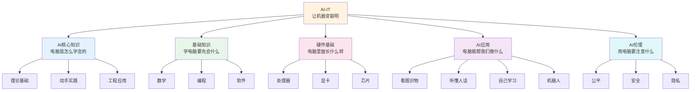
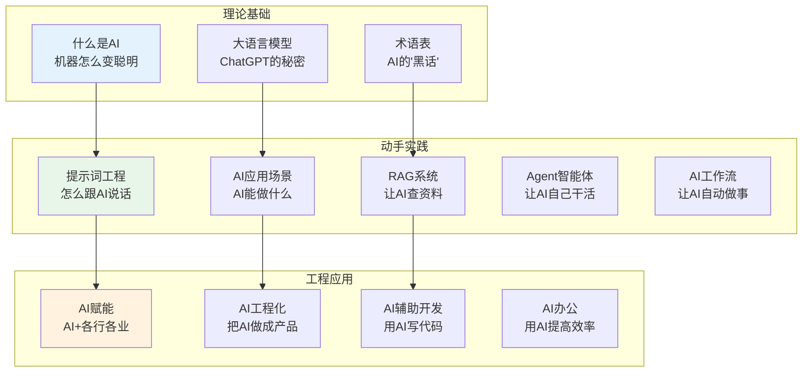
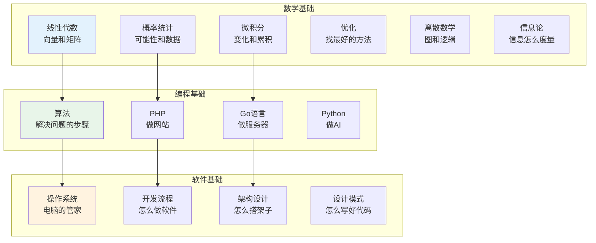
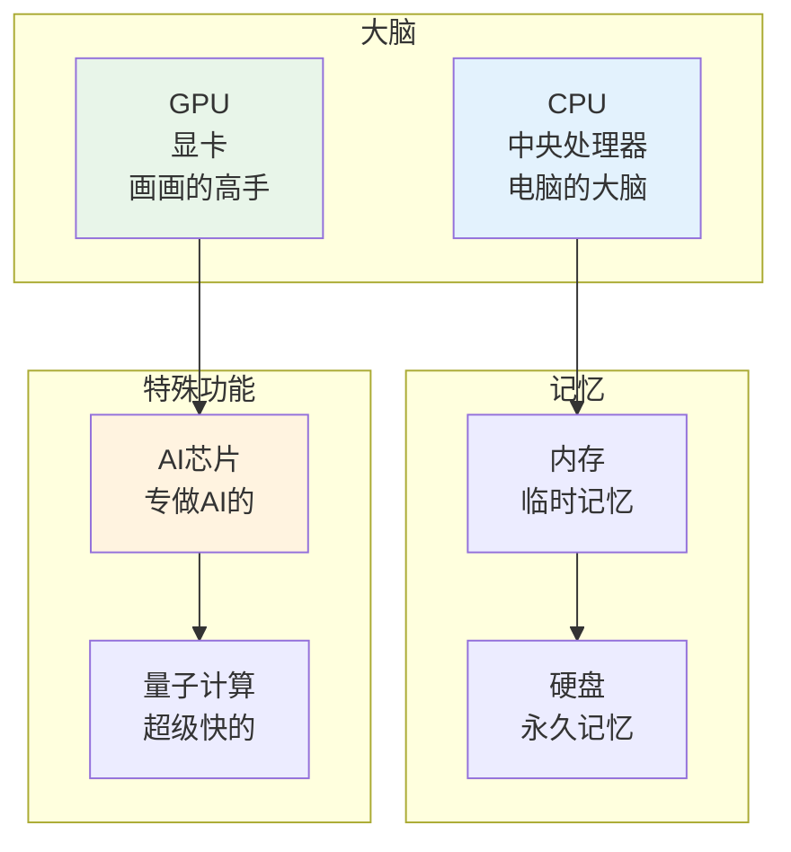
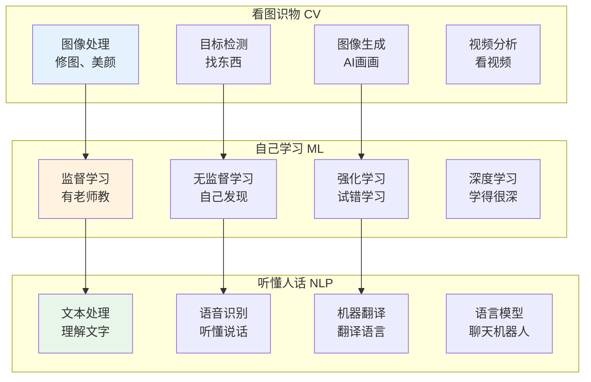
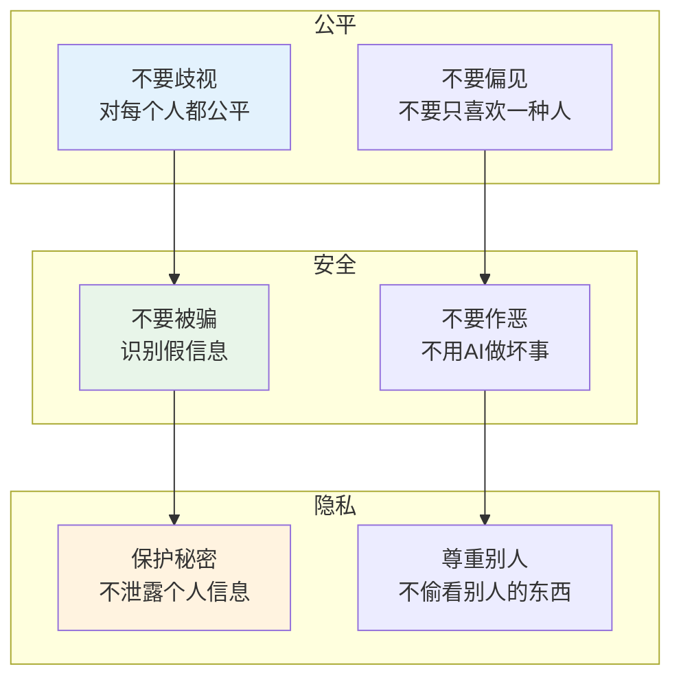
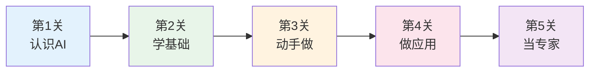

# AI-IT 知识体系

> **费曼学习法**：用最简单的话，解释最复杂的概念。

---

## 🎯 一句话理解AI-IT

**AI-IT就是教电脑变聪明的学问！**

就像你学习认字、算数一样，电脑也需要"学习"。AI-IT就是研究怎么让电脑学会看、听、说、想。

---

## 🏗️ AI-IT的"积木塔"

---

## 🗂️ 内容导航

| 领域 | 说明 | 链接 |
|------|------|------|
| 🧠 AI核心知识 | 理论、实战与工程应用 | [进入](ai-core/index.md) |
| 📐 基础知识 | 数学、编程与软件基础 | [进入](fundamentals/index.md) |
| 💾 数据基础 | 数据库、缓存与消息队列 | [进入](data-fundamentals/index.md) |
| 🌐 网络基础 | HTTP 与系统安全设计 | [进入](network-fundamentals/index.md) |
| 💻 硬件基础 | 处理器、显卡与芯片 | [进入](hardware/index.md) |
| 🎯 AI应用 | 视觉、语言、机器学习与智能系统 | [进入](applications/index.md) |
| ⚖️ AI伦理 | 公平、安全、隐私与可解释性 | [进入](ai-ethics/index.md) |

---

## 📚 每个积木块详解

### 🧠 AI核心知识（电脑是怎么学会的）

**用小学生的话说**：就像你学骑自行车，摔几次就会了。电脑也是这样"练"会的！

| 积木块 | 小学生版解释 | 你能做什么 |
|--------|--------------|------------|
| AI基础知识 | AI是什么？能干什么？ | 了解AI的基本概念 |
| LLM与提示词 | 怎么跟AI聊天让它听话 | 让AI帮你写作业、画画 |
| AI术语表 | AI的"字典" | 看懂AI文章 |
| 提示词工程 | 怎么"命令"AI | 让AI按你的要求做事 |
| RAG系统 | 让AI会查资料 | 让AI回答更准确 |
| Agent智能体 | 让AI自己做决定 | 让AI自动完成任务 |
| AI工作流 | 让AI自动做事 | 把重复的事交给AI |

---

### 📚 基础知识（学电脑要先会什么）

**用小学生的话说**：就像盖房子要先打地基，学电脑也要先学基础！

| 积木块 | 小学生版解释 | 为什么重要 |
|--------|--------------|------------|
| 线性代数 | 向量和矩阵的"游戏" | AI用它来处理图片和文字 |
| 概率统计 | 猜猜看、算算看 | AI用它来做预测 |
| 微积分 | 研究"变化"的学问 | AI用它来学习 |
| 优化 | 找到最好的方法 | AI用它来进步 |
| 算法 | 解决问题的"菜谱" | 电脑按步骤做事 |
| 编程 | 跟电脑说话的语言 | 教电脑做事 |
| 操作系统 | 电脑的"管家" | 管理电脑资源 |

---

### 💻 硬件基础（电脑里面长什么样）

**用小学生的话说**：电脑就像一个"小盒子"，里面有很多"小零件"在工作！

| 积木块 | 小学生版解释 | 类比 |
|--------|--------------|------|
| CPU | 电脑的大脑，负责思考 | 你的脑袋 |
| GPU | 电脑的画师，负责画图 | 画画的笔 |
| 内存 | 电脑的临时记忆 | 你正在做的事 |
| 硬盘 | 电脑的永久记忆 | 你的笔记本 |
| AI芯片 | 专门做AI的"大脑" | 专门学数学的老师 |
| 量子计算 | 超级快的电脑 | 瞬间移动 |

---

### 🎯 AI应用（电脑能帮我们做什么）

**用小学生的话说**：AI就像一个"超级助手"，能帮我们做很多事！

| 积木块 | 小学生版解释 | 生活中的例子 |
|--------|--------------|--------------|
| 计算机视觉 | 让电脑"看"东西 | 人脸识别、自动驾驶 |
| 自然语言处理 | 让电脑"听懂"人话 | Siri、ChatGPT |
| 机器学习 | 让电脑"自己学会" | 推荐系统、垃圾邮件过滤 |
| 智能系统 | 让电脑"自己做事" | 机器人、自动驾驶 |

---

### ⚖️ AI伦理（用电脑要注意什么）

**用小学生的话说**：用AI就像用工具，要用对地方，不能做坏事！

| 积木块 | 小学生版解释 | 为什么重要 |
|--------|--------------|------------|
| 公平性 | AI要对所有人都好 | 不能只对某些人好 |
| 安全性 | AI不能做坏事 | 保护大家的安全 |
| 隐私保护 | AI不能偷看你的秘密 | 保护个人隐私 |
| 可解释性 | AI要说清楚为什么这样做 | 不能当"黑盒子" |

---

## 🎮 AI闯关游戏

**闯关秘籍：**
1. **第1关**：AI是什么？能干什么？（看AI核心知识）
2. **第2关**：学数学、学编程（看基础知识）
3. **第3关**：认识电脑硬件（看硬件基础）
4. **第4关**：用AI做东西（看AI应用）
5. **第5关**：用AI做好事（看AI伦理）

---

## 💡 给小学生的话

> AI不是魔法，是科学！
> 
> 你也可以学会用AI，甚至创造AI！
> 
> 记住：AI是工具，要用对地方！

---

**每个AI专家都曾经是初学者！**