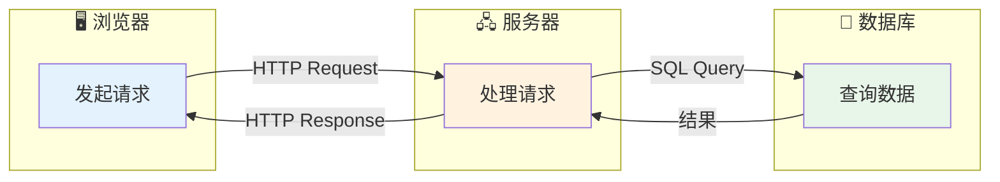
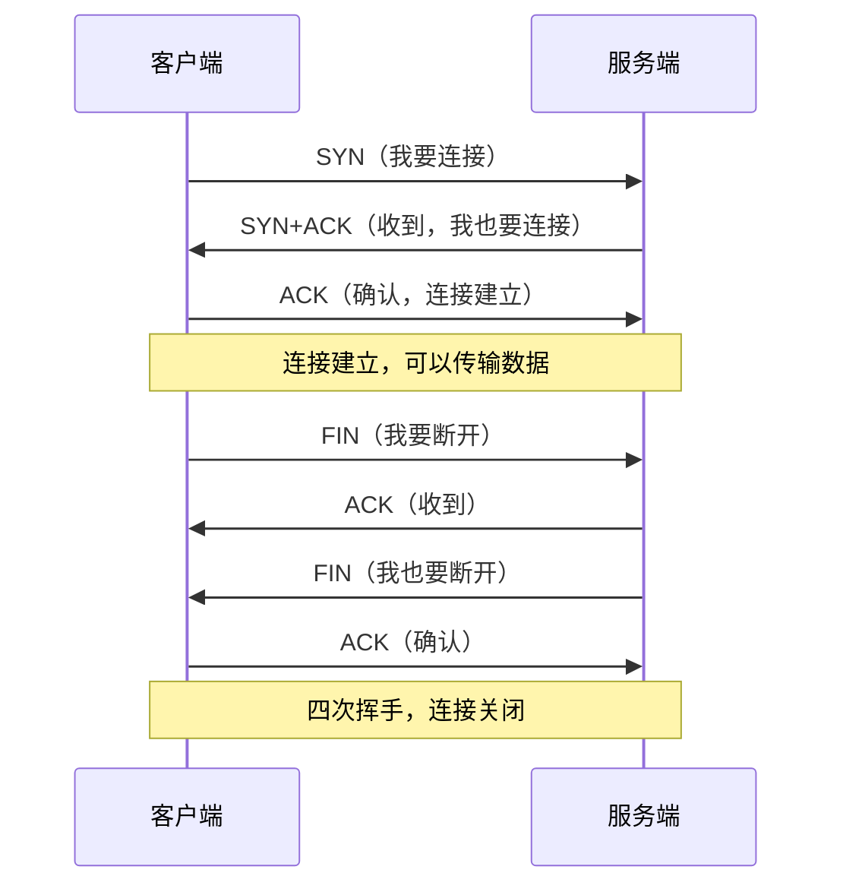
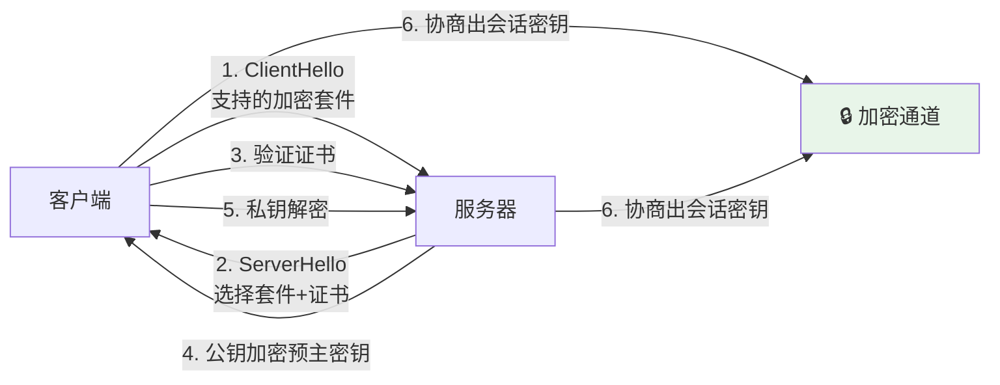
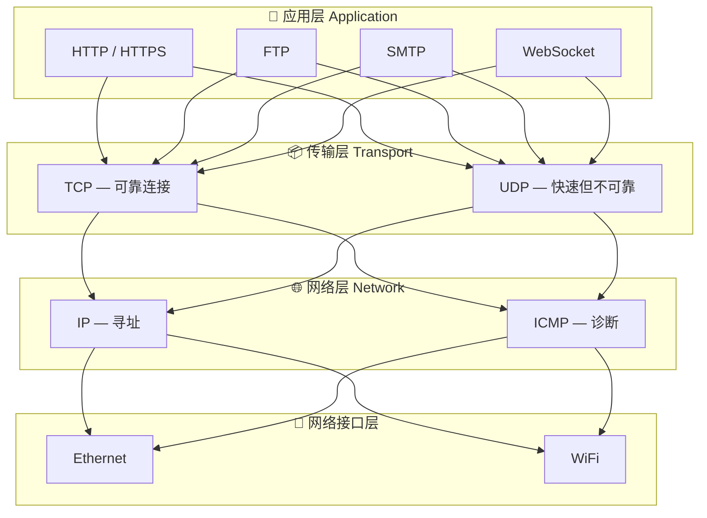

# 01 — HTTP与网络基础

> 核心规律：HTTP是无状态的，所有会话管理都是额外叠加的
> 一句话：理解请求-响应循环，就理解了Web的本质

---

## 一、核心规律

### 1.1 请求-响应模型



**核心规律：**
- HTTP是**无状态**的——每次请求独立，服务器不记得上次
- 所有"状态"都是应用层额外实现的（Session/Cookie/Token）
- 请求-响应是**同步**的——发完等结果，不处理其他事

### 1.2 关键思维模型

```
HTTP = 无状态协议 + 分层架构 + 缓存机制

无状态 → 需要Session/Token维持状态
分层架构 → 每层只关心自己的职责
缓存机制 → 减少重复请求，提升性能
```

---

## 二、HTTP核心概念

### 2.1 请求方法

| 方法 | 幂等 | 安全 | 用途 |
|------|:----:|:----:|------|
| **GET** | ✅ | ✅ | 查询资源 |
| **POST** | ❌ | ❌ | 创建资源 |
| **PUT** | ✅ | ❌ | 全量更新 |
| **PATCH** | ❌ | ❌ | 部分更新 |
| **DELETE** | ✅ | ❌ | 删除资源 |

> **记忆口诀：** GET只读，POST创建，PUT全替，PATCH部分改，DELETE删掉

### 2.2 状态码分类

```
1xx — 信息性（处理中）
2xx — 成功（✅）
3xx — 重定向（→）
4xx — 客户端错误（❌ 你的问题）
5xx — 服务端错误（❌ 服务器问题）
```

| 状态码 | 含义 | 常见原因 |
|--------|------|---------|
| 200 | OK | 成功 |
| 201 | Created | 创建成功 |
| 301 | Moved | 永久重定向 |
| 302 | Found | 临时重定向 |
| 400 | Bad Request | 参数错误 |
| 401 | Unauthorized | 未登录 |
| 403 | Forbidden | 无权限 |
| 404 | Not Found | 资源不存在 |
| 422 | Unprocessable | 验证失败 |
| 500 | Internal Error | 服务器异常 |

### 2.3 关键请求头

| Header | 作用 | 示例 |
|--------|------|------|
| `Content-Type` | 请求体类型 | `application/json` |
| `Authorization` | 认证信息 | `Bearer {token}` |
| `Cookie` | 携带Cookie | `session_id=abc123` |
| `Accept` | 期望的响应类型 | `application/json` |
| `Cache-Control` | 缓存策略 | `no-cache`, `max-age=3600` |
| `X-Forwarded-For` | 真实IP（经代理） | `1.2.3.4, 5.6.7.8` |

---

## 三、TCP/IP基础

### 3.1 三次握手



**为什么是三次？** 因为TCP是全双工的，双方都需要确认。

### 3.2 HTTPS原理



> **核心规律：** HTTPS = HTTP + SSL/TLS加密层，保证数据传输安全

---

## 四、网络分层



| 层级 | 职责 | 关键协议 |
|------|------|---------|
| **应用层** | 应用程序间通信 | HTTP, FTP, SMTP, WebSocket |
| **传输层** | 端到端数据传输 | TCP（可靠）, UDP（快速） |
| **网络层** | 数据包路由寻址 | IP, ICMP |
| **网络接口层** | 物理传输 | Ethernet, WiFi |

---

## 五、实战要点

### 5.1 常见HTTP问题排查

```
请求发出去了，但没收到响应？
├── 1. 检查网络连接（ping/curl）
├── 2. 检查DNS解析（nslookup）
├── 3. 检查防火墙/安全组
├── 4. 检查服务端日志
└── 5. 检查超时配置

响应慢怎么办？
├── 1. EXPLAIN分析SQL
├── 2. 检查是否有N+1查询
├── 3. 检查缓存命中率
├── 4. 检查外部API调用
└── 5. 检查服务器负载
```

### 5.2 HTTP缓存策略

| 策略 | 指令 | 说明 |
|------|------|------|
| 不缓存 | `Cache-Control: no-cache` | 每次向服务器验证 |
| 强缓存 | `Cache-Control: max-age=3600` | 有效期内直接用 |
| 过期验证 | `Cache-Control: max-age=3600, must-revalidate` | 过期后向服务器确认 |
| 禁用缓存 | `Cache-Control: no-store` | 完全不存储 |

---

## 六、本章总结

> **核心规律：HTTP是无状态协议，所有"状态"都是应用层额外实现的。理解这一点，就理解了Session/Cookie/Token的设计初衷。**

### 关键记忆点
- ✅ HTTP无状态 → 需要Session/Token维持状态
- ✅ TCP三次握手 → SYN→SYN+ACK→ACK
- ✅ HTTPS = HTTP + SSL/TLS
- ✅ 状态码2xx成功，3xx重定向，4xx客户端错，5xx服务端错

---

## 延伸阅读

- [02 操作系统与进程模型](../fundamentals/software/01-operating-systems.md) — 理解PHP-FPM进程模型
- [14 后端工程化](../fundamentals/software/09-backend-engineering.md) — HTTP请求的完整生命周期
