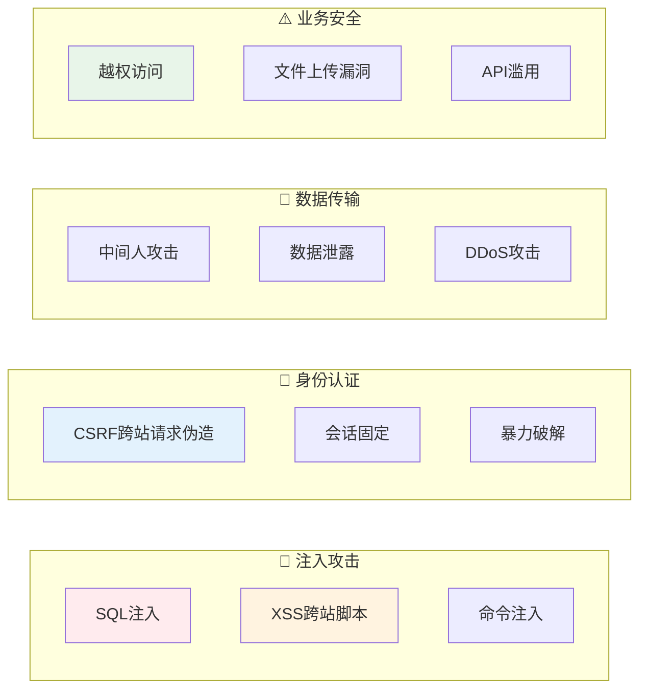
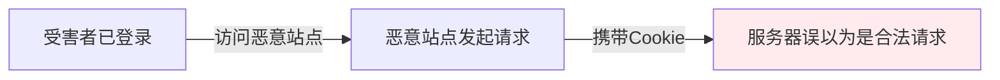
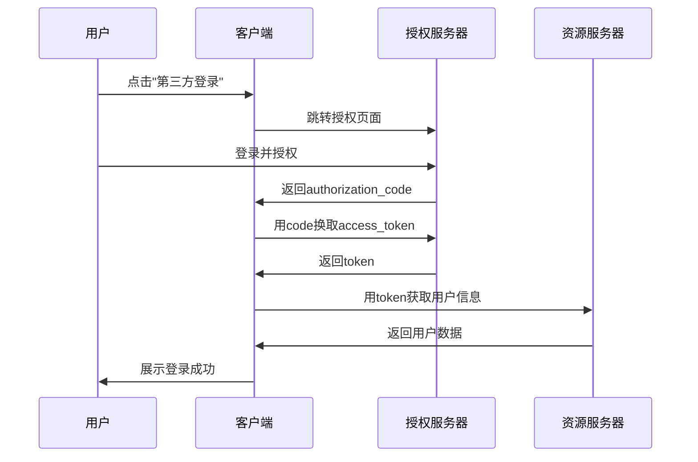

# 18 — 系统安全设计

> 核心规律：永远不要信任用户输入，安全是持续过程
> 一句话：安全漏洞往往源于「假设输入是可信的」

---

## 一、安全威胁全景



---

## 二、注入攻击防护

### 2.1 SQL注入

```
❌ 危险代码（拼接SQL）：
$sql = "SELECT * FROM users WHERE id = " . $_GET['id'];

✅ 正确代码（参数绑定）：
$stmt = $pdo->prepare("SELECT * FROM users WHERE id = ?");
$stmt->execute([$userId]);

✅ Laravel方式（自动转义）：
User::where('id', $userId)->first();
```

### 2.2 XSS防护

```mermaid
flowchart LR
    A["攻击者"] -->|"注入<script>| B["漏洞网站"]
    B --> C["受害者浏览器"]
    C --> D["Cookie被窃取"]
    
    style D fill:#ffebee
```

| 类型 | 说明 | 防护 |
|------|------|------|
| **存储型** | 恶意脚本存入数据库 | 输出时HTML编码 |
| **反射型** | 恶意脚本在URL中 | 输入验证+输出编码 |
| **DOM型** | 前端JS直接操作DOM | 禁用innerHTML，用textContent |

```php
// Laravel自动转义
{{ $user->bio }}        // Blade自动 htmlspecialchars
{!! $htmlContent !!}    // 不过滤，需谨慎使用
```

### 2.3 命令注入

```php
// ❌ 危险
system('ping ' . $userInput);

// ✅ 安全：白名单验证
$allowedHosts = ['example.com', 'google.com'];
if (in_array($userInput, $allowedHosts)) {
    system('ping -c 4 ' . escapeshellarg($userInput));
}
```

---

## 三、CSRF防护



| 防护方式 | 实现 |
|----------|------|
| **CSRF Token** | 每个表单嵌入随机token |
| **SameSite Cookie** | `Set-Cookie: Secure; SameSite=Lax` |
| **Origin检查** | 验证请求来源 |
| **双重提交** | Cookie+Header都带token |

```php
// Laravel自动防护
<form method="POST">
    @csrf  // 自动生成token
</form>
```

---

## 四、JWT与OAuth2

### 4.1 JWT结构

```
eyJhbGciOiJIUzI1NiIsInR5cCI6IkpXVCJ9.        // Header
eyJzdWIiOiIxMjM0NTY3ODkwIiwibmFtZSI6Ikp...      // Payload
SflKxwRJSMeKKF2QT4fwpMeJf36POk6yJV         // Signature
```

| 部分 | 内容 | 安全性 |
|------|------|--------|
| Header | 算法+类型 | 明文 |
| Payload | 用户声明（sub/name/email） | 明文（可解码） |
| Signature | HMACSHA256(encodeHeader.encodePayload+secret) | 签名验证 |

### 4.2 JWT安全注意事项

```
✅ 正确做法：
- 使用强密钥（至少256位）
- 设置合理的exp过期时间
- 存储敏感信息到服务端（不放入JWT）
- 使用HTTPS传输
- 实现token黑名单（注销场景）

❌ 错误做法：
- 将密码放入JWT payload
- 不设过期时间
- 使用HS256+弱密钥
- 在URL中传递JWT（进入日志）
```

### 4.3 OAuth2授权流程



---

## 五、密码安全

```php
// ❌ 绝对禁止
$password = md5($input);           // MD5已破解
$password = sha1($input);          // SHA1不安全
$password = base64_encode($input); // base64不是加密

// ✅ 正确使用
$passwordHash = password_hash($input, PASSWORD_BCRYPT, [
    'cost' => 12,  // 增加计算成本
]);

// 验证
if (password_verify($input, $storedHash)) {
    // 密码正确
    if (password_needs_rehash($storedHash, PASSWORD_BCRYPT, ['cost' => 12])) {
        // 更新哈希
    }
}
```

---

## 六、HTTPS配置

```nginx
server {
    listen 443 ssl http2;
    server_name example.com;
    
    ssl_certificate /path/to/fullchain.pem;
    ssl_certificate_key /path/to/privkey.pem;
    
    # 安全头
    add_header Strict-Transport-Security "max-age=63072000" always;
    add_header X-Content-Type-Options "nosniff" always;
    add_header X-Frame-Options "DENY" always;
    add_header X-XSS-Protection "1; mode=block" always;
    
    # 禁用旧协议
    ssl_protocols TLSv1.2 TLSv1.3;
}
```

---

## 七、安全 checklist

### 开发阶段
```
□ 所有用户输入都做验证和过滤
□ 使用参数化查询防止SQL注入
□ 输出时HTML实体编码防XSS
□ 表单添加CSRF Token
□ 敏感操作需要二次确认
□ 文件上传校验MIME类型和扩展名
□ API接口添加速率限制
□ 错误信息不泄露堆栈细节
```

### 部署阶段
```
□ 启用HTTPS（TLS 1.2+）
□ 配置安全响应头
□ 禁用危险HTTP方法
□ 配置CDN WAF防护
□ 定期安全扫描（OWASP ZAP）
□ 依赖包漏洞扫描（composer audit）
□ 配置文件不提交到版本库
```

---

## 八、本章总结

> **核心规律：安全不是功能，而是属性。安全漏洞往往源于「假设输入是可信的」。永远不要信任用户输入，永远验证、过滤、转义。**

### 关键记忆点
- ✅ SQL注入→参数化查询，XSS→输出编码，CSRF→Token验证
- ✅ JWT不存敏感信息，设过期时间，用强密钥
- ✅ 密码用bcrypt/argon2哈希，永不明文存储
- ✅ HTTPS是基础，安全头是保障

---

## 延伸阅读
- [09 DevOps与运维实践](../fundamentals/software/07-containerization-cicd.md) — 部署安全
- [19 技术团队管理](../fundamentals/software/10-technical-team-management.md) — 安全文化建设
