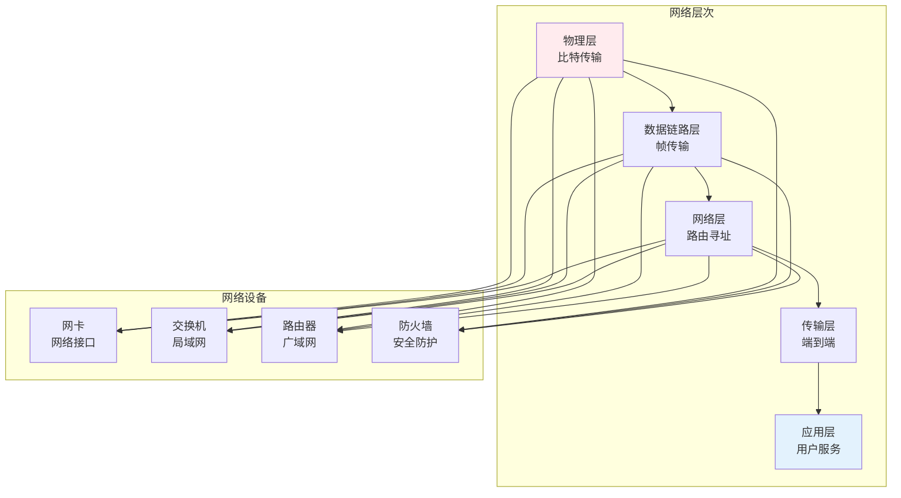
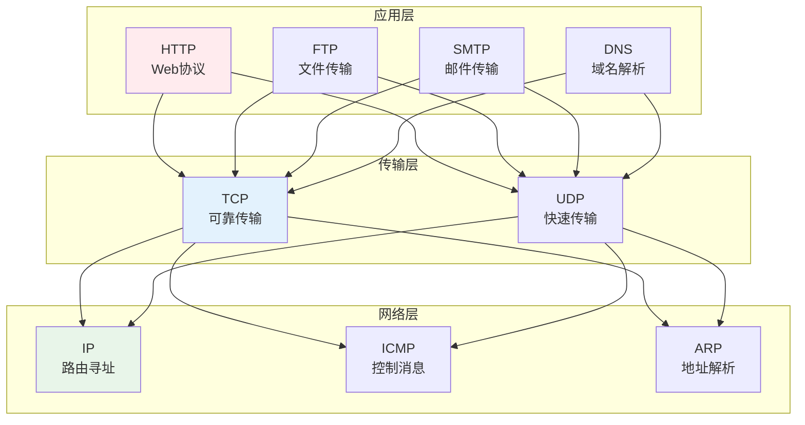
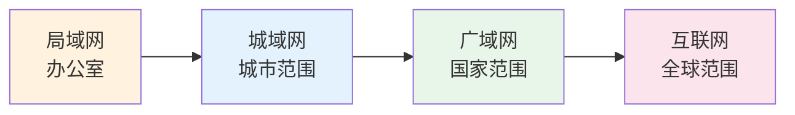

# 网络基础

> **核心观点**：计算机网络是连接计算设备的系统，理解网络原理是构建分布式系统的基础。

---

## 📊 网络体系



---

## 🔌 网络协议

### TCP/IP协议栈



### TCP vs UDP

| 特性 | TCP | UDP |
|------|-----|-----|
| 连接 | 面向连接 | 无连接 |
| 可靠性 | 可靠传输 | 不可靠 |
| 顺序 | 保证顺序 | 不保证 |
| 速度 | 较慢 | 较快 |
| 应用 | Web、邮件 | 视频、游戏 |

---

## 🌐 网络架构

### 局域网

| 技术 | 特点 | 应用 |
|------|------|------|
| 以太网 | 有线连接 | 办公网络 |
| WiFi | 无线连接 | 家庭网络 |
| VLAN | 虚拟划分 | 网络隔离 |

### 广域网



### 云计算网络

| 服务 | 内容 | 特点 |
|------|------|------|
| IaaS | 基础设施 | 虚拟化 |
| PaaS | 平台服务 | 开发环境 |
| SaaS | 软件服务 | 直接使用 |

---

## 🔒 网络安全

### 安全威胁

| 威胁类型 | 描述 | 防御措施 |
|----------|------|----------|
| DDoS攻击 | 流量洪泛 | 流量清洗 |
| SQL注入 | 数据库攻击 | 参数化查询 |
| XSS攻击 | 脚本注入 | 输入过滤 |
| 中间人攻击 | 通信窃听 | 加密通信 |

### 安全协议

```
网络安全协议：
1. SSL/TLS：传输层加密
2. IPsec：网络层加密
3. HTTPS：安全Web协议
4. SSH：安全远程登录
5. VPN：虚拟专用网络
```

---

## 🎯 核心结论

### 网络设计原则

1. **分层设计**：模块化、易维护
2. **冗余设计**：高可用性
3. **安全设计**：防御纵深
4. **可扩展性**：适应增长
5. **性能优化**：带宽、延迟

### 网络发展趋势

```
网络发展四大趋势：
1. 5G/6G：高速移动网络
2. 物联网：万物互联
3. 边缘计算：分布式处理
4. 零信任安全：持续验证
```

---

## 📚 参考文献

1. 《计算机网络：自顶向下方法》- James Kurose
2. 《计算机网络》- 谢希仁
3. 《TCP/IP详解》- W. Richard Stevens
4. 《网络安全基础》- William Stallings
5. 《网络工程师教程》
6. 《云计算：概念、技术与架构》
7. 《5G移动通信系统设计与标准详解》
8. 《物联网技术与应用》