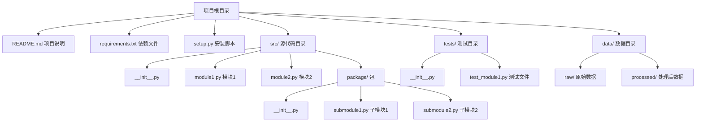
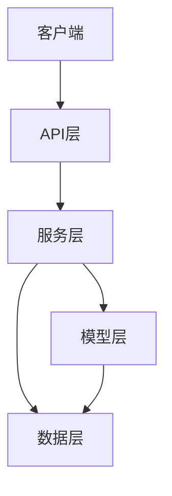
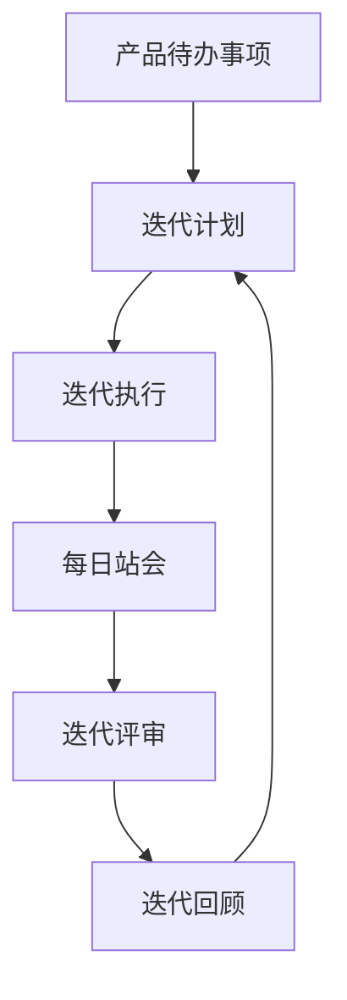
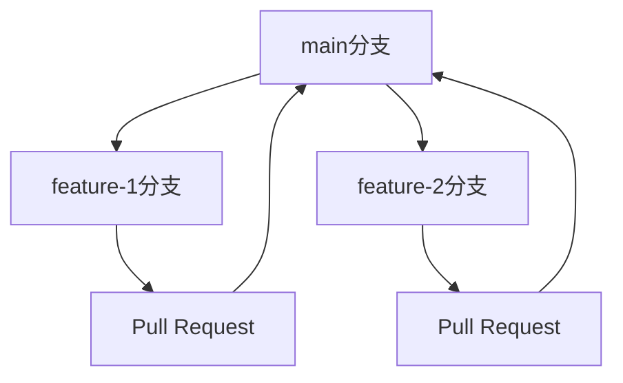

# AI开发基础知识指南

## 前言

随着AI技术的快速发展，产品经理需要具备一定的技术理解能力，以便更好地与开发团队沟通，设计出更符合技术实现的产品需求。本指南旨在帮助产品经理了解AI开发的核心技术概念，掌握如何运用这些概念构建有效提示词，从而精准指导AI实现产品想法。

## 1. Python代码组织方式

### 核心概念

Python代码组织是构建AI项目的基础，了解其结构有助于产品经理理解代码的组织逻辑和调用关系。

#### 模块与包

- **模块**：一个.py文件就是一个模块，包含函数、类和变量的定义
- **包**：包含多个模块的目录，必须包含`__init__.py`文件

#### 类与函数

- **类**：面向对象编程的基本单位，封装数据和方法
- **函数**：可重用的代码块，实现特定功能

### 代码文件组织原则

1. **单一职责**：每个模块或文件只负责一个功能
2. **模块化**：将相关功能组织到同一模块
3. **命名规范**：使用有意义的命名，遵循Python命名约定
4. **文档化**：为模块、类和函数添加文档字符串

### Python项目典型目录结构



### 实际应用场景

在AI产品开发中，合理的代码组织可以提高开发效率和代码可维护性。例如，一个智能推荐系统的代码结构可能如下：

- `src/data/`：数据处理相关模块
- `src/models/`：模型定义和训练模块
- `src/services/`：业务逻辑和API服务
- `src/utils/`：工具函数

## 2. 程序设计思想

### 面向对象编程(OOP)

#### 核心概念

- **封装**：将数据和方法封装在类中，隐藏内部实现细节
- **继承**：子类继承父类的属性和方法
- **多态**：不同对象对同一方法的不同实现

#### 在AI开发中的应用

```python
# 示例：面向对象编程在AI模型中的应用
class BaseModel:
    def train(self, data):
        # 基础训练方法
        pass
    
    def predict(self, input_data):
        # 基础预测方法
        pass

class RecommendationModel(BaseModel):
    def train(self, data):
        # 推荐模型的训练实现
        print("Training recommendation model...")
    
    def predict(self, input_data):
        # 推荐模型的预测实现
        print("Predicting recommendations...")
        return ["item1", "item2"]

class ClassificationModel(BaseModel):
    def train(self, data):
        # 分类模型的训练实现
        print("Training classification model...")
    
    def predict(self, input_data):
        # 分类模型的预测实现
        print("Classifying input...")
        return "class1"
```

### 函数式编程

#### 核心概念

- **纯函数**：相同输入总是产生相同输出，无副作用
- **高阶函数**：接受函数作为参数或返回函数
- **不可变数据**：数据一旦创建就不能修改

#### 在AI开发中的应用

```python
# 示例：函数式编程在数据处理中的应用
def process_data(data, transform_functions):
    """
    应用一系列转换函数处理数据
    """
    result = data
    for func in transform_functions:
        result = func(result)
    return result

# 定义转换函数
def normalize_data(data):
    # 归一化数据
    return [x / max(data) for x in data]

def filter_outliers(data, threshold=3):
    # 过滤异常值
    mean = sum(data) / len(data)
    std = (sum((x - mean)**2 for x in data) / len(data))**0.5
    return [x for x in data if abs(x - mean) < threshold * std]

# 使用函数式编程处理数据
data = [1, 2, 3, 100, 4, 5]
transforms = [normalize_data, filter_outliers]
processed_data = process_data(data, transforms)
print(processed_data)  # 输出：[0.01, 0.02, 0.03, 0.04, 0.05]
```

### 模块化设计

#### 核心概念

- **高内聚**：模块内部元素紧密相关
- **低耦合**：模块之间依赖关系最小化
- **接口清晰**：模块提供明确的接口，隐藏实现细节

#### 在AI开发中的应用



## 3. 程序逻辑基本概念

### 变量与数据类型

#### 基本数据类型

- **整数** (int)：如 1, 2, 3
- **浮点数** (float)：如 1.0, 2.5
- **字符串** (str)：如 "hello", "AI"
- **布尔值** (bool)：True, False
- **列表** (list)：如 [1, 2, 3]
- **字典** (dict)：如 {"name": "AI", "version": 1.0}

### 控制流

#### 条件语句

```python
# 示例：条件语句
if user_age >= 18:
    print("成年人")
elif user_age >= 13:
    print("青少年")
else:
    print("儿童")
```

#### 循环

```python
# 示例：循环
# for循环
for i in range(5):
    print(i)  # 输出：0, 1, 2, 3, 4

# while循环
count = 0
while count < 5:
    print(count)
    count += 1
```

### 函数

```python
# 示例：函数定义与调用
def calculate_average(numbers):
    """
    计算列表的平均值
    """
    if not numbers:
        return 0
    return sum(numbers) / len(numbers)

# 调用函数
scores = [85, 90, 78, 92, 88]
average_score = calculate_average(scores)
print(f"平均分数: {average_score}")
```

### 异常处理

```python
# 示例：异常处理
try:
    result = 10 / 0
except ZeroDivisionError:
    print("除数不能为零")
except Exception as e:
    print(f"发生错误: {e}")
finally:
    print("无论是否发生异常，都会执行这里")
```

## 4. 软件项目管理基本概念

### 敏捷开发

#### 核心概念

- **迭代**：将项目分解为多个小的迭代周期
- **增量**：每个迭代都交付可工作的软件增量
- **自适应**：根据反馈不断调整计划和需求

#### 敏捷开发流程



### 需求分析

1. **收集需求**：通过用户访谈、市场调研等方式收集需求
2. **分析需求**：识别需求的优先级、可行性和依赖关系
3. **文档化需求**：使用用户故事、用例等方式记录需求
4. **验证需求**：与 stakeholders 确认需求的准确性

### 任务分解

- **工作分解结构(WBS)**：将项目分解为可管理的任务
- **任务估算**：评估每个任务的工作量和时间
- **任务分配**：根据团队成员的技能和 availability 分配任务

### 迭代管理

- **迭代计划**：每个迭代开始时确定要完成的任务
- **进度跟踪**：使用看板、燃尽图等工具跟踪进度
- **风险管理**：识别和应对项目风险

## 5. 软件测试概念

### 单元测试

#### 核心概念

- **测试用例**：验证特定功能的测试代码
- **断言**：检查代码行为是否符合预期
- **测试框架**：如 pytest, unittest 等

#### 示例

```python
# 示例：单元测试
import pytest

def add(a, b):
    return a + b

def test_add():
    assert add(1, 2) == 3
    assert add(-1, 1) == 0
    assert add(0, 0) == 0
```

### 集成测试

- **测试目标**：验证不同模块之间的交互是否正常
- **测试范围**：跨模块、跨系统的功能
- **测试方法**：模拟真实使用场景

### 功能测试

- **测试目标**：验证软件是否满足功能需求
- **测试方法**：黑盒测试，不关注内部实现
- **测试场景**：用户故事、用例场景

## 6. 软件调试概念

### 调试流程

1. **复现问题**：尝试重现用户报告的问题
2. **定位错误**：使用调试工具和日志找到错误位置
3. **分析原因**：理解错误的根本原因
4. **修复错误**：实施修复方案
5. **验证修复**：确保修复有效且未引入新问题

### 错误定位技巧

- **日志分析**：查看应用日志，寻找错误信息
- **断点调试**：在关键位置设置断点，检查变量值
- **代码审查**：仔细检查相关代码，寻找逻辑错误
- **二分查找**：通过注释代码逐步缩小错误范围

### 日志分析

```python
# 示例：日志记录
import logging

# 配置日志
logging.basicConfig(
    level=logging.INFO,
    format='%(asctime)s - %(name)s - %(levelname)s - %(message)s'
)

logger = logging.getLogger(__name__)

def process_data(data):
    logger.info(f"开始处理数据: {data}")
    try:
        # 处理逻辑
        result = data * 2
        logger.info(f"处理完成，结果: {result}")
        return result
    except Exception as e:
        logger.error(f"处理数据时出错: {e}")
        raise
```

## 7. 软件版本管理方式

### Git基本操作

- **克隆仓库**：`git clone <repository-url>`
- **添加文件**：`git add <file>`
- **提交更改**：`git commit -m "commit message"`
- **推送更改**：`git push`
- **拉取更新**：`git pull`

### 分支管理



### 协作流程

1. **创建分支**：从 main 分支创建新的功能分支
2. **开发功能**：在分支上进行开发和测试
3. **提交更改**：将更改提交到远程分支
4. **创建PR**：提交Pull Request，请求合并到 main 分支
5. **代码审查**：团队成员审查代码
6. **合并PR**：通过审查后，合并到 main 分支
7. **删除分支**：合并完成后，删除功能分支

## 构建有效提示词的方法

基于以上技术概念，产品经理可以构建更有效的提示词来指导AI实现产品想法：

### 1. 明确目标和范围

- 清晰描述产品功能和目标
- 定义输入和输出格式
- 设定性能和质量要求

### 2. 提供具体示例

- 给出输入输出示例
- 描述边缘情况和异常处理
- 提供测试用例

### 3. 运用技术概念

- 参考代码组织方式，描述模块和组件关系
- 基于程序设计思想，说明架构设计
- 使用控制流概念，描述业务逻辑流程

### 4. 考虑项目管理因素

- 明确项目阶段和交付物
- 定义测试和验证方法
- 考虑版本控制和迭代计划

## 实际应用示例

### 智能客服系统提示词示例

```
# 智能客服系统开发需求

## 系统目标
开发一个智能客服系统，能够自动回答用户问题，提高客服效率。

## 技术架构
- 采用模块化设计，包含以下模块：
  - 输入处理模块：负责接收和预处理用户输入
  - 意图识别模块：识别用户的问题意图
  - 知识库模块：存储和检索知识
  - 响应生成模块：生成自然语言响应
  - API接口模块：提供外部访问接口

## 核心功能
1. **意图识别**：识别用户问题的意图，如产品咨询、订单查询、技术支持等
2. **知识库查询**：根据意图和实体信息查询相关知识
3. **多轮对话**：支持上下文理解和多轮对话
4. **响应生成**：生成自然、准确的回答
5. **错误处理**：优雅处理无法回答的问题

## 技术要求
- 使用Python语言开发
- 采用面向对象编程思想
- 使用Git进行版本控制
- 遵循敏捷开发流程，每两周一个迭代
- 包含单元测试和集成测试

## 输入输出示例
输入："我的订单什么时候能到货？"
输出："您的订单预计将在3个工作日内送达，具体时间取决于您的收货地址。"

## 测试要求
- 单元测试覆盖率达到80%以上
- 集成测试验证模块间交互
- 功能测试验证系统整体功能
```

## 总结

本指南介绍了产品经理在AI开发中需要掌握的核心技术概念，包括Python代码组织、程序设计思想、程序逻辑、项目管理、测试、调试和版本控制等方面。通过理解这些概念，产品经理可以更好地与技术团队沟通，构建更有效的提示词，从而精准指导AI实现产品想法。

随着AI技术的不断发展，产品经理需要持续学习和更新自己的技术知识，以适应快速变化的技术环境。希望本指南能够为产品经理的AI开发之旅提供有价值的参考和指导。