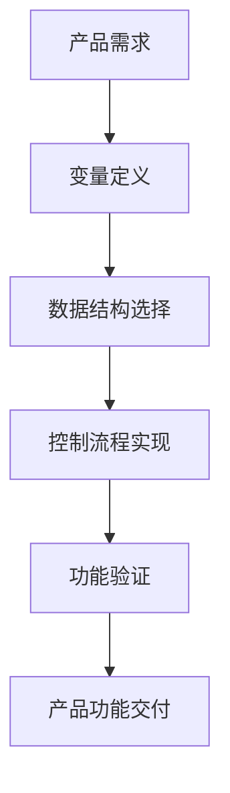

# Python基础语法与数据结构

## 核心概念解释

### Python是什么？
Python是一种高级编程语言，以其简洁易读的语法和强大的生态系统而闻名。对于产品经理来说，理解Python的基础语法和数据结构是看懂AI相关代码的第一步。

### 为什么产品经理需要了解Python？
- **沟通效率**：与开发团队更有效地沟通AI功能需求
- **代码理解**：能够阅读和理解AI相关的Python代码
- **需求评估**：评估技术实现的可行性和复杂度
- **功能规划**：基于技术能力规划合理的产品功能

## 基础语法

### 变量与数据类型

```python
# 变量定义
name = "产品经理"
age = 30
is_ai_related = True

# 数据类型
string_type = "字符串"
integer_type = 123
float_type = 123.45
bool_type = False
```

### 控制流程

```python
# 条件语句
if age >= 18:
    print("成年人")
elif age >= 12:
    print("青少年")
else:
    print("儿童")

# 循环语句
for i in range(5):
    print(f"第{i+1}次循环")

# while循环
count = 0
while count < 3:
    print(f"当前计数: {count}")
    count += 1
```

## 数据结构

### 列表 (List)

```python
# 列表定义
product_features = ["用户界面", "AI推荐", "数据分析"]

# 列表操作
product_features.append("安全保障")  # 添加元素
product_features[0] = "优化用户界面"  # 修改元素
product_features.remove("AI推荐")  # 删除元素
```

### 字典 (Dictionary)

```python
# 字典定义
product_info = {
    "name": "智能推荐系统",
    "version": "1.0",
    "features": ["个性化推荐", "实时更新"]
}

# 字典操作
product_info["status"] = "开发中"  # 添加键值对
product_info["version"] = "1.1"  # 修改值
```

### 元组 (Tuple)

```python
# 元组定义（不可变）
product_coordinates = (30.2672, -97.7431)  # 经纬度
```

### 集合 (Set)

```python
# 集合定义（无序且唯一）
user_tags = {"AI爱好者", "产品经理", "技术学习者"}
```

## 调用链路分析



## 工具与概念对照表

| 概念 | 描述 | 应用场景 |
|------|------|----------|
| 变量 | 存储数据的容器 | 存储用户输入、配置参数 |
| 列表 | 有序可变的元素集合 | 存储产品功能列表、用户反馈 |
| 字典 | 键值对映射 | 存储产品配置、用户信息 |
| 元组 | 有序不可变的元素集合 | 存储固定配置、坐标信息 |
| 集合 | 无序唯一的元素集合 | 存储标签、用户群体 |
| 条件语句 | 根据条件执行不同代码 | 实现功能开关、权限控制 |
| 循环语句 | 重复执行代码 | 批量处理数据、生成报表 |

## 实际应用场景

### AI产品开发案例：个性化推荐系统

**需求**：为电商平台开发个性化商品推荐功能

**实现流程**：
1. **数据收集**：使用列表存储用户浏览历史
2. **数据处理**：使用字典存储用户偏好标签
3. **推荐算法**：使用条件语句和循环处理推荐逻辑
4. **结果展示**：将推荐结果存储在列表中返回给前端

**代码示例**：

```python
# 模拟用户浏览历史
user_history = ["智能手机", "无线耳机", "智能手表"]

# 模拟商品库
products = [
    {"name": "智能手机A", "category": "手机"},
    {"name": "无线耳机B", "category": "音频"},
    {"name": "智能手表C", "category": "穿戴"},
    {"name": "平板电脑D", "category": "平板"}
]

# 简单推荐逻辑
def recommend_products(user_history, products):
    recommendations = []
    
    # 分析用户历史，提取类别
    categories = set()
    for item in user_history:
        for product in products:
            if item in product["name"]:
                categories.add(product["category"])
    
    # 基于类别推荐
    for product in products:
        if product["category"] in categories and product["name"] not in user_history:
            recommendations.append(product["name"])
    
    return recommendations

# 调用推荐函数
recommended = recommend_products(user_history, products)
print("推荐商品:", recommended)
```

## 总结

Python的基础语法和数据结构是理解AI代码的基石。作为产品经理，掌握这些基础知识可以：

1. 更准确地理解技术团队的实现方案
2. 更合理地规划产品功能和迭代计划
3. 更有效地评估技术可行性和风险
4. 更顺畅地与开发团队沟通需求

通过本文档的学习，您已经了解了Python的基本语法和常用数据结构，为后续学习AI相关的Python库和代码分析打下了基础。