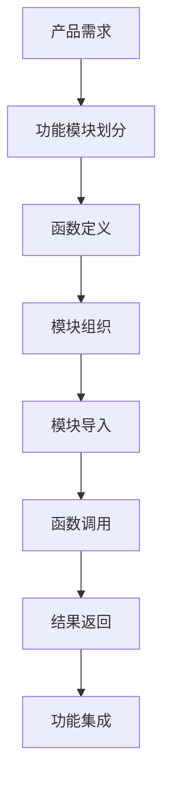

# 函数定义与模块化编程

## 核心概念解释

### 函数是什么？
函数是Python中可重用的代码块，用于执行特定的任务。对于产品经理来说，理解函数的概念和结构有助于理解AI代码的组织方式和执行流程。

### 为什么产品经理需要了解函数和模块化编程？
- **代码结构理解**：理解AI项目的代码组织结构
- **功能边界识别**：识别不同功能模块的职责和边界
- **需求分解能力**：将产品需求分解为可实现的功能模块
- **技术沟通效率**：与开发团队更准确地讨论技术实现方案

## 函数定义与调用

### 函数定义

```python
def calculate_discount(price, discount_rate):
    """
    计算折扣后的价格
    
    Args:
        price: 原价
        discount_rate: 折扣率（0-1之间）
    
    Returns:
        折扣后的价格
    """
    discounted_price = price * (1 - discount_rate)
    return discounted_price
```

### 函数调用

```python
# 调用函数
original_price = 100
discount = 0.2
final_price = calculate_discount(original_price, discount)
print(f"折扣后的价格: {final_price}")  # 输出: 折扣后的价格: 80.0
```

### 函数参数类型

```python
# 位置参数
def create_product(name, price, category):
    return {"name": name, "price": price, "category": category}

# 关键字参数
product = create_product(name="智能手表", price=1999, category="穿戴设备")

# 默认参数
def create_user(name, email, role="user"):
    return {"name": name, "email": email, "role": role}

# 可变参数
def calculate_average(*numbers):
    if not numbers:
        return 0
    return sum(numbers) / len(numbers)

# 关键字可变参数
def create_config(**kwargs):
    return kwargs
```

## 模块化编程

### 模块导入

```python
# 导入整个模块
import math

# 使用模块中的函数
radius = 5
area = math.pi * math.pow(radius, 2)

# 导入特定函数
from math import pi, pow

# 使用导入的函数
area = pi * pow(radius, 2)

# 导入并别名
import numpy as np

# 使用别名
array = np.array([1, 2, 3])
```

### 包的结构

```
my_ai_project/
├── __init__.py        # 标记为包
├── data/
│   ├── __init__.py
│   ├── loader.py      # 数据加载模块
│   └── preprocessor.py # 数据预处理模块
├── models/
│   ├── __init__.py
│   ├── classifier.py  # 分类模型
│   └── regressor.py   # 回归模型
└── utils/
    ├── __init__.py
    └── helpers.py     # 辅助函数
```

### 自定义模块示例

```python
# utils/helpers.py
def validate_input(data):
    """验证输入数据"""
    if not data:
        return False
    return True

def format_output(result):
    """格式化输出结果"""
    return {"status": "success", "data": result}
```

```python
# 使用自定义模块
from utils.helpers import validate_input, format_output

user_input = {"name": "产品经理", "age": 30}

if validate_input(user_input):
    result = {"user": user_input, "message": "验证通过"}
    formatted_result = format_output(result)
    print(formatted_result)
```

## 调用链路分析



## 工具与概念对照表

| 概念 | 描述 | 应用场景 |
|------|------|----------|
| 函数 | 可重用的代码块 | 封装特定功能，如数据处理、模型预测 |
| 参数 | 函数的输入值 | 传递配置、数据等信息 |
| 返回值 | 函数的输出结果 | 返回处理结果、状态信息 |
| 模块 | 包含函数和变量的Python文件 | 组织相关功能代码 |
| 包 | 包含多个模块的目录 | 组织大型项目的代码结构 |
| 导入 | 引入其他模块的功能 | 复用代码，避免重复开发 |
| 命名空间 | 变量和函数的作用范围 | 避免命名冲突 |

## 实际应用场景

### AI产品开发案例：情感分析系统

**需求**：开发一个用户评论情感分析功能，分析用户对产品的情感倾向

**实现流程**：
1. **数据收集模块**：收集用户评论数据
2. **预处理模块**：清洗和预处理文本数据
3. **分析模块**：使用情感分析模型分析情感倾向
4. **结果处理模块**：格式化和存储分析结果

**代码示例**：

```python
# 数据收集模块 (data/collector.py)
def collect_comments(product_id):
    """收集指定产品的用户评论"""
    # 模拟数据收集
    comments = [
        "产品质量很好，非常满意",
        "价格有点贵，但功能不错",
        "物流很慢，体验很差"
    ]
    return comments

# 预处理模块 (data/preprocessor.py)
def preprocess_text(text):
    """预处理文本数据"""
    # 简单的文本清洗
    text = text.lower()
    return text

def preprocess_comments(comments):
    """预处理评论列表"""
    return [preprocess_text(comment) for comment in comments]

# 分析模块 (models/analyzer.py)
def analyze_sentiment(text):
    """分析文本情感"""
    # 简单的情感分析逻辑
    positive_words = ["好", "满意", "不错", "喜欢"]
    negative_words = ["贵", "慢", "差", "失望"]
    
    positive_count = sum(1 for word in positive_words if word in text)
    negative_count = sum(1 for word in negative_words if word in text)
    
    if positive_count > negative_count:
        return "positive"
    elif negative_count > positive_count:
        return "negative"
    else:
        return "neutral"

def analyze_comments(comments):
    """分析评论情感"""
    results = []
    for comment in comments:
        sentiment = analyze_sentiment(comment)
        results.append({"comment": comment, "sentiment": sentiment})
    return results

# 结果处理模块 (utils/processor.py)
def format_results(results):
    """格式化分析结果"""
    summary = {
        "total_comments": len(results),
        "positive": sum(1 for r in results if r["sentiment"] == "positive"),
        "negative": sum(1 for r in results if r["sentiment"] == "negative"),
        "neutral": sum(1 for r in results if r["sentiment"] == "neutral")
    }
    return {"details": results, "summary": summary}

# 主函数 (main.py)
def analyze_product_sentiment(product_id):
    """分析产品评论情感"""
    # 1. 收集评论
    comments = collect_comments(product_id)
    
    # 2. 预处理评论
    processed_comments = preprocess_comments(comments)
    
    # 3. 分析情感
    analysis_results = analyze_comments(processed_comments)
    
    # 4. 格式化结果
    formatted_results = format_results(analysis_results)
    
    return formatted_results

# 调用示例
if __name__ == "__main__":
    product_id = "P12345"
    results = analyze_product_sentiment(product_id)
    print("情感分析结果:")
    print(f"总评论数: {results['summary']['total_comments']}")
    print(f"正面评论: {results['summary']['positive']}")
    print(f"负面评论: {results['summary']['negative']}")
    print(f"中性评论: {results['summary']['neutral']}")
```

## 总结

函数定义与模块化编程是Python中组织代码的核心方式，对于理解AI项目的结构至关重要。作为产品经理，掌握这些概念可以：

1. **理解代码组织结构**：识别AI项目的模块划分和功能边界
2. **评估开发复杂度**：基于模块数量和依赖关系评估开发工作量
3. **优化需求设计**：基于模块化思想设计更合理的产品功能
4. **提高沟通效率**：与开发团队使用共同的技术语言讨论实现方案

通过本文档的学习，您已经了解了Python函数的定义和调用方式，以及模块化编程的基本概念，为理解AI项目的代码结构打下了基础。