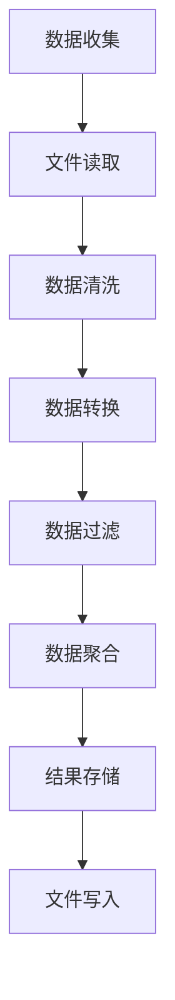

# 文件操作与数据处理基础

## 核心概念解释

### 文件操作是什么？
文件操作是指在Python中对文件进行读写、创建、删除等操作。对于产品经理来说，理解文件操作有助于理解AI系统如何存储和处理数据。

### 数据处理基础是什么？
数据处理基础是指对数据进行清洗、转换、分析等操作的基本方法。在AI项目中，数据处理是模型训练和预测的重要环节。

### 为什么产品经理需要了解文件操作与数据处理？
- **数据理解**：理解AI系统如何处理和存储数据
- **需求设计**：基于数据处理能力设计合理的产品功能
- **性能评估**：评估数据处理对系统性能的影响
- **问题定位**：在数据相关问题时能够与开发团队有效沟通

## 文件操作

### 文件读取

```python
# 读取文本文件
with open("user_comments.txt", "r", encoding="utf-8") as file:
    content = file.read()
    print(content)

# 逐行读取
with open("user_comments.txt", "r", encoding="utf-8") as file:
    for line in file:
        print(line.strip())
```

### 文件写入

```python
# 写入文本文件
with open("output.txt", "w", encoding="utf-8") as file:
    file.write("这是写入的内容\n")
    file.write("第二行内容\n")

# 追加内容
with open("output.txt", "a", encoding="utf-8") as file:
    file.write("追加的内容\n")
```

### JSON文件操作

```python
import json

# 写入JSON文件
user_data = {
    "name": "产品经理",
    "age": 30,
    "interests": ["AI", "产品设计", "数据分析"]
}

with open("user_data.json", "w", encoding="utf-8") as file:
    json.dump(user_data, file, ensure_ascii=False, indent=2)

# 读取JSON文件
with open("user_data.json", "r", encoding="utf-8") as file:
    data = json.load(file)
    print(data["name"])
    print(data["interests"])
```

### CSV文件操作

```python
import csv

# 写入CSV文件
with open("products.csv", "w", newline="", encoding="utf-8") as file:
    writer = csv.writer(file)
    writer.writerow(["产品ID", "名称", "价格"])
    writer.writerow(["P001", "智能手机", 5999])
    writer.writerow(["P002", "平板电脑", 3999])

# 读取CSV文件
with open("products.csv", "r", encoding="utf-8") as file:
    reader = csv.reader(file)
    for row in reader:
        print(row)
```

## 数据处理基础

### 数据清洗

```python
# 数据清洗示例
def clean_data(data):
    """清洗数据"""
    cleaned_data = []
    for item in data:
        # 移除空值
        if item and item.strip():
            # 转换为小写
            cleaned_item = item.strip().lower()
            cleaned_data.append(cleaned_item)
    return cleaned_data

# 示例使用
raw_data = ["  AI产品  ", "", "产品设计", "  数据分析  ", ""]
cleaned_data = clean_data(raw_data)
print("清洗后的数据:", cleaned_data)
```

### 数据转换

```python
# 数据转换示例
def transform_data(data):
    """转换数据格式"""
    transformed = []
    for item in data:
        # 转换为字典格式
        product_info = {
            "id": item[0],
            "name": item[1],
            "price": float(item[2])
        }
        transformed.append(product_info)
    return transformed

# 示例使用
csv_data = [["P001", "智能手机", "5999"], ["P002", "平板电脑", "3999"]]
transformed_data = transform_data(csv_data)
print("转换后的数据:", transformed_data)
```

### 数据过滤

```python
# 数据过滤示例
def filter_data(data, min_price):
    """过滤价格大于等于指定值的产品"""
    filtered = []
    for product in data:
        if product["price"] >= min_price:
            filtered.append(product)
    return filtered

# 示例使用
products = [
    {"id": "P001", "name": "智能手机", "price": 5999},
    {"id": "P002", "平板电脑": "平板电脑", "price": 3999},
    {"id": "P003", "name": "智能手表", "price": 1999}
]
filtered_products = filter_data(products, 3000)
print("过滤后的数据:", filtered_products)
```

### 数据聚合

```python
# 数据聚合示例
def aggregate_data(data):
    """聚合数据，计算平均价格"""
    total_price = 0
    count = 0
    for product in data:
        total_price += product["price"]
        count += 1
    if count > 0:
        average_price = total_price / count
        return {
            "total_products": count,
            "total_price": total_price,
            "average_price": average_price
        }
    return {"total_products": 0, "total_price": 0, "average_price": 0}

# 示例使用
products = [
    {"id": "P001", "name": "智能手机", "price": 5999},
    {"id": "P002", "name": "平板电脑", "price": 3999},
    {"id": "P003", "name": "智能手表", "price": 1999}
]
aggregated = aggregate_data(products)
print("聚合结果:", aggregated)
```

## 调用链路分析



## 工具与概念对照表

| 概念 | 描述 | 应用场景 |
|------|------|----------|
| 文件读取 | 从文件中读取数据 | 加载训练数据、配置文件 |
| 文件写入 | 将数据写入文件 | 保存模型结果、日志记录 |
| JSON操作 | 处理JSON格式数据 | 配置文件、API响应 |
| CSV操作 | 处理CSV格式数据 | 表格数据、批量数据 |
| 数据清洗 | 去除脏数据、空值 | 提高数据质量 |
| 数据转换 | 转换数据格式 | 适配不同系统需求 |
| 数据过滤 | 筛选符合条件的数据 | 提取有效信息 |
| 数据聚合 | 汇总统计数据 | 生成分析报告 |

## 实际应用场景

### AI产品开发案例：用户行为分析系统

**需求**：开发一个用户行为分析系统，分析用户在产品中的行为模式

**实现流程**：
1. **数据收集**：从日志文件中读取用户行为数据
2. **数据清洗**：去除无效数据和异常值
3. **数据转换**：将原始数据转换为可分析格式
4. **数据过滤**：筛选特定时间段或特定用户的行为
5. **数据聚合**：计算用户行为指标
6. **结果存储**：将分析结果写入文件

**代码示例**：

```python
import json
import csv
from datetime import datetime

# 1. 数据收集 - 读取日志文件
def load_user_logs(log_file):
    """加载用户行为日志"""
    logs = []
    with open(log_file, "r", encoding="utf-8") as file:
        for line in file:
            try:
                log = json.loads(line.strip())
                logs.append(log)
            except json.JSONDecodeError:
                pass
    return logs

# 2. 数据清洗 - 去除无效数据
def clean_logs(logs):
    """清洗日志数据"""
    cleaned = []
    for log in logs:
        # 检查必要字段
        if all(key in log for key in ["user_id", "action", "timestamp"]):
            # 转换时间戳
            try:
                log["timestamp"] = datetime.fromisoformat(log["timestamp"])
                cleaned.append(log)
            except ValueError:
                pass
    return cleaned

# 3. 数据转换 - 标准化数据格式
def transform_logs(logs):
    """转换日志数据格式"""
    transformed = []
    for log in logs:
        transformed_log = {
            "user_id": log["user_id"],
            "action": log["action"],
            "timestamp": log["timestamp"],
            "date": log["timestamp"].date(),
            "hour": log["timestamp"].hour
        }
        transformed.append(transformed_log)
    return transformed

# 4. 数据过滤 - 筛选特定时间范围的数据
def filter_logs(logs, start_date, end_date):
    """筛选指定时间范围的日志"""
    filtered = []
    for log in logs:
        if start_date <= log["date"] <= end_date:
            filtered.append(log)
    return filtered

# 5. 数据聚合 - 计算用户行为指标
def aggregate_logs(logs):
    """聚合日志数据"""
    # 按用户分组
    user_actions = {}
    for log in logs:
        user_id = log["user_id"]
        if user_id not in user_actions:
            user_actions[user_id] = {"actions": [], "count": 0}
        user_actions[user_id]["actions"].append(log["action"])
        user_actions[user_id]["count"] += 1
    
    # 计算每个用户的行为统计
    aggregates = []
    for user_id, data in user_actions.items():
        # 计算行为类型数
        action_types = set(data["actions"])
        aggregates.append({
            "user_id": user_id,
            "total_actions": data["count"],
            "action_types": len(action_types),
            "most_common_action": max(set(data["actions"]), key=data["actions"].count)
        })
    
    return aggregates

# 6. 结果存储 - 将分析结果写入CSV文件
def save_analysis(results, output_file):
    """保存分析结果"""
    with open(output_file, "w", newline="", encoding="utf-8") as file:
        writer = csv.writer(file)
        writer.writerow(["用户ID", "总行为数", "行为类型数", "最常见行为"])
        for result in results:
            writer.writerow([
                result["user_id"],
                result["total_actions"],
                result["action_types"],
                result["most_common_action"]
            ])

# 主函数
def analyze_user_behavior(log_file, output_file, start_date, end_date):
    """分析用户行为"""
    # 1. 加载日志
    logs = load_user_logs(log_file)
    print(f"加载了 {len(logs)} 条日志")
    
    # 2. 清洗日志
    cleaned_logs = clean_logs(logs)
    print(f"清洗后剩余 {len(cleaned_logs)} 条日志")
    
    # 3. 转换日志
    transformed_logs = transform_logs(cleaned_logs)
    
    # 4. 过滤日志
    filtered_logs = filter_logs(transformed_logs, start_date, end_date)
    print(f"筛选后剩余 {len(filtered_logs)} 条日志")
    
    # 5. 聚合日志
    aggregates = aggregate_logs(filtered_logs)
    print(f"分析了 {len(aggregates)} 个用户的行为")
    
    # 6. 保存结果
    save_analysis(aggregates, output_file)
    print(f"分析结果已保存到 {output_file}")

# 调用示例
if __name__ == "__main__":
    # 模拟日志文件
    sample_logs = [
        '{"user_id": "U001", "action": "view_product", "timestamp": "2026-03-01T10:00:00"}',
        '{"user_id": "U001", "action": "add_to_cart", "timestamp": "2026-03-01T10:05:00"}',
        '{"user_id": "U002", "action": "view_product", "timestamp": "2026-03-01T11:00:00"}',
        '{"user_id": "U001", "action": "checkout", "timestamp": "2026-03-01T10:10:00"}',
        '{"user_id": "U002", "action": "view_product", "timestamp": "2026-03-02T09:00:00"}'
    ]
    
    # 写入模拟日志
    with open("user_logs.txt", "w", encoding="utf-8") as file:
        for log in sample_logs:
            file.write(log + "\n")
    
    # 分析用户行为
    analyze_user_behavior(
        "user_logs.txt",
        "user_behavior_analysis.csv",
        datetime(2026, 3, 1).date(),
        datetime(2026, 3, 2).date()
    )
```

## 总结

文件操作与数据处理是AI项目中的基础环节，对于产品经理来说，理解这些概念可以：

1. **理解数据流程**：了解AI系统如何处理和存储数据
2. **设计合理需求**：基于数据处理能力设计可行的产品功能
3. **评估技术可行性**：评估数据相关需求的实现难度
4. **优化产品体验**：基于数据处理效率优化用户体验

通过本文档的学习，您已经了解了Python的文件操作和数据处理基础，为理解AI项目的数据流程打下了基础。