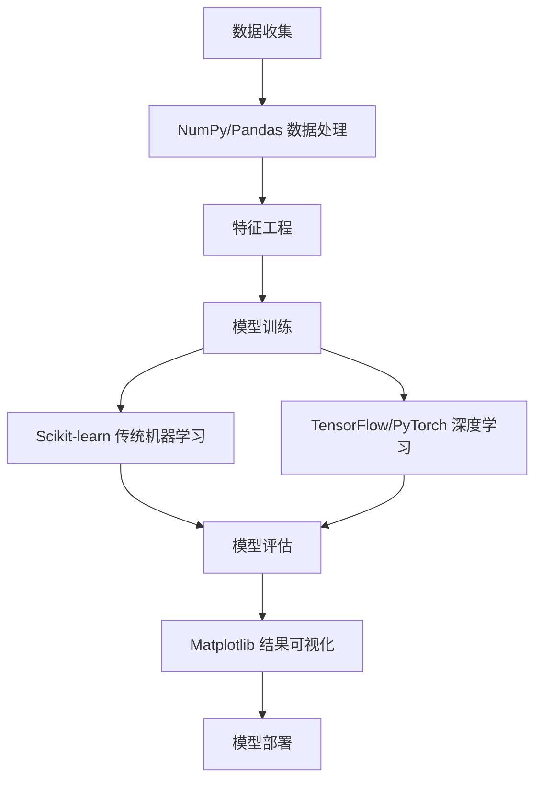

# AI开发常用Python库概览

## 核心概念解释

### AI开发常用Python库是什么？
AI开发常用Python库是指在人工智能和机器学习开发中常用的Python第三方库。这些库提供了丰富的功能，简化了AI模型的开发和部署过程。

### 为什么产品经理需要了解这些库？
- **技术理解**：理解AI项目中使用的核心技术栈
- **需求评估**：评估功能的技术可行性和实现难度
- **资源规划**：了解项目所需的依赖和资源
- **沟通效率**：与开发团队使用共同的技术语言

## 常用AI库介绍

### NumPy

**核心功能**：科学计算库，提供多维数组和矩阵运算

**安装**：
```bash
pip install numpy
```

**基本用法**：
```python
import numpy as np

# 创建数组
arr = np.array([1, 2, 3, 4, 5])

# 矩阵运算
matrix = np.array([[1, 2], [3, 4]])
result = np.dot(matrix, matrix)  # 矩阵乘法

# 统计功能
mean = np.mean(arr)  # 平均值
std = np.std(arr)    # 标准差
```

**应用场景**：数据预处理、特征工程、数值计算

### Pandas

**核心功能**：数据处理和分析库，提供DataFrame数据结构

**安装**：
```bash
pip install pandas
```

**基本用法**：
```python
import pandas as pd

# 创建DataFrame
data = {
    'name': ['产品A', '产品B', '产品C'],
    'price': [100, 200, 300],
    'sales': [1000, 2000, 1500]
}
df = pd.DataFrame(data)

# 数据操作
filtered = df[df['sales'] > 1500]  # 筛选
mean_price = df['price'].mean()     # 计算均值

# 数据读取
# df = pd.read_csv('data.csv')  # 读取CSV文件
# df = pd.read_excel('data.xlsx')  # 读取Excel文件
```

**应用场景**：数据清洗、数据探索、特征工程

### Scikit-learn

**核心功能**：机器学习库，提供常用的机器学习算法

**安装**：
```bash
pip install scikit-learn
```

**基本用法**：
```python
from sklearn.model_selection import train_test_split
from sklearn.linear_model import LinearRegression
from sklearn.metrics import mean_squared_error

# 示例数据
X = [[1], [2], [3], [4], [5]]  # 特征
y = [2, 4, 6, 8, 10]           # 标签

# 划分训练集和测试集
X_train, X_test, y_train, y_test = train_test_split(X, y, test_size=0.2)

# 训练模型
model = LinearRegression()
model.fit(X_train, y_train)

# 预测
predictions = model.predict(X_test)

# 评估
mse = mean_squared_error(y_test, predictions)
print(f"均方误差: {mse}")
```

**应用场景**：分类、回归、聚类、特征选择

### TensorFlow

**核心功能**：深度学习框架，用于构建和训练神经网络

**安装**：
```bash
pip install tensorflow
```

**基本用法**：
```python
import tensorflow as tf
from tensorflow.keras.models import Sequential
from tensorflow.keras.layers import Dense

# 创建模型
model = Sequential([
    Dense(64, activation='relu', input_shape=(10,)),
    Dense(32, activation='relu'),
    Dense(1, activation='sigmoid')
])

# 编译模型
model.compile(optimizer='adam',
              loss='binary_crossentropy',
              metrics=['accuracy'])

# 训练模型
# model.fit(X_train, y_train, epochs=10, batch_size=32)

# 预测
# predictions = model.predict(X_test)
```

**应用场景**：图像识别、自然语言处理、语音识别

### PyTorch

**核心功能**：深度学习框架，提供动态计算图

**安装**：
```bash
pip install torch torchvision
```

**基本用法**：
```python
import torch
import torch.nn as nn

# 创建模型
class SimpleModel(nn.Module):
    def __init__(self):
        super(SimpleModel, self).__init__()
        self.fc1 = nn.Linear(10, 64)
        self.fc2 = nn.Linear(64, 32)
        self.fc3 = nn.Linear(32, 1)
    
    def forward(self, x):
        x = torch.relu(self.fc1(x))
        x = torch.relu(self.fc2(x))
        x = torch.sigmoid(self.fc3(x))
        return x

model = SimpleModel()

# 损失函数和优化器
criterion = nn.BCELoss()
optimizer = torch.optim.Adam(model.parameters(), lr=0.001)

# 训练循环
# for epoch in range(10):
#     optimizer.zero_grad()
#     outputs = model(inputs)
#     loss = criterion(outputs, targets)
#     loss.backward()
#     optimizer.step()
```

**应用场景**：深度学习研究、计算机视觉、自然语言处理

### NLTK

**核心功能**：自然语言处理库，提供文本处理工具

**安装**：
```bash
pip install nltk
```

**基本用法**：
```python
import nltk
from nltk.tokenize import word_tokenize
from nltk.corpus import stopwords

# 下载必要的数据
# nltk.download('punkt')
# nltk.download('stopwords')

# 文本分词
text = "产品经理需要了解AI开发常用的Python库"
tokens = word_tokenize(text)

# 去除停用词
stop_words = set(stopwords.words('chinese'))
filtered_tokens = [word for word in tokens if word not in stop_words]

print("分词结果:", tokens)
print("去除停用词后:", filtered_tokens)
```

**应用场景**：文本分析、情感分析、聊天机器人

### spaCy

**核心功能**：自然语言处理库，提供高效的文本处理

**安装**：
```bash
pip install spacy
python -m spacy download zh_core_web_sm
```

**基本用法**：
```python
import spacy

# 加载模型
nlp = spacy.load('zh_core_web_sm')

# 处理文本
doc = nlp("产品经理需要了解AI开发常用的Python库")

# 实体识别
for ent in doc.ents:
    print(f"实体: {ent.text}, 类型: {ent.label_}")

# 词性标注
for token in doc:
    print(f"词: {token.text}, 词性: {token.pos_}")
```

**应用场景**：命名实体识别、文本分类、信息提取

### Matplotlib

**核心功能**：数据可视化库，用于创建图表

**安装**：
```bash
pip install matplotlib
```

**基本用法**：
```python
import matplotlib.pyplot as plt
import numpy as np

# 生成数据
x = np.linspace(0, 10, 100)
y = np.sin(x)

# 创建图表
plt.figure(figsize=(10, 6))
plt.plot(x, y, label='正弦曲线')
plt.title('正弦函数图像')
plt.xlabel('x')
plt.ylabel('sin(x)')
plt.legend()
plt.grid(True)

# 显示图表
# plt.show()

# 保存图表
# plt.savefig('sin_wave.png')
```

**应用场景**：数据可视化、模型性能分析、结果展示

## 调用链路分析



## 工具与概念对照表

| 库 | 核心功能 | 应用场景 | 优势 |
|----|----------|----------|------|
| NumPy | 科学计算 | 数值计算、矩阵运算 | 高效的数组操作 |
| Pandas | 数据处理 | 数据清洗、分析 | 强大的数据结构和操作 |
| Scikit-learn | 机器学习 | 分类、回归、聚类 | 简单易用的API |
| TensorFlow | 深度学习 | 神经网络、复杂模型 | 强大的生态系统 |
| PyTorch | 深度学习 | 研究、原型开发 | 动态计算图、易用性 |
| NLTK | 自然语言处理 | 文本分析、分词 | 丰富的语料库 |
| spaCy | 自然语言处理 | 实体识别、文本分类 | 高性能、生产就绪 |
| Matplotlib | 数据可视化 | 图表创建、结果展示 | 灵活的绘图功能 |

## 实际应用场景

### AI产品开发案例：智能客服系统

**需求**：开发一个智能客服系统，能够自动回答用户问题

**实现流程**：
1. **数据收集**：收集用户问题和答案数据
2. **数据预处理**：使用NLTK或spaCy进行文本处理
3. **特征提取**：将文本转换为向量表示
4. **模型训练**：使用TensorFlow或PyTorch构建和训练模型
5. **模型评估**：评估模型性能
6. **部署上线**：将模型部署为API服务

**代码示例**：

```python
import pandas as pd
import numpy as np
from sklearn.model_selection import train_test_split
from sklearn.feature_extraction.text import TfidfVectorizer
from sklearn.svm import SVC
from sklearn.metrics import accuracy_score

# 1. 数据收集与预处理
data = {
    'question': [
        '如何重置密码',
        '忘记密码怎么办',
        '如何修改个人信息',
        '怎么更新资料',
        '如何查看订单',
        '订单在哪里查看'
    ],
    'intent': [
        'reset_password',
        'reset_password',
        'update_profile',
        'update_profile',
        'view_order',
        'view_order'
    ]
}

df = pd.DataFrame(data)

# 2. 特征提取
vectorizer = TfidfVectorizer()
X = vectorizer.fit_transform(df['question'])
y = df['intent']

# 3. 划分训练集和测试集
X_train, X_test, y_train, y_test = train_test_split(X, y, test_size=0.3, random_state=42)

# 4. 训练模型
model = SVC(kernel='linear')
model.fit(X_train, y_train)

# 5. 评估模型
predictions = model.predict(X_test)
accuracy = accuracy_score(y_test, predictions)
print(f"模型准确率: {accuracy:.2f}")

# 6. 预测新问题
new_questions = ['我想修改密码', '我的订单在哪里']
new_X = vectorizer.transform(new_questions)
new_predictions = model.predict(new_X)

for question, intent in zip(new_questions, new_predictions):
    print(f"问题: {question} -> 意图: {intent}")
```

## 总结

AI开发常用的Python库是构建AI产品的基础工具，对于产品经理来说，了解这些库可以：

1. **理解技术实现**：了解AI功能是如何通过这些库实现的
2. **评估开发成本**：基于使用的库评估开发时间和资源需求
3. **优化产品设计**：基于库的能力和限制设计合理的产品功能
4. **提高沟通效率**：与开发团队使用共同的技术语言讨论实现方案

通过本文档的学习，您已经了解了AI开发中常用的Python库及其应用场景，为理解AI项目的技术栈打下了基础。