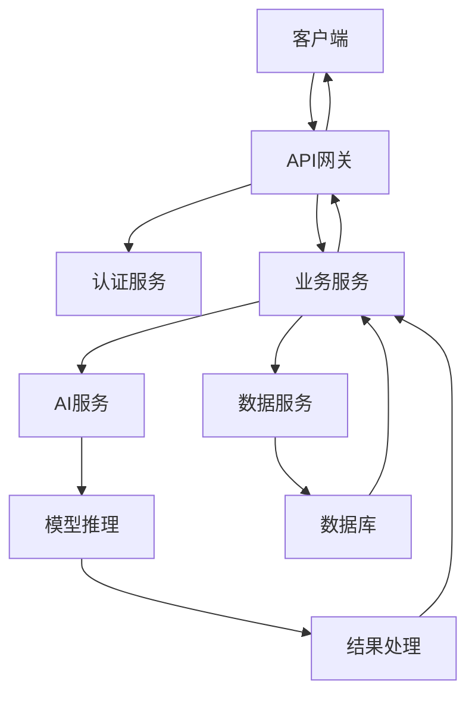

# API调用与服务集成模式

## 核心概念解释

### API是什么？
API（Application Programming Interface）是应用程序编程接口，是不同软件系统之间进行通信的桥梁。对于产品经理来说，理解API调用和服务集成模式有助于理解AI系统如何与其他服务交互。

### 服务集成模式是什么？
服务集成模式是指将不同的服务和系统连接起来的方法和架构。在AI产品中，服务集成模式决定了系统的可扩展性、可靠性和性能。

### 为什么产品经理需要了解API调用与服务集成？
- **功能设计**：设计需要与外部服务集成的产品功能
- **技术评估**：评估API集成的技术可行性和成本
- **性能优化**：了解集成模式对系统性能的影响
- **故障处理**：设计合理的错误处理和降级策略

## API调用基础

### HTTP请求

```python
import requests

# GET请求
response = requests.get('https://api.example.com/users')
print(response.status_code)
print(response.json())

# POST请求
data = {'name': '产品经理', 'email': 'pm@example.com'}
response = requests.post('https://api.example.com/users', json=data)
print(response.status_code)
print(response.json())

# 带参数的请求
params = {'page': 1, 'limit': 10}
response = requests.get('https://api.example.com/users', params=params)

# 带 headers 的请求
headers = {'Authorization': 'Bearer your_token'}
response = requests.get('https://api.example.com/protected', headers=headers)
```

### 错误处理

```python
import requests

try:
    response = requests.get('https://api.example.com/users', timeout=5)
    response.raise_for_status()  # 检查HTTP错误
    data = response.json()
except requests.exceptions.Timeout:
    print('请求超时')
except requests.exceptions.HTTPError as e:
    print(f'HTTP错误: {e}')
except requests.exceptions.RequestException as e:
    print(f'请求异常: {e}')
```

### API认证

```python
import requests

# API Key认证
headers = {'X-API-Key': 'your_api_key'}
response = requests.get('https://api.example.com/data', headers=headers)

# OAuth2认证
token_url = 'https://api.example.com/oauth/token'
payload = {
    'grant_type': 'client_credentials',
    'client_id': 'your_client_id',
    'client_secret': 'your_client_secret'
}
response = requests.post(token_url, data=payload)
token = response.json()['access_token']

# 使用token访问API
headers = {'Authorization': f'Bearer {token}'}
response = requests.get('https://api.example.com/protected', headers=headers)
```

## 服务集成模式

### 同步调用

**特点**：调用方等待服务响应后再继续执行

**适用场景**：实时性要求高、响应时间短的场景

**代码示例**：

```python
def process_order(order_id):
    # 同步调用支付服务
    payment_response = requests.post('https://payment-api.example.com/process', json={'order_id': order_id})
    payment_result = payment_response.json()
    
    # 等待支付结果后再继续
    if payment_result['status'] == 'success':
        # 处理成功逻辑
        update_order_status(order_id, 'paid')
    else:
        # 处理失败逻辑
        update_order_status(order_id, 'payment_failed')
```

### 异步调用

**特点**：调用方发送请求后不等待响应，继续执行其他任务

**适用场景**：响应时间长、非实时性要求的场景

**代码示例**：

```python
import threading

def send_analytics_data(data):
    def async_send():
        try:
            requests.post('https://analytics-api.example.com/track', json=data)
        except Exception as e:
            print(f'分析数据发送失败: {e}')
    
    # 创建线程异步发送
    thread = threading.Thread(target=async_send)
    thread.daemon = True
    thread.start()

# 主业务逻辑
def process_user_action(user_id, action):
    # 处理用户操作
    print(f'处理用户 {user_id} 的 {action} 操作')
    
    # 异步发送分析数据
    analytics_data = {'user_id': user_id, 'action': action, 'timestamp': datetime.now().isoformat()}
    send_analytics_data(analytics_data)
    
    # 继续执行其他任务，无需等待分析数据发送完成
    return '操作处理完成'
```

### 事件驱动集成

**特点**：通过事件发布和订阅机制进行集成

**适用场景**：松耦合、多系统集成的场景

**代码示例**：

```python
# 简化的事件发布订阅系统
class EventBus:
    def __init__(self):
        self.subscribers = {}
    
    def subscribe(self, event_type, callback):
        if event_type not in self.subscribers:
            self.subscribers[event_type] = []
        self.subscribers[event_type].append(callback)
    
    def publish(self, event_type, data):
        if event_type in self.subscribers:
            for callback in self.subscribers[event_type]:
                try:
                    callback(data)
                except Exception as e:
                    print(f'事件处理失败: {e}')

# 创建事件总线
event_bus = EventBus()

# 订阅订单创建事件
def handle_order_created(order_data):
    print(f'处理订单创建: {order_data}')
    # 调用库存服务
    requests.post('https://inventory-api.example.com/reserve', json=order_data)

# 订阅订单支付事件
def handle_order_paid(order_data):
    print(f'处理订单支付: {order_data}')
    # 调用物流服务
    requests.post('https://shipping-api.example.com/create', json=order_data)

# 注册订阅者
event_bus.subscribe('order_created', handle_order_created)
event_bus.subscribe('order_paid', handle_order_paid)

# 发布事件
def create_order(order_data):
    # 创建订单逻辑
    print('创建订单')
    # 发布订单创建事件
    event_bus.publish('order_created', order_data)
    return order_data

def pay_order(order_id):
    # 支付订单逻辑
    print(f'支付订单 {order_id}')
    # 发布订单支付事件
    event_bus.publish('order_paid', {'order_id': order_id})
    return {'order_id': order_id, 'status': 'paid'}
```

## 调用链路分析



## 工具与概念对照表

| 概念 | 描述 | 应用场景 | 优势 |
|------|------|----------|------|
| 同步调用 | 等待响应后继续执行 | 实时性要求高的场景 | 逻辑简单，易于实现 |
| 异步调用 | 不等待响应继续执行 | 响应时间长的场景 | 提高系统吞吐量 |
| 事件驱动 | 通过事件发布订阅集成 | 松耦合系统集成 | 灵活性高，可扩展性强 |
| API网关 | 统一API入口 | 多服务集成 | 集中管理，安全控制 |
| 微服务架构 | 服务化拆分 | 复杂系统 | 独立部署，易于维护 |
| 容器化 | 服务容器化部署 | 服务部署 | 环境一致性，易于扩展 |

## 实际应用场景

### AI产品开发案例：智能推荐系统集成

**需求**：将智能推荐系统集成到电商平台中

**实现流程**：
1. **API设计**：设计推荐API接口
2. **服务部署**：部署推荐模型服务
3. **集成方式**：选择合适的集成模式
4. **错误处理**：设计错误处理和降级策略
5. **性能优化**：优化API调用性能

**代码示例**：

```python
import requests
import time
import threading

# 推荐服务API
tRECOMMENDATION_API = 'https://recommendation-api.example.com/recommend'

# 同步调用推荐服务
def get_recommendations_sync(user_id, product_id):
    """同步获取推荐"""
    try:
        response = requests.post(
            RECOMMENDATION_API,
            json={'user_id': user_id, 'product_id': product_id},
            timeout=2
        )
        response.raise_for_status()
        return response.json()['recommendations']
    except Exception as e:
        print(f'推荐服务调用失败: {e}')
        # 返回默认推荐
        return get_default_recommendations()

# 异步获取推荐
def get_recommendations_async(user_id, callback):
    """异步获取推荐"""
    def fetch_recommendations():
        try:
            response = requests.post(
                RECOMMENDATION_API,
                json={'user_id': user_id}
            )
            response.raise_for_status()
            recommendations = response.json()['recommendations']
            callback(recommendations)
        except Exception as e:
            print(f'推荐服务调用失败: {e}')
            callback(get_default_recommendations())
    
    thread = threading.Thread(target=fetch_recommendations)
    thread.daemon = True
    thread.start()

# 获取默认推荐
def get_default_recommendations():
    """获取默认推荐"""
    return [
        {'id': 'P001', 'name': '热门商品A'},
        {'id': 'P002', 'name': '热门商品B'}
    ]

# 产品详情页集成
def product_detail_page(user_id, product_id):
    """产品详情页逻辑"""
    # 获取产品信息
    product = get_product_info(product_id)
    
    # 同步获取推荐（实时性要求高）
    recommendations = get_recommendations_sync(user_id, product_id)
    
    # 渲染页面
    return {
        'product': product,
        'recommendations': recommendations
    }

# 首页集成
def home_page(user_id):
    """首页逻辑"""
    # 获取最新商品
    latest_products = get_latest_products()
    
    # 异步获取推荐（实时性要求不高）
    def handle_recommendations(recommendations):
        # 更新缓存的推荐数据
        update_recommendation_cache(user_id, recommendations)
    
    get_recommendations_async(user_id, handle_recommendations)
    
    # 从缓存获取推荐（如果有）
    cached_recommendations = get_cached_recommendations(user_id)
    if not cached_recommendations:
        cached_recommendations = get_default_recommendations()
    
    # 渲染页面
    return {
        'latest_products': latest_products,
        'recommendations': cached_recommendations
    }

# 模拟函数
def get_product_info(product_id):
    return {'id': product_id, 'name': '示例产品', 'price': 999}

def get_latest_products():
    return [{'id': 'P003', 'name': '最新商品C'}, {'id': 'P004', 'name': '最新商品D'}]

def update_recommendation_cache(user_id, recommendations):
    print(f'更新用户 {user_id} 的推荐缓存')

def get_cached_recommendations(user_id):
    return None  # 模拟缓存未命中

# 调用示例
if __name__ == '__main__':
    # 产品详情页
    product_page = product_detail_page('U001', 'P001')
    print('产品详情页推荐:', product_page['recommendations'])
    
    # 首页
    home_page_data = home_page('U001')
    print('首页推荐:', home_page_data['recommendations'])
    
    # 等待异步操作完成
    time.sleep(1)
```

## 总结

API调用与服务集成是AI产品开发中的重要环节，对于产品经理来说，理解这些概念可以：

1. **设计合理的集成方案**：选择适合业务场景的集成模式
2. **评估技术可行性**：了解API集成的技术难度和成本
3. **优化用户体验**：基于集成模式设计流畅的用户体验
4. **规划系统架构**：从产品角度规划合理的系统架构

通过本文档的学习，您已经了解了API调用的基本方法和服务集成的常见模式，为理解AI系统的集成方案打下了基础。