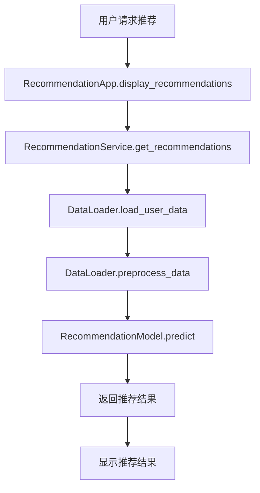
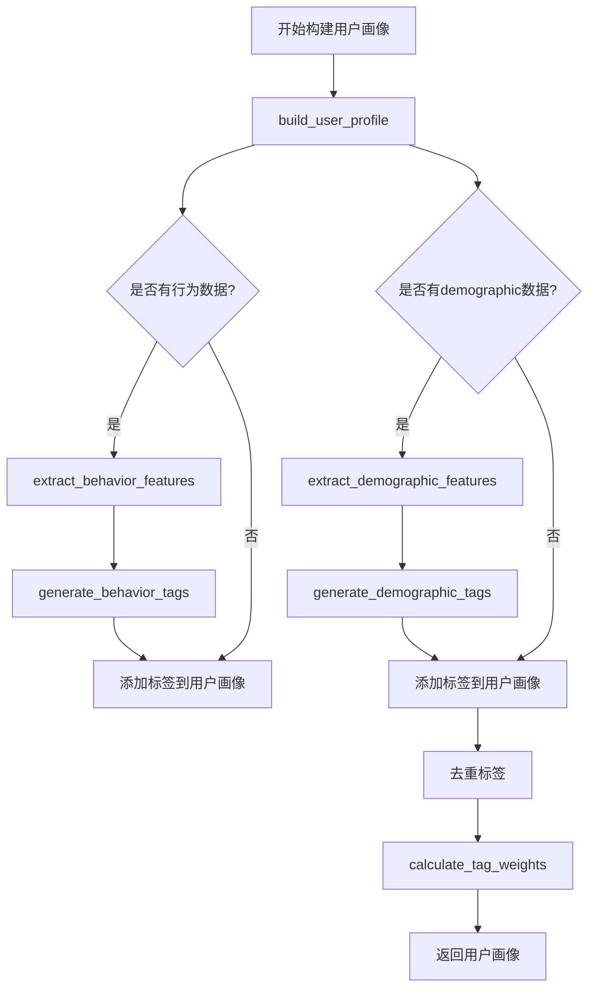

# 代码阅读与逻辑分析方法

## 核心概念解释

代码阅读与逻辑分析是产品经理理解AI技术实现的关键能力。作为产品经理，你不需要成为编码专家，但需要能够理解代码的基本结构、调用关系和业务逻辑，以便更好地与技术团队沟通，评估技术方案的可行性，并在产品设计中做出合理的技术决策。

### 关键概念

- **代码结构**：代码的组织方式，包括文件结构、目录层次和模块划分
- **调用链路**：函数或方法之间的调用关系，形成的执行路径
- **逻辑流程**：代码的执行顺序和条件分支
- **依赖关系**：模块或组件之间的相互依赖
- **性能瓶颈**：代码中影响执行效率的部分
- **设计模式**：解决特定问题的代码组织模式

## 代码示例

### 1. 代码结构分析示例

```python
# 示例：AI推荐系统的代码结构

# 1. 数据层 - 负责数据获取和预处理
class DataLoader:
    def load_user_data(self, user_id):
        # 加载用户数据
        pass
    
    def preprocess_data(self, raw_data):
        # 预处理数据
        pass

# 2. 模型层 - 负责推荐算法实现
class RecommendationModel:
    def __init__(self, model_type):
        # 初始化推荐模型
        pass
    
    def train(self, training_data):
        # 训练模型
        pass
    
    def predict(self, user_data):
        # 预测推荐结果
        pass

# 3. 服务层 - 负责业务逻辑和API接口
class RecommendationService:
    def __init__(self):
        self.data_loader = DataLoader()
        self.model = RecommendationModel("collaborative_filtering")
    
    def get_recommendations(self, user_id):
        # 1. 加载用户数据
        user_data = self.data_loader.load_user_data(user_id)
        
        # 2. 预处理数据
        processed_data = self.data_loader.preprocess_data(user_data)
        
        # 3. 生成推荐
        recommendations = self.model.predict(processed_data)
        
        # 4. 返回结果
        return recommendations

# 4. 应用层 - 负责用户交互和界面
class RecommendationApp:
    def __init__(self):
        self.service = RecommendationService()
    
    def display_recommendations(self, user_id):
        # 获取推荐
        recommendations = self.service.get_recommendations(user_id)
        
        # 显示结果
        print(f"为用户 {user_id} 推荐:")
        for item in recommendations:
            print(f"- {item}")

# 主函数
if __name__ == "__main__":
    app = RecommendationApp()
    app.display_recommendations(123)
```

### 2. 逻辑流程分析示例

```python
# 示例：用户画像构建逻辑

def build_user_profile(user_id, behavior_data, demographic_data):
    """
    构建用户画像的逻辑流程
    
    Args:
        user_id: 用户ID
        behavior_data: 用户行为数据
        demographic_data: 用户 demographic 数据
    
    Returns:
        user_profile: 构建好的用户画像
    """
    # 1. 初始化用户画像
    user_profile = {"user_id": user_id, "tags": []}
    
    # 2. 分析用户行为数据
    if behavior_data:
        # 提取行为特征
        behavior_features = extract_behavior_features(behavior_data)
        # 基于行为特征生成标签
        behavior_tags = generate_behavior_tags(behavior_features)
        user_profile["tags"].extend(behavior_tags)
    
    # 3. 分析用户 demographic 数据
    if demographic_data:
        # 提取 demographic 特征
        demographic_features = extract_demographic_features(demographic_data)
        # 基于 demographic 特征生成标签
        demographic_tags = generate_demographic_tags(demographic_features)
        user_profile["tags"].extend(demographic_tags)
    
    # 4. 去重标签
    user_profile["tags"] = list(set(user_profile["tags"]))
    
    # 5. 计算标签权重
    user_profile["tag_weights"] = calculate_tag_weights(user_profile["tags"])
    
    # 6. 返回用户画像
    return user_profile

# 辅助函数
def extract_behavior_features(behavior_data):
    # 提取行为特征
    pass

def generate_behavior_tags(features):
    # 生成行为标签
    pass

def extract_demographic_features(demographic_data):
    # 提取 demographic 特征
    pass

def generate_demographic_tags(features):
    # 生成 demographic 标签
    pass

def calculate_tag_weights(tags):
    # 计算标签权重
    pass
```

## 调用链路分析

### 推荐系统调用链路



### 用户画像构建调用链路



## 工具与概念对照表

| 工具/概念 | 描述 | 应用场景 | 优势 |
|---------|------|---------|------|
| 代码编辑器 | 用于查看和分析代码的工具，如VS Code、PyCharm | 代码阅读和分析 | 提供语法高亮、代码导航等功能 |
| 静态代码分析工具 | 分析代码结构和潜在问题的工具，如Pylint | 代码质量评估 | 自动检测代码问题和优化机会 |
| 调试器 | 用于跟踪代码执行过程的工具 | 逻辑流程分析 | 可以逐步执行代码，观察变量变化 |
| 调用图生成工具 | 生成代码调用关系图的工具 | 调用链路分析 | 可视化展示代码间的依赖关系 |
| UML图表 | 统一建模语言图表，如类图、时序图 | 系统架构分析 | 标准化的系统设计表示方法 |
| 代码注释 | 代码中的说明文字 | 代码理解 | 提供代码的设计意图和实现细节 |
| 文档生成工具 | 从代码生成文档的工具，如Sphinx | 代码文档化 | 自动生成结构化的代码文档 |
| 版本控制系统 | 管理代码变更的工具，如Git | 代码历史分析 | 跟踪代码的演进过程 |

## 实际应用场景

### AI产品开发案例：智能客服系统

#### 背景
某公司计划开发一个智能客服系统，使用AI技术自动回答用户问题，提高客服效率。

#### 代码阅读与分析过程

1. **系统架构分析**：
   - 查看项目目录结构，了解各个模块的职责
   - 分析主要文件和模块之间的依赖关系

2. **核心功能分析**：
   - 查看意图识别模块的代码，理解如何识别用户意图
   - 分析对话管理模块，了解如何处理多轮对话
   - 研究知识库查询模块，掌握知识检索的实现方式

3. **调用链路分析**：
   - 跟踪用户请求从接入到响应的完整流程
   - 分析各个模块之间的调用关系和数据传递

4. **性能瓶颈识别**：
   - 分析代码中的耗时操作，如知识库查询、模型推理等
   - 识别可能影响系统响应速度的部分

#### 产品经理的价值

1. **需求验证**：通过代码分析，验证技术方案是否能满足产品需求
2. **风险评估**：识别技术实现中的潜在风险和挑战
3. **功能优化**：基于代码分析结果，提出功能优化建议
4. **沟通桥梁**：能够与技术团队进行更有效的沟通，准确表达产品需求

#### 示例代码分析

```python
# 智能客服系统的核心流程

def handle_user_query(user_query):
    """
    处理用户查询的核心函数
    
    Args:
        user_query: 用户输入的查询
    
    Returns:
        response: 系统生成的响应
    """
    # 1. 预处理用户输入
    processed_query = preprocess_query(user_query)
    
    # 2. 识别用户意图
    intent = intent_classifier.classify(processed_query)
    
    # 3. 提取实体
    entities = entity_extractor.extract(processed_query)
    
    # 4. 根据意图和实体生成响应
    if intent == "product_inquiry":
        response = handle_product_inquiry(entities)
    elif intent == "order_status":
        response = handle_order_status(entities)
    elif intent == "technical_support":
        response = handle_technical_support(entities)
    else:
        response = handle_general_inquiry(processed_query)
    
    # 5. 后处理响应
    final_response = postprocess_response(response)
    
    # 6. 记录对话历史
    conversation_history.add(user_query, final_response)
    
    return final_response
```

通过分析这段代码，产品经理可以了解：
- 系统如何处理用户查询的完整流程
- 各个模块的职责和调用关系
- 意图识别和实体提取在系统中的作用
- 不同类型查询的处理逻辑

这种理解有助于产品经理在设计智能客服系统的功能时，更好地考虑技术实现的可行性和局限性，从而制定更合理的产品需求和功能规划。