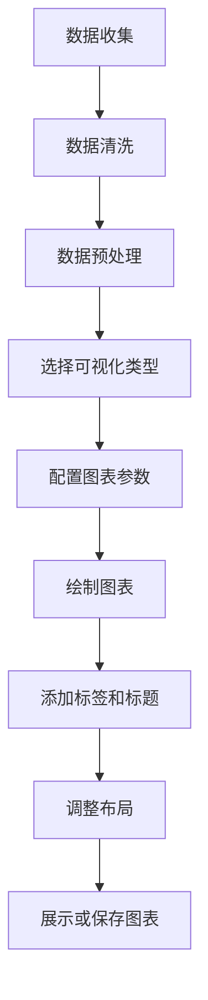
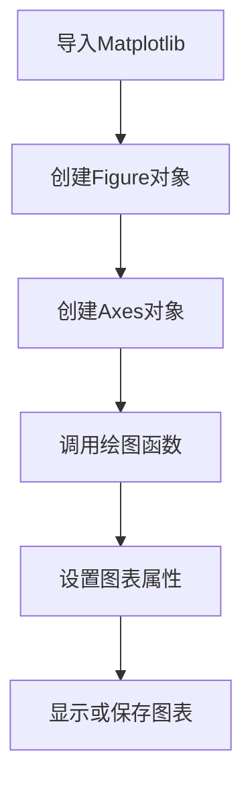

# 数据可视化基础

## 核心概念解释

数据可视化是将数据转化为图形或图像的过程，帮助人们更直观地理解数据中的模式、趋势和关系。对于产品经理来说，数据可视化是理解AI模型输出、分析用户行为、评估产品性能的重要工具。

### 关键概念

- **数据可视化**：将数据以图形、图表等形式呈现的过程
- **图表类型**：不同类型的图表适用于不同的数据展示需求，如折线图、柱状图、散点图等
- **数据维度**：数据的属性或特征，如时间、地点、用户群体等
- **交互性**：用户与可视化图表的互动能力，如缩放、筛选、悬停提示等
- **色彩编码**：使用颜色来表示数据的不同类别或数值范围
- **数据故事**：通过可视化讲述数据背后的故事和洞察

## 代码示例

### 1. 基础图表绘制

```python
# 示例：使用Matplotlib绘制基础图表
import matplotlib.pyplot as plt
import numpy as np

# 1. 折线图 - 展示时间序列数据
def plot_time_series():
    # 生成示例数据
    dates = np.arange('2023-01', '2023-13', dtype='datetime64[M]')
    values = np.random.randn(12) + np.arange(12) * 0.5
    
    # 创建图表
    plt.figure(figsize=(10, 6))
    plt.plot(dates, values, marker='o', linestyle='-', color='b')
    plt.title('月度销售趋势')
    plt.xlabel('月份')
    plt.ylabel('销售额')
    plt.grid(True)
    plt.xticks(rotation=45)
    plt.tight_layout()
    plt.show()

# 2. 柱状图 - 比较不同类别的数据
def plot_bar_chart():
    # 示例数据
    categories = ['产品A', '产品B', '产品C', '产品D']
    sales = [120, 190, 150, 220]
    
    # 创建图表
    plt.figure(figsize=(10, 6))
    plt.bar(categories, sales, color=['blue', 'green', 'red', 'purple'])
    plt.title('产品销售对比')
    plt.xlabel('产品')
    plt.ylabel('销售额')
    plt.grid(axis='y')
    plt.tight_layout()
    plt.show()

# 3. 散点图 - 展示两个变量之间的关系
def plot_scatter():
    # 生成示例数据
    x = np.random.randn(100) * 10
    y = x * 2 + np.random.randn(100) * 10
    
    # 创建图表
    plt.figure(figsize=(10, 6))
    plt.scatter(x, y, alpha=0.6, color='green')
    plt.title('变量X与Y的关系')
    plt.xlabel('变量X')
    plt.ylabel('变量Y')
    plt.grid(True)
    plt.tight_layout()
    plt.show()

# 4. 饼图 - 展示部分与整体的关系
def plot_pie_chart():
    # 示例数据
    labels = ['直接访问', '社交媒体', '搜索引擎', '其他']
    sizes = [30, 25, 40, 5]
    colors = ['gold', 'yellowgreen', 'lightcoral', 'lightskyblue']
    
    # 创建图表
    plt.figure(figsize=(8, 8))
    plt.pie(sizes, labels=labels, colors=colors, autopct='%1.1f%%', startangle=140)
    plt.title('流量来源分布')
    plt.axis('equal')  # 确保饼图是圆的
    plt.tight_layout()
    plt.show()

# 调用函数
plot_time_series()
plot_bar_chart()
plot_scatter()
plot_pie_chart()
```

### 2. 使用Seaborn进行统计数据可视化

```python
# 示例：使用Seaborn进行统计数据可视化
import seaborn as sns
import pandas as pd
import numpy as np

# 创建示例数据集
def create_sample_data():
    np.random.seed(42)
    data = {
        'category': np.repeat(['A', 'B', 'C'], 100),
        'value1': np.random.randn(300) + np.repeat([1, 2, 3], 100),
        'value2': np.random.randn(300) * 2 + np.repeat([2, 4, 6], 100)
    }
    return pd.DataFrame(data)

# 1. 箱线图 - 展示数据分布
def plot_boxplot(data):
    plt.figure(figsize=(10, 6))
    sns.boxplot(x='category', y='value1', data=data)
    plt.title('不同类别的值分布')
    plt.tight_layout()
    plt.show()

# 2. 热力图 - 展示相关性
def plot_heatmap(data):
    plt.figure(figsize=(10, 6))
    correlation = data.corr()
    sns.heatmap(correlation, annot=True, cmap='coolwarm')
    plt.title('变量相关性热力图')
    plt.tight_layout()
    plt.show()

# 3. 小提琴图 - 展示数据分布和密度
def plot_violinplot(data):
    plt.figure(figsize=(10, 6))
    sns.violinplot(x='category', y='value1', data=data)
    plt.title('不同类别的值分布')
    plt.tight_layout()
    plt.show()

# 4. 配对图 - 展示多个变量之间的关系
def plot_pairplot(data):
    sns.pairplot(data, hue='category')
    plt.title('变量间关系配对图')
    plt.tight_layout()
    plt.show()

# 调用函数
data = create_sample_data()
plot_boxplot(data)
plot_heatmap(data)
plot_violinplot(data)
plot_pairplot(data)
```

## 调用链路分析

### 数据可视化流程



### Matplotlib调用链路



## 工具与概念对照表

| 工具/概念 | 描述 | 应用场景 | 优势 |
|---------|------|---------|------|
| Matplotlib | Python的基础可视化库 | 基本图表绘制 | 功能强大，高度可定制 |
| Seaborn | 基于Matplotlib的统计数据可视化库 | 统计数据可视化 | 内置多种统计图表，美观易用 |
| Plotly | 交互式可视化库 | 交互式图表 | 支持交互操作，适合Web展示 |
| Bokeh | 用于现代Web浏览器的交互式可视化库 | 大型数据集可视化 | 高性能，适合实时数据 |
| pandas | 数据分析库，包含基本可视化功能 | 数据探索 | 与数据处理无缝集成 |
| Dash | 基于Plotly的Web应用框架 | 交互式数据仪表板 | 快速构建数据驱动的Web应用 |
| Tableau | 商业智能和数据可视化工具 | 企业级数据可视化 | 拖拽式操作，功能丰富 |
| Power BI | Microsoft的商业分析工具 | 企业级数据可视化 | 与Microsoft生态系统集成 |

## 实际应用场景

### AI产品开发案例：用户行为分析系统

#### 背景
某电商平台计划开发一个用户行为分析系统，使用AI技术分析用户的浏览、点击、购买等行为数据，以优化产品推荐和用户体验。

#### 数据可视化应用

1. **用户行为路径分析**：
   - 使用桑基图展示用户从浏览到购买的转化路径
   - 分析用户在不同页面的停留时间和跳转行为

2. **用户分群分析**：
   - 使用散点图和聚类分析展示不同用户群体的特征
   - 通过热力图展示不同用户群体的行为模式差异

3. **推荐系统效果评估**：
   - 使用折线图展示推荐系统的点击率和转化率
   - 通过柱状图比较不同推荐算法的性能

4. **用户留存分析**：
   - 使用折线图展示用户的留存率变化
   - 通过热力图展示不同时间段的用户活跃度

#### 示例代码：用户行为路径分析

```python
# 示例：用户行为路径分析可视化
import matplotlib.pyplot as plt
import pandas as pd
import numpy as np

# 创建示例用户行为数据
def create_user_journey_data():
    # 模拟用户行为路径数据
    paths = [
        ['首页', '分类页', '商品详情', '购物车', '结算'],
        ['首页', '搜索', '商品详情', '购物车', '结算'],
        ['首页', '推荐页', '商品详情', '购物车', '结算'],
        ['首页', '分类页', '商品详情', '退出'],
        ['首页', '搜索', '商品详情', '退出'],
        ['首页', '推荐页', '商品详情', '购物车', '退出'],
        ['首页', '分类页', '退出'],
        ['首页', '搜索', '退出'],
        ['首页', '推荐页', '退出'],
        ['首页', '退出']
    ]
    
    # 统计路径频次
    path_counts = {}
    for path in paths:
        path_str = ' -> '.join(path)
        if path_str in path_counts:
            path_counts[path_str] += 1
        else:
            path_counts[path_str] = 1
    
    # 转换为DataFrame
    data = pd.DataFrame(list(path_counts.items()), columns=['路径', '频次'])
    data = data.sort_values('频次', ascending=False)
    return data

# 绘制用户行为路径频次图
def plot_user_journey(data):
    plt.figure(figsize=(12, 8))
    plt.barh(data['路径'], data['频次'], color='skyblue')
    plt.xlabel('频次')
    plt.ylabel('用户路径')
    plt.title('用户行为路径分析')
    plt.tight_layout()
    plt.show()

# 调用函数
data = create_user_journey_data()
plot_user_journey(data)
```

#### 产品经理的价值

1. **数据驱动决策**：通过数据可视化，产品经理可以更直观地理解用户行为，做出数据驱动的产品决策
2. **功能优化**：基于可视化分析结果，识别产品功能的优化机会
3. **沟通效果**：使用可视化图表向团队和 stakeholders 清晰传达产品性能和用户行为洞察
4. **AI模型评估**：通过可视化展示AI模型的输出和性能，评估模型的效果和改进空间

#### 数据可视化最佳实践

1. **选择合适的图表类型**：根据数据类型和展示目的选择合适的图表
2. **保持简洁**：避免过多的装饰和信息，突出核心数据
3. **使用一致的色彩**：建立统一的色彩方案，增强视觉一致性
4. **添加适当的标签**：确保图表有清晰的标题、轴标签和图例
5. **考虑交互性**：对于复杂数据，添加交互功能，允许用户探索数据
6. **讲述数据故事**：通过可视化讲述数据背后的故事和洞察

通过掌握数据可视化基础，产品经理可以更好地理解AI技术的应用效果，与技术团队更有效地沟通，并在产品设计中做出更合理的决策。