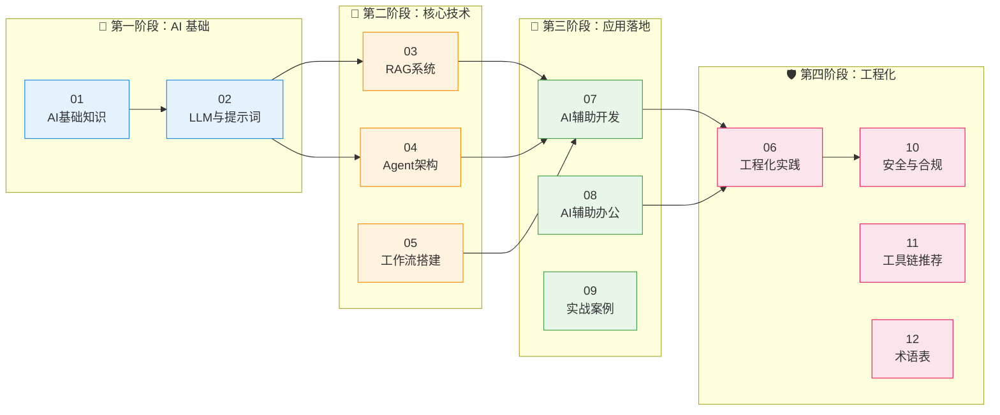
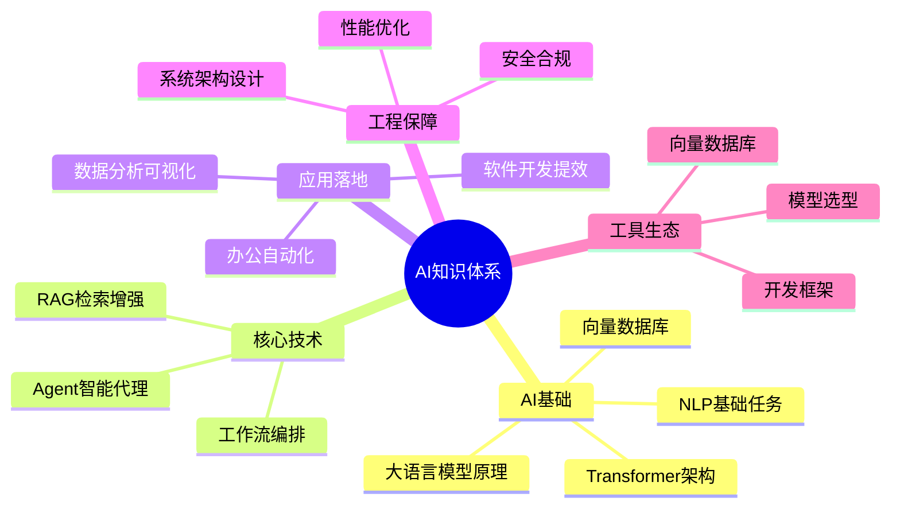
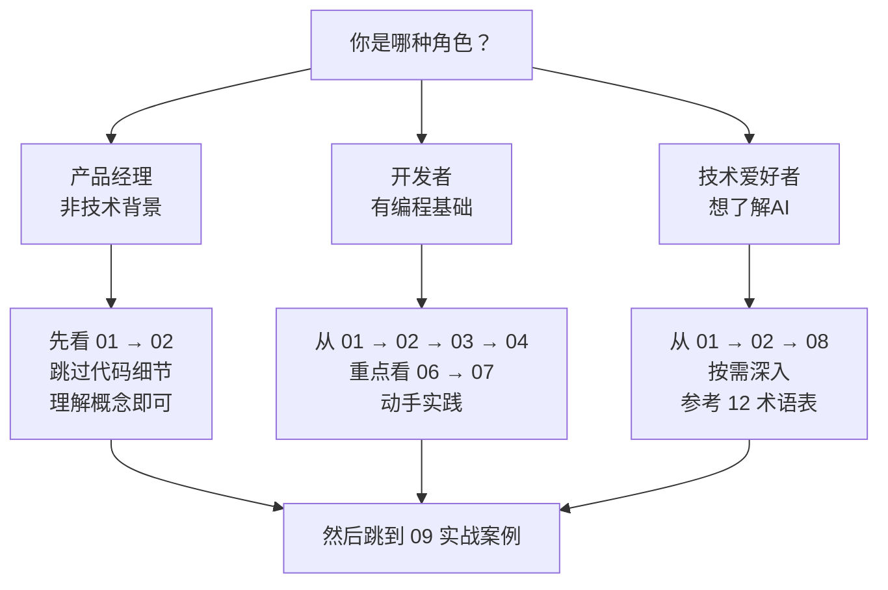

# AI 快速入门与落地应用指南

> 系统化 AI 学习路径：从原理到实践，从概念到落地
> 适用人群：产品经理 / 开发者 / 技术爱好者
> 学习目标：掌握 AI 核心技术原理 + 快速落地应用到实际工作

---

## 一、学习路径总览

---

## 二、文档目录

| 编号 | 文档 | 核心主题 | 阶段 |
|:--:|------|---------|:----:|
| [01](./01-AI基础知识与概念.md) | AI 基础知识与概念 | AI 发展史、大模型基础、NLP、向量数据库 | 基础 |
| [02](./02-LLM与提示词工程.md) | LLM 与提示词工程 | 提示词设计方法、模型选择、最佳实践 | 基础 |
| [03](./03-RAG检索增强生成系统.md) | RAG 检索增强生成系统 | RAG 原理、文档处理、向量检索、完整搭建指南 | 核心 |
| [04](./04-Agent智能代理架构.md) | Agent 智能代理架构 | Agent 设计、多Agent协作、工具调用、记忆系统 | 核心 |
| [05](./05-AI工作流搭建.md) | AI 工作流搭建 | 工作流引擎、编排实践、监控优化 | 核心 |
| [06](./06-AI工程化实践.md) | AI 工程化实践 | 系统架构、部署监控、性能优化、测试策略 | 工程化 |
| [07](./07-AI辅助软件开发体系.md) | AI 辅助软件开发体系 | 全栈AI开发：需求→代码→测试→部署 | 应用 |
| [08](./08-AI辅助办公提效指南.md) | AI 辅助办公提效指南 | AI在日常工作中的高效应用方法论 | 应用 |
| [09](./09-AI开发实战案例.md) | AI 开发实战案例 | Python实战、API集成、代码分析、数据可视化 | 实战 |
| [10](./10-AI安全合规与伦理.md) | AI 安全、合规与伦理 | 数据安全、模型安全、合规要求 | 保障 |
| [11](./11-AI工具链与平台推荐.md) | AI 工具链与平台推荐 | 模型/工具/框架选型矩阵 | 工具 |
| [12](./12-AI术语表.md) | AI 术语表 | 核心术语快速查阅 | 参考 |

---

## 三、核心知识点速查

---

## 四、快速开始建议

### 如果你是初学者

### 学习优先级

| 优先级 | 文档 | 理由 |
|:------:|------|------|
| ⭐⭐⭐ | **01 AI基础知识** | 建立AI认知框架 |
| ⭐⭐⭐ | **02 LLM与提示词** | 掌握AI交互核心技能 |
| ⭐⭐⭐ | **03 RAG系统** | 企业AI应用最核心技术 |
| ⭐⭐⭐ | **07 AI辅助开发** | 立即提升开发效率 |
| ⭐⭐ | 04 Agent架构 | 理解AI系统高级形态 |
| ⭐⭐ | 08 AI辅助办公 | 提升日常工作效率 |
| ⭐⭐ | 09 实战案例 | 打通理论与实践 |
| ⭐ | 05-06 工程化 | 生产环境部署需要 |
| ⭐ | 10 安全合规 | 上线前必须了解 |
| ⭐ | 11-12 工具/术语 | 随用随查 |

---

## 五、更新日志

| 日期 | 版本 | 更新内容 |
|------|------|----------|
| 2026-01-18 | v1.0 | 初始化知识体系 |
| 2026-08-16 | v2.0 | 全面重构：新增02/08/09/10/11，整合web-dev/Python体系 |

---

> 📌 **使用建议：** 从 **01 AI基础知识** 开始按顺序阅读，建立完整认知框架后再按需深入特定领域。
