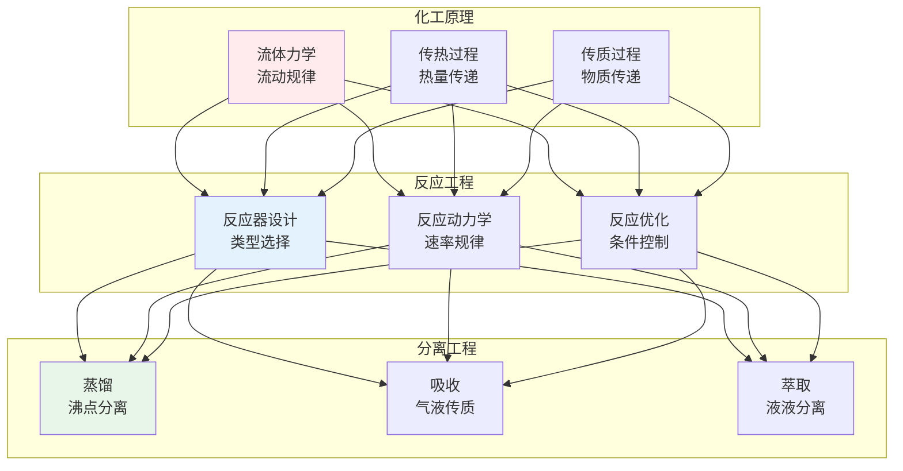
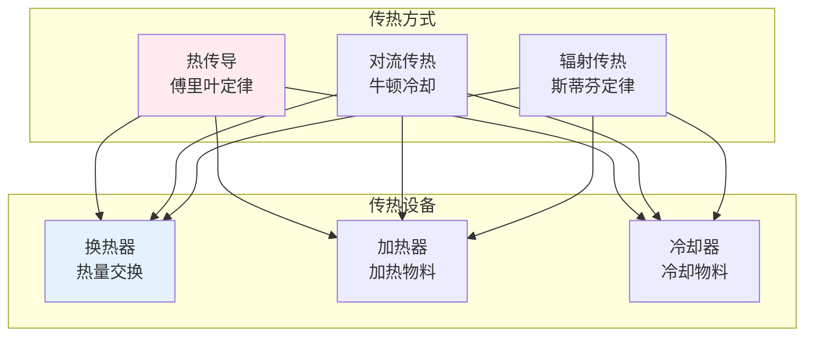
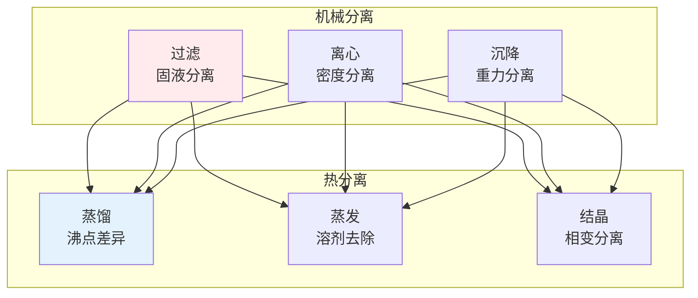

# 化学工程

> **核心观点**：化学工程是研究化学工业生产过程的学科，将实验室成果转化为工业生产。

---

## 📊 化学工程体系



---

## 💧 化工原理

### 流体力学

| 概念 | 内涵 | 应用 |
|------|------|------|
| 静压力 | 流体静止压力 | 储罐设计 |
| 伯努利方程 | 能量守恒 | 管路计算 |
| 雷诺数 | 流动状态 | 层流/湍流 |
| 摩擦阻力 | 能量损失 | 管径选择 |

### 传热过程



### 传质过程

| 过程 | 原理 | 应用 |
|------|------|------|
| 蒸馏 | 沸点差异 | 石油分离 |
| 吸收 | 气液平衡 | 气体净化 |
| 萃取 | 溶解度差异 | 产品提取 |
| 干燥 | 水分蒸发 | 固体干燥 |

---

## ⚗️ 反应工程

### 反应器类型

| 类型 | 特点 | 应用 |
|------|------|------|
| 间歇反应器 | 批次操作 | 小批量 |
| 连续搅拌釜 | 完全混合 | 液相反应 |
| 管式反应器 | 活塞流 | 气相反应 |
| 固定床反应器 | 催化反应 | 催化裂化 |

### 反应动力学

```
反应动力学方程：
-rA = k·CA^n
-rA：反应速率
k：反应速率常数
CA：反应物浓度
n：反应级数
```

---

## 🧪 分离工程

### 分离方法



### 分离设备

| 设备 | 功能 | 特点 |
|------|------|------|
| 精馏塔 | 液体分离 | 多级分离 |
| 吸收塔 | 气体吸收 | 传质面积 |
| 萃取塔 | 液液萃取 | 选择性 |
| 膜分离 | 分子级分离 | 节能高效 |

---

## 🎯 核心结论

### 化工设计原则

1. **安全第一**：防爆防火防毒
2. **效率优先**：能量物质高效利用
3. **环保达标**：减少污染排放
4. **经济合理**：控制生产成本
5. **可持续发展**：绿色化工

### 发展趋势

```
化学工程四大趋势：
1. 过程强化：设备小型化
2. 绿色化工：清洁生产
3. 智能化：自动化控制
4. 生物化工：生物技术应用
```

---

## 📚 参考文献

1. 《化工原理》- 谭天恩
2. 《化学反应工程》- 朱炳辰
3. 《分离工程》- 刘家祺
4. 《化工热力学》- 陈新志
5. 《化工设计》- 居滋培
6. 《化工安全》- 蒋军成
7. 《绿色化学》- 沈玉龙
8. 《生物化工》