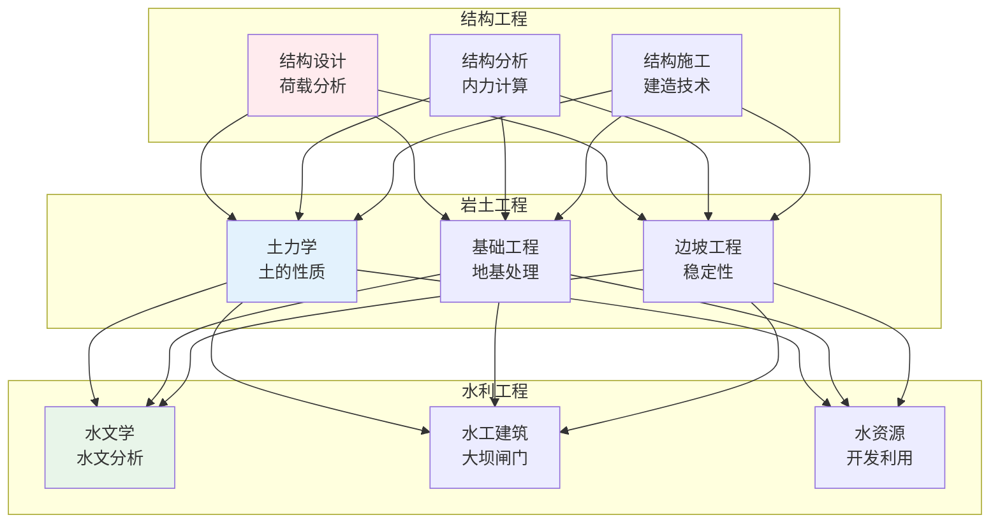
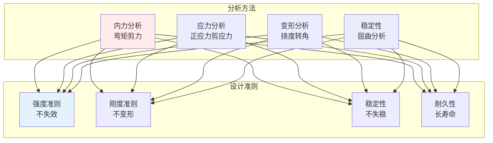
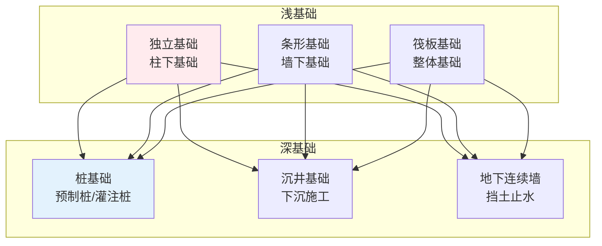

# 土木工程

> **核心观点**：土木工程是建造各类工程设施的学科，是基础设施建设的基础。

---

## 📊 土木工程体系



---

## 🏗️ 结构工程

### 结构类型

| 类型 | 特点 | 应用 |
|------|------|------|
| 框架结构 | 梁柱承重 | 多层建筑 |
| 剪力墙结构 | 墙体承重 | 高层建筑 |
| 框架-剪力墙 | 综合优点 | 高层建筑 |
| 筒体结构 | 空间受力 | 超高层 |

### 结构分析



### 建筑材料

| 材料 | 优点 | 缺点 | 应用 |
|------|------|------|------|
| 混凝土 | 可塑性好、耐久 | 自重大 | 基础、梁柱 |
| 钢材 | 强度高、延性好 | 易腐蚀 | 桁架、高层 |
| 木材 | 轻质、美观 | 易燃、变形 | 建筑、桥梁 |
| 复合材料 | 比强度高 | 成本高 | 特殊结构 |

---

## 🪨 岩土工程

### 土的性质

| 性质 | 内涵 | 测试方法 |
|------|------|----------|
| 物理性质 | 含水量、密度 | 取样测试 |
| 力学性质 | 压缩、剪切 | 三轴试验 |
| 渗透性质 | 透水性 | 渗透试验 |

### 基础类型



### 地基处理

| 方法 | 原理 | 适用土质 |
|------|------|----------|
| 换填法 | 置换软弱土 | 软弱土层 |
| 预压法 | 排水固结 | 软粘土 |
| 强夯法 | 动力密实 | 碎石土 |
| 深层搅拌 | 加固土体 | 软粘土 |

---

## 💧 水利工程

### 水工建筑

| 类型 | 功能 | 特点 |
|------|------|------|
| 重力坝 | 挡水 | 稳定性好 |
| 拱坝 | 挡水 | 材料省 |
| 土石坝 | 挡水 | 就地取材 |
| 溢洪道 | 泄洪 | 安全设施 |

### 水文分析

```
水文分析内容：
1. 降水分析：频率计算
2. 径流计算：汇流分析
3. 洪水预报：预警系统
4. 水资源评价：供需分析
```

---

## 🎯 核心结论

### 土木工程原则

1. **安全可靠**：结构安全是底线
2. **经济合理**：控制工程造价
3. **技术先进**：采用新技术
4. **环境友好**：减少环境影响
5. **耐久适用**：保证使用寿命

### 发展趋势

```
土木工程四大趋势：
1. 智能化：数字孪生、BIM
2. 绿色化：绿色建筑、海绵城市
3. 工业化：装配式建筑
4. 韧性化：防灾减灾
```

---

## 📚 参考文献

1. 《结构力学》- 龙驭球
2. 《土力学》- 陈希哲
3. 《基础工程》- 顾晓鲁
4. 《混凝土结构设计原理》- 沈蒲生
5. 《钢结构设计原理》- 戴国欣
6. 《水工建筑物》- 林继镛
7. 《工程地质》- 孔宪立
8. 《土木工程施工》- 方先和