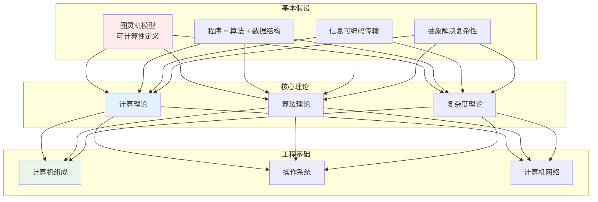
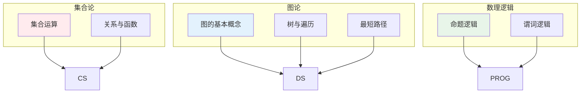
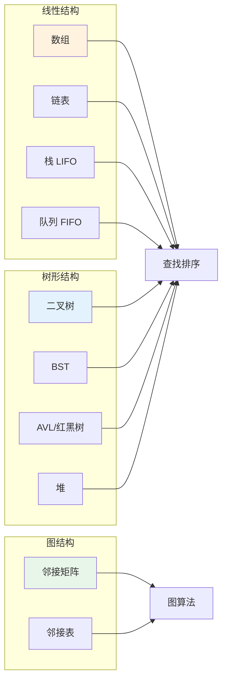
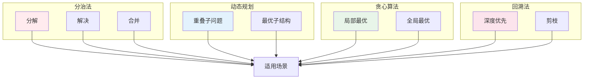
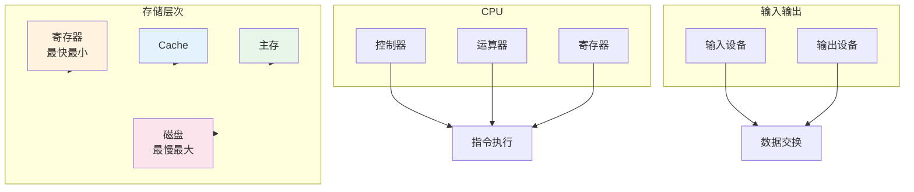
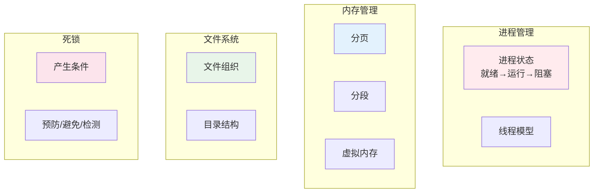
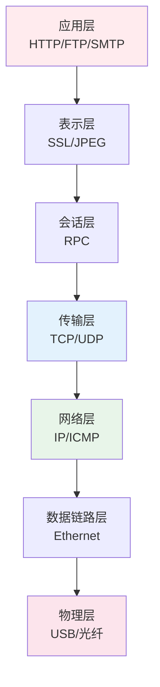
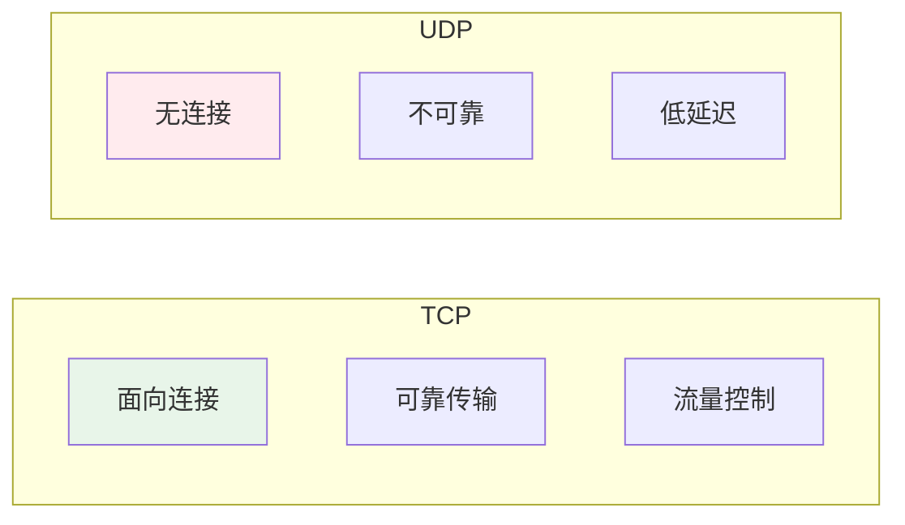
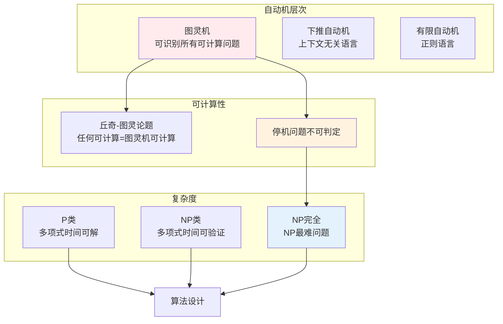
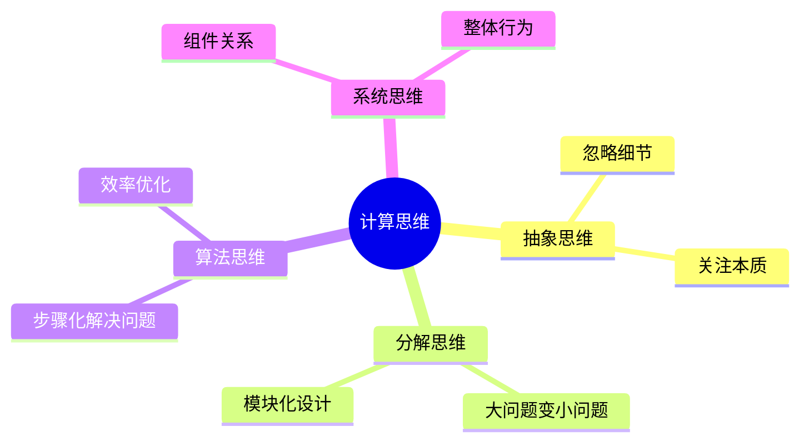

# 计算机科学知识体系

> **第一性原理**：计算机科学是研究信息和计算的学科，核心问题是"什么可以被计算"和"如何高效计算"。

---

## 📚 计算机科学的公理体系



---

## 一、离散数学 Discrete Mathematics



---

## 二、数据结构 Data Structures



---

## 三、算法 Algorithm

### 排序算法对比

```mermaid
flowchart LR
    B1[冒泡 O(n²)] --> B2[选择 O(n²)]
    B2 --> B3[插入 O(n²)]
    B3 --> B4[快速 O(nlogn)]
    B4 --> B5[归并 O(nlogn)]
    B5 --> B6[堆排 O(nlogn)]
    
    style B1 fill:#ffebee
    style B4 fill:#fff3e0
    style B6 fill:#e8f5e9
```

### 算法设计策略



---

## 四、计算机组成 Computer Organization



---

## 五、操作系统 Operating System



---

## 六、计算机网络 Computer Network

### OSI七层模型



### TCP vs UDP



---

## 七、计算理论 Theory of Computation



---

## 八、计算机科学思维方式



---

## 📖 学习路径

```mermaid
flowchart TD
    A[编程基础<br/>Python/C] --> B[离散数学<br/>逻辑与集合]
    B --> C[数据结构<br/>线性结构]
    C --> D[算法设计<br/>排序与搜索]
    D --> E[计算机组成<br/>硬件基础]
    E --> F[操作系统<br/>系统软件]
    F --> G[计算机网络<br/>网络通信]
    G --> H[专业方向<br/>AI/安全/...]]
    
    style A fill:#fff3e0
    style B fill:#e3f2fd
    style D fill:#e8f5e9
    style H fill:#f3e5f5
```

---

## 参考文献

1. 《算法导论》- CLRS
2. 《计算机程序的构造和解释》- SICP
3. 《深入理解计算机系统》- CSAPP
4. 《自动机理论、语言和计算》