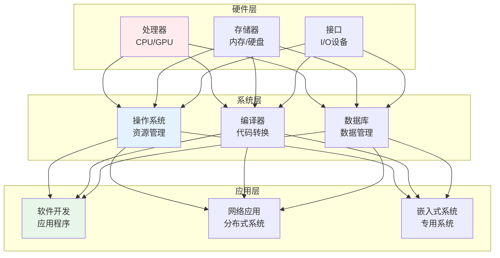
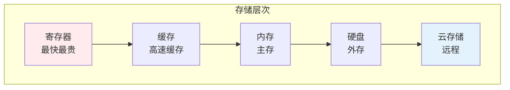
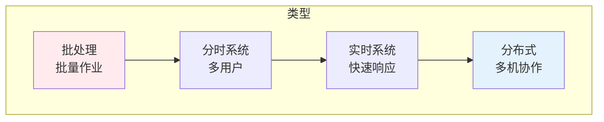

# 计算机工程

> **核心观点**：计算机工程是研究计算机系统设计、开发和应用的学科，是信息技术的核心。

---

## 📊 计算机工程体系



---

## 💻 硬件基础

### 计算机架构

| 层次 | 组成 | 功能 |
|------|------|------|
| 运算器 | ALU | 算术逻辑运算 |
| 控制器 | CU | 指令控制 |
| 存储器 | 内存 | 数据存储 |
| 输入设备 | 键盘鼠标 | 数据输入 |
| 输出设备 | 显示器 | 数据输出 |

### 存储系统



### 接口技术

| 接口 | 速度 | 应用 |
|------|------|------|
| USB | 5-40Gbps | 外设连接 |
| PCIe | 16GT/s | 显卡/SSD |
| SATA | 6Gbps | 硬盘 |
| Thunderbolt | 40Gbps | 高速外设 |

---

## 🖥️ 操作系统

### 核心功能

| 功能 | 内容 | 作用 |
|------|------|------|
| 进程管理 | 调度、同步 | CPU资源 |
| 内存管理 | 分配、回收 | 内存资源 |
| 文件管理 | 存储、检索 | 磁盘资源 |
| 设备管理 | 驱动、分配 | I/O资源 |

### 操作系统类型



---

## 📦 数据结构与算法

### 数据结构

| 结构 | 特点 | 应用 |
|------|------|------|
| 数组 | 连续存储 | 随机访问 |
| 链表 | 离散存储 | 插入删除 |
| 树 | 层次关系 | 搜索排序 |
| 图 | 网状关系 | 路径规划 |

### 算法复杂度

```
时间复杂度排序：
O(1) < O(log n) < O(n) < O(n log n) < O(n²) < O(2ⁿ)
```

---

## 🌐 网络工程

### 网络协议

| 层次 | 协议 | 功能 |
|------|------|------|
| 应用层 | HTTP/FTP/DNS | 用户服务 |
| 传输层 | TCP/UDP | 端到端通信 |
| 网络层 | IP/ICMP | 路由寻址 |
| 链路层 | Ethernet/WiFi | 帧传输 |

### 网络安全

| 威胁 | 防御 |
|------|------|
| 病毒 | 杀毒软件 |
| 黑客 | 防火墙 |
| 窃听 | 加密通信 |
| 欺骗 | 身份认证 |

---

## 🎯 核心结论

### 计算机工程原则

1. **可靠性**：系统稳定运行
2. **可扩展性**：适应增长需求
3. **安全性**：保护系统安全
4. **效率性**：资源高效利用
5. **兼容性**：支持多种环境

### 发展趋势

```
计算机工程四大趋势：
1. 云计算：集中化服务
2. 边缘计算：分布式处理
3. 量子计算：突破经典极限
4. AI计算：专用硬件加速
```

---

## 📚 参考文献

1. 《计算机组成原理》- 唐朔飞
2. 《操作系统概念》- Silberschatz
3. 《数据结构》- 严蔚敏
4. 《算法导论》- Thomas Cormen
5. 《计算机网络》- 谢希仁
6. 《编译原理》- Aho
7. 《数据库系统概论》- 王珊
8. 《嵌入式系统设计》