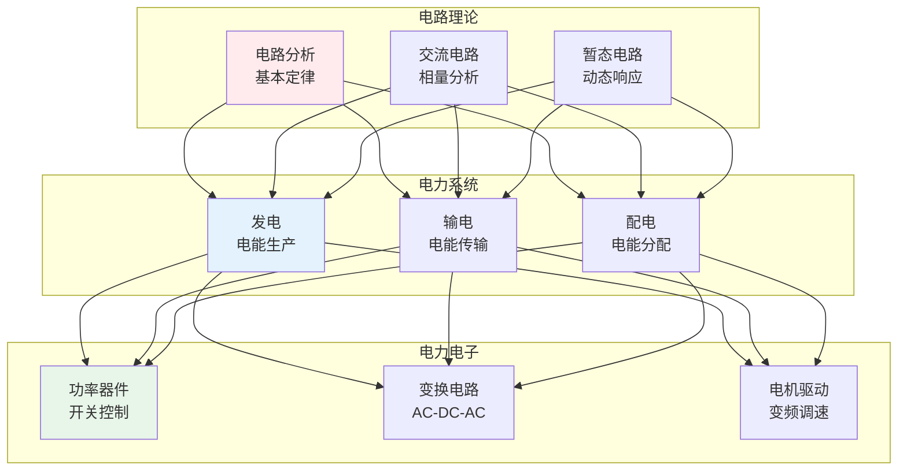
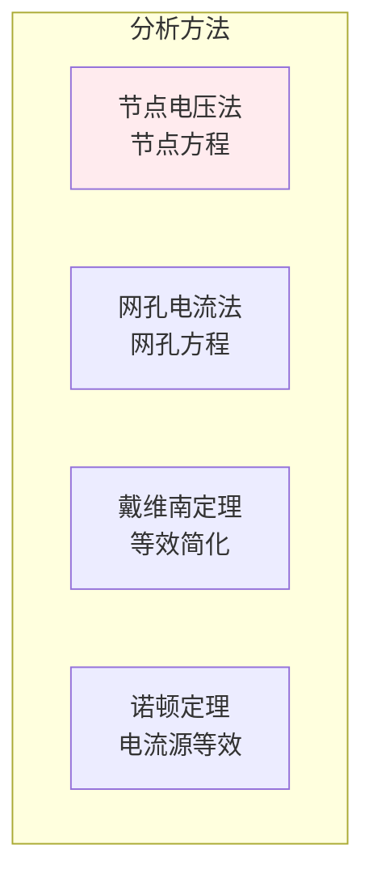
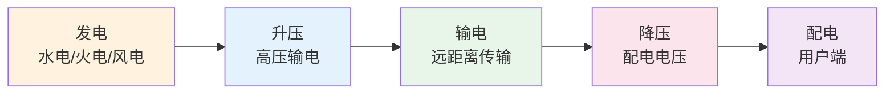

# 电气工程

> **核心观点**：电气工程是研究电能生产、传输、分配和应用的学科，是现代社会的能源基础。

---

## 📊 电气工程体系



---

## ⚡ 电路理论

### 基本定律

| 定律 | 内涵 | 应用 |
|------|------|------|
| 欧姆定律 | V=IR | 电压电流关系 |
| 基尔霍夫电流定律 | ∑I=0 | 节点电流 |
| 基尔霍夫电压定律 | ∑V=0 | 回路电压 |
| 叠加定理 | 线性系统 | 多源电路 |

### 电路分析



### 交流电路

| 概念 | 内涵 | 计算 |
|------|------|------|
| 相量 | 正弦量表示 | 复数形式 |
| 阻抗 | 电阻+电抗 | Z=R+jX |
| 功率 | 有功+无功 | P=VIcosφ |

---

## 🔌 电力系统

### 电力系统架构



### 发电方式

| 方式 | 优点 | 缺点 |
|------|------|------|
| 火电 | 稳定可靠 | 污染排放 |
| 水电 | 清洁可再生 | 季节性 |
| 核电 | 高效低碳 | 安全风险 |
| 风电 | 清洁可再生 | 间歇性 |
| 光伏 | 清洁可再生 | 效率较低 |

### 电力系统保护

```
保护系统功能：
1. 故障检测：识别异常
2. 故障隔离：切除故障
3. 系统恢复：恢复正常
4. 信息记录：事故分析
```

---

## 🔧 电力电子

### 功率器件

| 器件 | 特点 | 应用 |
|------|------|------|
| 晶闸管 | 半控型 | 整流器 |
| MOSFET | 全控型、高频 | 开关电源 |
| IGBT | 全控型、中大功率 | 变频器 |

### 变换电路

```mermaid
graph TB
    subgraph AC-DC<br/>整流
        A1[不可控整流<br/>二极管]
        A2[可控整流<br/>晶闸管]
    end    
    subgraph DC-AC<br/>逆变
        B1[电压型逆变<br/>PWM控制]
        B2[电流型逆变<br/>电网同步]
    end    
    subgraph DC-DC<br/>斩波
        C1[Buck降压]
        C2[Boost升压]
        C3[Buck-Boost升降压]
    end
    
    A1 & A2 --> B1 & B2
    B1 & B2 --> C1 & C2 & C3
    
    style A1 fill:#ffebee
    style B1 fill:#e3f2fd
    style C1 fill:#e8f5e9
```

### 应用领域

| 领域 | 应用 | 技术 |
|------|------|------|
| 电机驱动 | 变频调速 | V/F控制、矢量控制 |
| 新能源 | 光伏并网 | MPPT、并网逆变 |
| 电动汽车 | 电池管理 | BMS、充电 |
| 电源 | 开关电源 | 高频变换 |

---

## 🎯 核心结论

### 电气工程原则

1. **安全第一**：电气安全是底线
2. **效率优先**：提高能源效率
3. **可靠性**：保证供电可靠
4. **经济性**：成本效益平衡
5. **环保性**：减少环境影响

### 发展趋势

```
电气工程四大趋势：
1. 智能电网：数字化、自动化
2. 新能源：清洁、可再生
3. 电力电子：高效、高密度
4. 电动汽车：交通电气化
```

---

## 📚 参考文献

1. 《电路》- 邱关源
2. 《电力系统分析》- 何仰赞
3. 《电力电子技术》- 王兆安
4. 《电机学》- 汤蕴璆
5. 《自动控制原理》- 胡寿松
6. 《电气工程概论》
7. 《电力系统保护》
8. 《新能源发电技术》