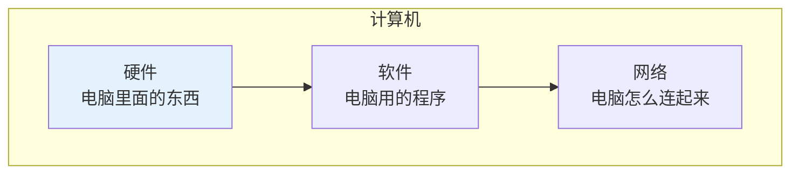
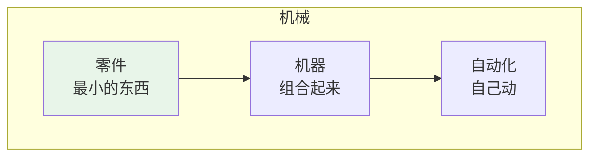
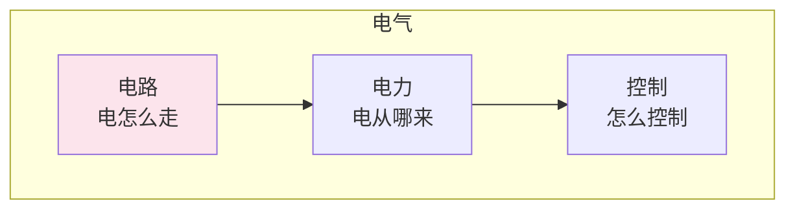
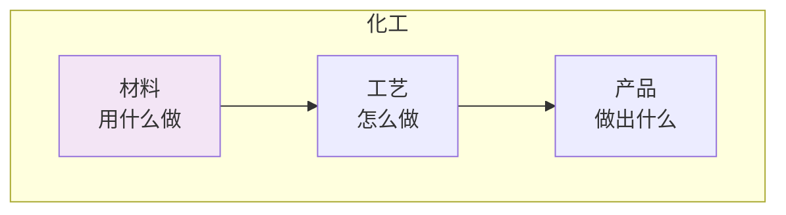
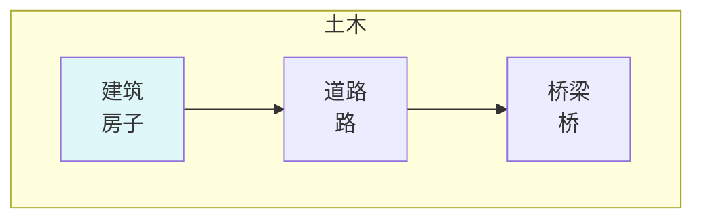

# 工程技术

## 🗂️ 内容导航

| 名称 | 说明 | 链接 |
|------|------|------|
| 化学工程 | 理解化学工艺与工程设计的核心知识 | [进入](chemical-engineering/index.md) |
| 土木工程 | 理解土木工程设计与施工的核心知识 | [进入](civil-engineering/index.md) |
| 计算机工程 | 理解计算机系统设计与实现的核心知识 | [进入](computer-engineering/index.md) |
| 电气工程 | 理解电气系统与电力电子的核心知识 | [进入](electrical-engineering/index.md) |
| 机械工程 | 理解机械设计与制造的核心知识 | [进入](mechanical-engineering/index.md) |

---

> **费曼学习法**：工程技术就是用科学知识"造东西"的学问！

---

## 🎯 一句话理解工程技术

**工程技术就是用科学知识造出有用的东西！**

---

## 🔗 科学基础跳转

| 工程领域 | 需要的科学基础 | 跳转链接 |
|----------|----------------|----------|
| 计算机 | 数学、物理 | [自然科学/数学](/natural-sciences/mathematics/index.md) |
| 机械 | 物理、数学 | [自然科学/物理](/natural-sciences/physics/index.md) |
| 电气 | 物理、数学 | [自然科学/物理](/natural-sciences/physics/index.md) |
| 化工 | 化学、物理 | [自然科学/化学](/natural-sciences/chemistry/index.md) |
| 土木 | 物理、数学 | [自然科学/物理](/natural-sciences/physics/index.md) |

---

## 📚 每个积木块详解

### 💻 计算机（电脑和手机）

**用小学生的话说**：计算机就是研究"电脑和手机是怎么工作的"的学问！

| 积木块 | 小学生版解释 | 需要的科学基础 |
|--------|--------------|----------------|
| 硬件 | 电脑里面的东西 | [物理](/natural-sciences/physics/index.md) |
| 软件 | 电脑用的程序 | [数学](/natural-sciences/mathematics/index.md) |
| 网络 | 电脑怎么连起来 | [物理](/natural-sciences/physics/index.md) |

---

### ⚙️ 机械（汽车和机器人）

**用小学生的话说**：机械就是研究"汽车、飞机、机器人是怎么造的"的学问！

| 积木块 | 小学生版解释 | 需要的科学基础 |
|--------|--------------|----------------|
| 零件 | 最小的东西 | [物理](/natural-sciences/physics/index.md) |
| 机器 | 组合起来 | [物理](/natural-sciences/physics/index.md) |
| 自动化 | 自己动 | [数学](/natural-sciences/mathematics/index.md) |

---

### ⚡ 电气（电灯和电视）

**用小学生的话说**：电气就是研究"电是怎么用的"的学问！

| 积木块 | 小学生版解释 | 需要的科学基础 |
|--------|--------------|----------------|
| 电路 | 电怎么走 | [物理](/natural-sciences/physics/index.md) |
| 电力 | 电从哪来 | [物理](/natural-sciences/physics/index.md) |
| 控制 | 怎么控制 | [数学](/natural-sciences/mathematics/index.md) |

---

### 🧪 化工（塑料和药品）

**用小学生的话说**：化工就是研究"东西是怎么做出来的"的学问！

| 积木块 | 小学生版解释 | 需要的科学基础 |
|--------|--------------|----------------|
| 材料 | 用什么做 | [化学](/natural-sciences/chemistry/index.md) |
| 工艺 | 怎么做 | [化学](/natural-sciences/chemistry/index.md) |
| 产品 | 做出什么 | [化学](/natural-sciences/chemistry/index.md) |

---

### 🏗️ 土木（房子和桥）

**用小学生的话说**：土木就是研究"房子、桥、路是怎么修的"的学问！

| 积木块 | 小学生版解释 | 需要的科学基础 |
|--------|--------------|----------------|
| 建筑 | 房子 | [物理](/natural-sciences/physics/index.md) |
| 道路 | 路 | [物理](/natural-sciences/physics/index.md) |
| 桥梁 | 桥 | [物理](/natural-sciences/physics/index.md) |

---

## 🎮 工程技术闯关游戏

---

## 💡 给小学生的话

> 工程师就是"造东西"的人！
> 
> 先学好 [自然科学](/natural-sciences/index.md)，再来学工程！
> 
> 记住：科学是工程的基础！

---

**每个工程师都曾经是初学者！**