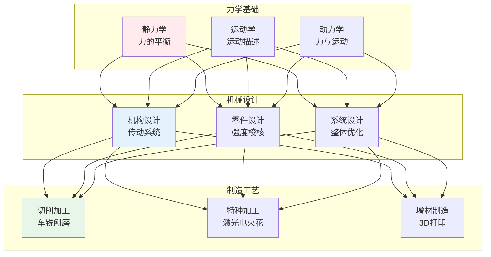
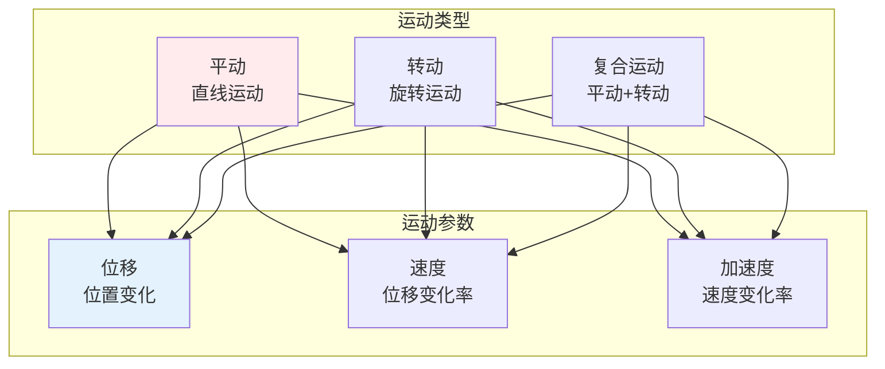
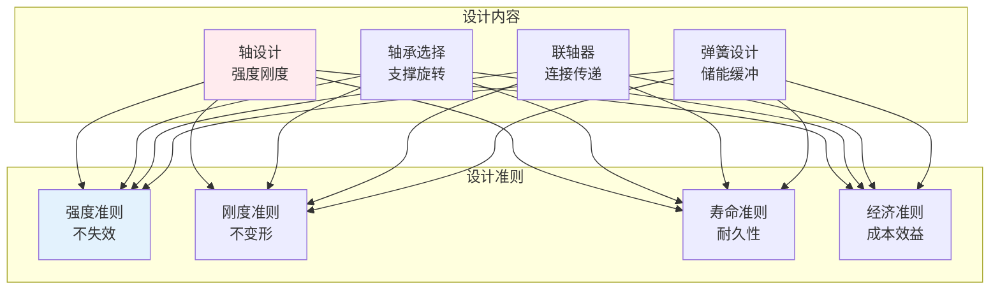
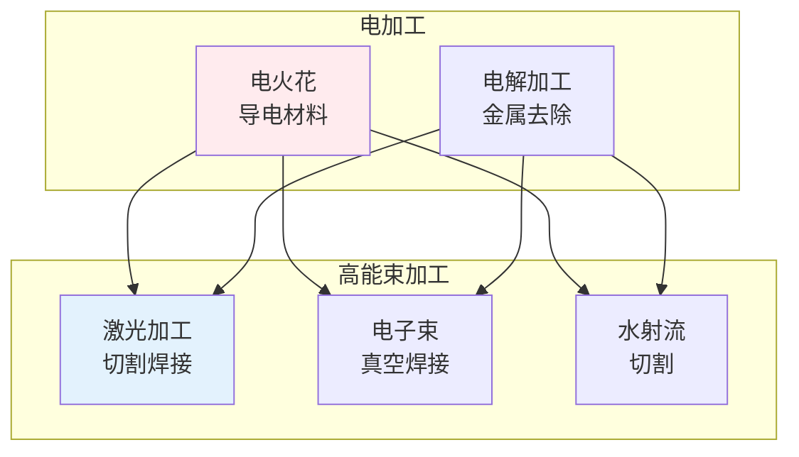

# 机械工程

> **核心观点**：机械工程是研究机械系统设计、制造和应用的学科，是现代工业的基础。

---

## 📊 机械工程体系



---

## ⚙️ 力学基础

### 静力学

| 概念 | 内涵 | 应用 |
|------|------|------|
| 力的平衡 | ∑F=0 | 结构分析 |
| 力矩平衡 | ∑M=0 | 稳定性 |
| 约束反力 | 支座反力 | 结构设计 |

### 运动学



### 动力学

| 定律 | 公式 | 意义 |
|------|------|------|
| 牛顿第二定律 | F=ma | 力与加速度 |
| 动能定理 | W=ΔEk | 功与能量 |
| 动量定理 | Ft=Δp | 冲量与动量 |

---

## 🔧 机械设计

### 机构设计

| 机构类型 | 功能 | 特点 |
|----------|------|------|
| 连杆机构 | 运动转换 | 结构简单 |
| 凸轮机构 | 运动控制 | 精确规律 |
| 齿轮机构 | 传动变速 | 效率高 |
| 带传动 | 柔性传动 | 缓冲 |

### 零件设计



### 公差与配合

| 配合类型 | 特点 | 应用 |
|----------|------|------|
| 间隙配合 | 孔>轴 | 转动连接 |
| 过盈配合 | 孔<轴 | 固定连接 |
| 过渡配合 | 孔≈轴 | 定位连接 |

---

## 🏭 制造工艺

### 切削加工

| 加工方法 | 特点 | 应用 |
|----------|------|------|
| 车削 | 回转体加工 | 轴类零件 |
| 铣削 | 平面/槽加工 | 箱体零件 |
| 磨削 | 精密加工 | 精度要求高 |
| 钻削 | 孔加工 | 连接孔 |

### 特种加工



### 增材制造

| 技术 | 原理 | 材料 | 应用 |
|------|------|------|------|
| FDM | 熔融沉积 | 塑料 | 原型制造 |
| SLA | 光固化 | 树脂 | 精密零件 |
| SLS | 激光烧结 | 金属/塑料 | 功能零件 |
| SLM | 激光熔化 | 金属 | 高性能零件 |

---

## 🎯 核心结论

### 机械工程原则

1. **功能优先**：满足功能需求
2. **安全可靠**：保证使用安全
3. **经济合理**：控制制造成本
4. **易于维护**：方便检修保养
5. **环境友好**：绿色制造

### 发展趋势

```
机械工程四大趋势：
1. 智能化：数控、机器人
2. 精密化：超精密加工
3. 绿色化：清洁生产
4. 集成化：机电一体化
```

---

## 📚 参考文献

1. 《机械设计》- 濮良贵
2. 《机械原理》- 孙桓
3. 《工程力学》- 刘鸿文
4. 《机械制造技术基础》- 陈明
5. 《数控技术》- 王爱玲
6. 《机器人技术基础》- 蔡自兴
7. 《有限元分析》- 王勖成
8. 《3D打印技术》- 卢秉恒