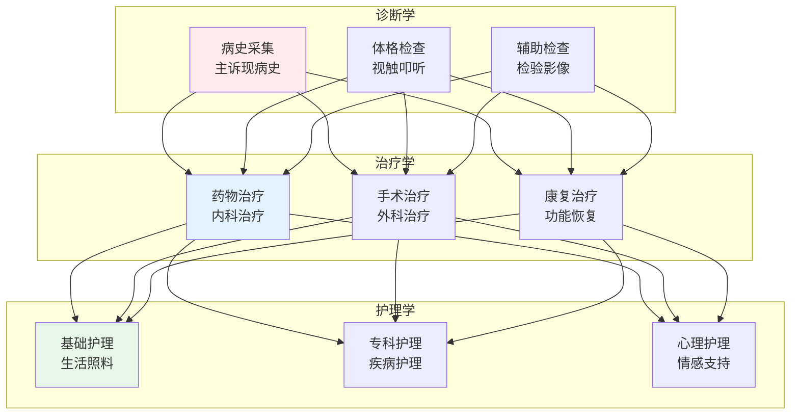
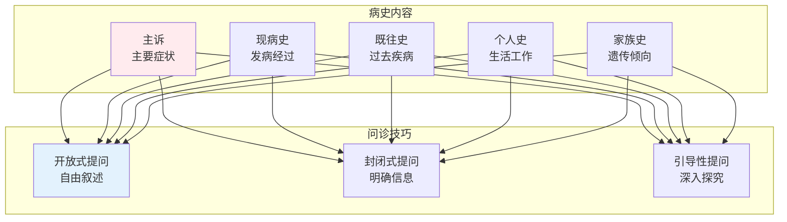
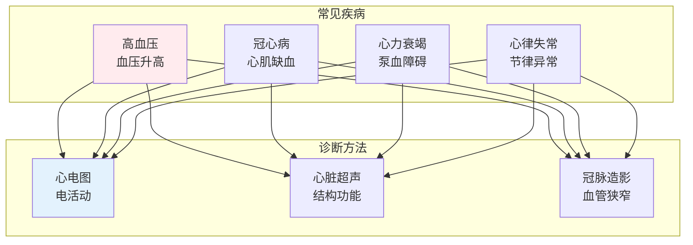
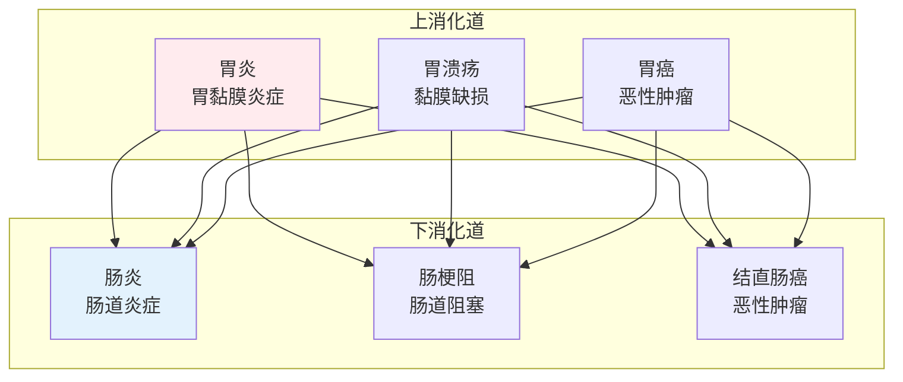

# 临床医学

> **核心观点**：临床医学是研究疾病的诊断、治疗和预防的实践医学，直接服务于患者。

---

## 📊 临床医学体系



---

## 🔬 诊断学基础

### 病史采集



### 体格检查

| 方法 | 内容 | 目的 |
|------|------|------|
| 视诊 | 外观观察 | 整体印象 |
| 触诊 | 手部触感 | 质地温度 |
| 叩诊 | 叩击音响 | 器官边界 |
| 听诊 | 听诊器 | 器官功能 |

### 辅助检查

| 检查类型 | 方法 | 应用 |
|----------|------|------|
| 实验室检查 | 血液、尿液、粪便 | 生化指标 |
| 影像学检查 | X线、CT、MRI | 结构病变 |
| 内镜检查 | 胃镜、肠镜 | 直接观察 |
| 病理检查 | 组织活检 | 确诊依据 |

---

## 🏥 主要疾病系统

### 心血管疾病



### 呼吸系统疾病

| 疾病 | 症状 | 诊断 | 治疗 |
|------|------|------|------|
| 肺炎 | 发热、咳嗽 | 胸片、血常规 | 抗感染 |
| COPD | 气促、咳嗽 | 肺功能 | 支气管扩张 |
| 哮喘 | 喘息、胸闷 | 肺功能、激发试验 | 抗炎平喘 |
| 肺癌 | 咯血、消瘦 | CT、病理 | 手术/化疗 |

### 消化系统疾病



---

## 💊 治疗原则

### 药物治疗

```
药物治疗原则：
1. 明确诊断：对症下药
2. 合理选药：安全有效
3. 个体化用药：因人而异
4. 联合用药：协同增效
5. 疗程适当：防止复发
```

### 手术治疗

| 手术类型 | 目的 | 特点 |
|----------|------|------|
| 急诊手术 | 挽救生命 | 紧急 |
| 择期手术 | 择期进行 | 充分准备 |
| 微创手术 | 减少创伤 | 恢复快 |
| 器官移植 | 替换病变 | 技术要求高 |

### 支持治疗

| 治疗类型 | 目的 | 方法 |
|----------|------|------|
| 液体治疗 | 维持内环境 | 补液 |
| 营养支持 | 维持营养 | 肠内/肠外 |
| 输血治疗 | 纠正贫血 | 输血 |
| 呼吸支持 | 维持通气 | 氧疗/机械通气 |

---

## 🎯 核心结论

### 临床医学的基本原则

1. **以患者为中心**：患者利益至上
2. **循证医学**：基于最佳证据
3. **个体化治疗**：因人而异
4. **多学科协作**：综合治疗
5. **持续学习**：更新知识

### 临床思维

```
临床思维三要素：
1. 病史：疾病线索
2. 检查：客观证据
3. 分析：逻辑推理
```

---

## 📚 参考文献

1. 《诊断学》- 人民卫生出版社
2. 《内科学》- 人民卫生出版社
3. 《外科学》- 人民卫生出版社
4. 《妇产科学》- 人民卫生出版社
5. 《儿科学》- 人民卫生出版社
6. 《神经病学》- 人民卫生出版社
7. 《精神病学》- 人民卫生出版社
8. 《传染病学》- 人民卫生出版社