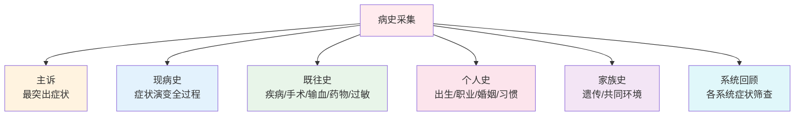
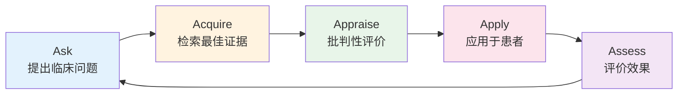

# 临床医学

> **核心观点**：临床医学是研究疾病发生、发展、诊断、治疗、预防和康复的医学学科，是连接基础医学与患者健康的桥梁。

---

## 📊 临床医学体系架构

```mermaid
graph TB
    subgraph 诊断学
        D1["病史采集<br/>核心技能"]
        D2["体格检查<br/>核心技能"]
        D3["辅助检查<br/>实验室/影像"]
        D4["临床思维<br/>诊断推理"]
    end
    subgraph 内科学
        I1[心血管系统]
        I2[呼吸系统]
        I3[消化系统]
        I4[泌尿系统]
        I5[血液系统]
        I6[内分泌系统]
        I7[风湿免疫]
    end
    subgraph 外科学
        S1[普通外科]
        S2[骨科]
        S3[神经外科]
        S4[胸外科]
        S5[泌尿外科]
    end
    subgraph 专科医学
        P1[妇产科学]
        P2[儿科学]
        P3[神经病学]
        P4[精神病学]
        P5[传染病学]
        P6[皮肤性病学]
        P7[眼科学]
        P8[耳鼻咽喉]
    end
    subgraph 临床核心能力
        C1[临床决策]
        C2["手术/操作技能"]
        C3[医患沟通]
        C4[循证医学]
        C5[多学科协作]
    end
    
    D1 & D2 & D3 & D4 --> I1 & I2 & I3 & I4 & I5 & I6 & I7
    D1 & D2 & D3 & D4 --> S1 & S2 & S3 & S4 & S5
    D1 & D2 & D3 & D4 --> P1 & P2 & P3 & P4 & P5 & P6 & P7 & P8
    I1 & I2 & I3 & I4 & I5 & I6 & I7 --> C1 & C2 & C3 & C4 & C5
    S1 & S2 & S3 & S4 & S5 --> C1 & C2 & C3 & C4 & C5
    P1 & P2 & P3 & P4 & P5 & P6 & P7 & P8 --> C1 & C2 & C3 & C4 & C5
    
    style D1 fill:#ffebee
    style I1 fill:#e3f2fd
    style S1 fill:#e8f5e9
    style P1 fill:#fce4ec
    style C1 fill:#fff3e0
```



---

## 🔬 诊断学基础——临床医学的基石

### 病史采集：诊断的"金标准"

> **经验法则**：80%的诊断靠病史，15%靠体格检查，5%靠辅助检查



**高效病史采集模板（OPQRST-AAA）**：

| 维度 | 提问要点 | 临床意义 |
|------|----------|----------|
| **O**nset | 何时、何地、何情况发病 | 判断诱因、病程 |
| **P**rovocation/Palliation | 什么加重/缓解 | 定性疼痛性质 |
| **Q**uality | 症状性质（锐痛/钝痛/压迫感） | 鉴别器质性/功能性 |
| **R**adiation | 是否放射、放射部位 | 定位病变 |
| **S**everity | 程度分级（1-10分/轻中重） | 评估紧急程度 |
| **T**iming | 持续时间、间歇/持续、昼夜变化 | 判断病理生理 |
| **A**ssociated symptoms | 伴随症状 | 综合定位 |
| **A**lleviating factors | 缓解因素 | 指导治疗 |
| **A**ggravating factors | 加重因素 | 避免诱因 |

### 体格检查：四诊合参

| 检查方法 | 核心内容 | 常见阳性体征 |
|----------|----------|--------------|
| **视诊** | 面色、体态、皮肤黏膜、呼吸模式 | 苍白、黄疸、紫绀、呼吸困难体位 |
| **触诊** | 体温、脉搏、淋巴结、腹部、包块 | 发热、心动过速、肝脾肿大、压痛 |
| **叩诊** | 肺/心/肝/脾界、腹部鼓音 | 浊音界移动、鼓音 |
| **听诊** | 心音、呼吸音、血管杂音、肠鸣音 | 杂音、湿啰音、肠鸣音亢进/消失 |

---

## 🏥 内科学核心系统速查

### 心血管系统——临床最常见、最致命

| 疾病 | 典型表现 | 关键检查 | 核心治疗原则 |
|------|----------|----------|--------------|
| **高血压** | 多无症状，头晕头痛 | 血压监测、靶器官损害评估 | 生活方式+药物，目标<130/80 |
| **冠心病** | 胸闷胸痛、劳累诱发 | 心电图、冠脉CTA/DSA | 抗血小板+他汀+β受体阻滞剂+ACEI/ARB |
| **心力衰竭** | 活动后气促、不能平卧、下肢水肿 | BNP/NT-proBNP、心超 | 利尿+ACEI/ARB/ARNI+β受体阻滞剂+MRA+SGLT2i |
| **心律失常** | 心悸、胸闷、晕厥 | 动态心电图、电生理 | 抗心律失常药、射频消融、起搏器/ICD |

**急危重症识别口诀**：
- **ACS**：胸痛>20min、出汗、辐射左肩背、NT-proBNP升高、肌钙蛋白升高
- **急性左心衰**：端坐呼吸、咳粉红泡沫痰、双肺湿啰音、BNP显著升高
- **心源性休克**：血压<90/60、心率>100、尿量<20ml/h、皮肤湿冷

### 呼吸系统

| 疾病 | 典型表现 | 关键检查 | 核心治疗 |
|------|----------|----------|----------|
| **COPD** | 慢性咳嗽咳痰、活动后气促 | 肺功能（FEV1/FVC<0.7） | 支气管扩张剂+吸入糖皮质激素、肺康复 |
| **支哮** | 反复喘息、呼气性呼吸困难、夜间加重 | 肺功能+支气管激发/舒张试验 | 分级治疗：ICS/LABA为主 |
| **肺炎** | 发热、咳嗽、胸痛、脓痰 | 胸部CT、血常规、病原学 | 经验性抗菌、对症支持 |
| **肺癌** | 刺激性咳嗽、血痰、消瘦 | 胸部CT、支镜、病理 | 手术/放化疗/靶向/免疫多模式 |

### 消化系统

| 疾病 | 红旗征（需警惕恶变） | 关键检查 |
|------|---------------------|----------|
| **消化性溃疡** | 上腹痛、节律性、夜间痛 | 胃镜、HP检测 |
| **肝硬化** | 腹水、脾大、蜘蛛痣、肝掌 | 肝功能、腹部B超、肝硬度、胃镜 |
| **胃癌/结直肠癌** | 黑便、贫血、体重下降、排便习惯改变 | 胃镜/肠镜+病理、CT分期 |

### 内分泌系统

| 疾病 | 诊断标准 | 监测指标 |
|------|----------|----------|
| **2型糖尿病** | 空腹≥7.0、餐后2h≥11.1、HbA1c≥6.5% | HbA1c<7.0%、空腹4.4-7.0、餐后<10.0 |
| **甲亢** | FT3/FT4升高、TSH抑制、TRAb阳性 | 甲功复查、心率、体重 |
| **甲减** | TSH升高、FT4降低 | TSH、FT4、血脂 |

---

## ⚕️ 临床决策核心框架

### 循证医学五步法



**PICO 框架构建临床问题**：
- **P**atient/Problem：患者/问题特征
- **I**ntervention：干预措施
- **C**omparison：对照干预
- **O**utcome：结局指标

### 临床路径标准化要素

| 要素 | 内容 | 质控点 |
|------|------|--------|
| 入径标准 | 明确诊断、分型、分期 | 诊断明确率100% |
| 标准化医嘱集 | 检查、用药、护理、饮食 | 医嘱执行率>95% |
| 关键节点 | 关键检查时机、转科标准 | 关键节点完成率100% |
| 出径标准 | 症状缓解、指标达标、功能恢复 | 计划内出院率>90% |
| 异常管理 | 并发症预案、转上级条件 | 异常处理及时率100% |

---

## 📋 常见疾病临床路径速查卡

### 社区获得性肺炎（CAP）住院路径

| 住院日 | 关键动作 | 质控指标 |
|--------|----------|----------|
| D0 | 入院评估：CURB-65/PSI评分、血培养、抗生素首剂 | 入院4h内首剂抗生素 |
| D1 | 病原学检查、胸片复查、调整抗菌谱 | 病原学送检率100% |
| D3 | 评价疗效：体温、白细胞、症状 | 体温正常率>80% |
| D5-7 | 口服转换、出院评估 | 口服转换率>90% |
| 出院 | 随访计划、疫苗接种建议 | 随访率>95% |

### 2型糖尿病门诊管理路径

| 随访频次 | 核心内容 | 目标值 |
|----------|----------|--------|
| 每3个月 | HbA1c、血压、体重、足部检查、用药依从 | HbA1c<7.0% |
| 每年 | 眼底、肾功能、血脂、心电图、神经病变筛查 | 无并发症进展 |
| 低血糖发作时 | 立即处理、原因分析、方案调整 | 重度低血糖为0 |

---

## 🔗 核心学习路径与资源导航

### 进阶学习地图


### 必读经典教材（第9-10版）

| 学科 | 推荐教材 | 核心章节 |
|------|----------|----------|
| 诊断学 | 《诊断学》人卫版 | 病史采集、体格检查、临床思维 |
| 内科学 | 《内科学》人卫版 | 心血管、呼吸、消化、内分泌 |
| 外科学 | 《外科学》人卫版 | 围手术期、创伤、肿瘤、器官移植 |
| 妇产科 | 《妇产科学》人卫版 | 产科并发症、妇科肿瘤 |
| 儿科学 | 《儿科学》人卫版 | 新生儿、呼吸、消化、血液 |
| 神经内科 | 《神经病学》人卫版 | 脑血管、脱髓鞘、变性、感染 |

### 高频临床指南速查入口

- [中国高血压防治指南(2024)](http://www.chinaheart.org/)
- [中国2型糖尿病防治指南(2023)](http://www.cda.org.cn/)
- [中国慢阻肺诊治指南(2023)](http://www.cma.org.cn/)
- [CSCO肿瘤诊疗指南](http://www.csco.org.cn/)
- [中国心衰诊治指南(2024)](http://www.chinaheart.org/)

---

## 💡 临床医学的"华溯视角"：从治病到健康管理

| 传统临床模式 | 华溯健康生态模式 |
|--------------|------------------|
| 以疾病为中心 | 以**家庭/人**为中心 |
| 急性发作干预 | **全周期**健康管理 |
| 单病种治疗 | **多病共存**精准干预 |
| 医生主导决策 | **共同决策**、患者赋能 |
| 院内为主 | **院内+社区+家庭**无缝衔接 |
| 结果导向 | **过程+结果**双重价值 |

**临床医生在健康生态中的新角色**：
1. **健康管家**：从"治病"转向"管人"
2. **决策教练**：用循证证据辅助患者共同决策
3. **跨界协作者**：联动护理、营养、康复、心理、药师
4. **数据解读者**：将体检/监测数据转化为可执行健康方案
5. **科普传播者**：用大白话讲清疾病、缓解焦虑

---

## 🎯 核心结论

### 临床医学的基本原则

1. **以患者为中心**：尊重意愿、共同决策、知情同意
2. **循证实践**：最佳证据+临床经验+患者价值观
3. **安全第一**：核查制度、不良事件上报、根因分析
4. **精准医疗**：分型分期、个体化、生物标志物引导
5. **持续照护**：出院不等于结束、全周期管理
6. **多学科协作（MDT）**：打破科室壁垒、整体获益

### 临床医学的职业价值

```
临床医生如何服务"健康触手可及"：
1. 精准诊断：让每个家庭少走弯路
2. 科学治疗：让每份方案经得起推敲
3. 持续陪伴：让慢病管理不再孤单
4. 知识赋能：让家庭成为健康第一责任人
5. 生态协作：连接每一份专业力量
```

---

## 📚 参考文献与资源库

### 核心教材（人卫版第9-10版）
1. 《诊断学》
2. 《内科学》上下册
3. 《外科学》
4. 《妇产科学》
5. 《儿科学》
6. 《神经病学》
7. 《精神病学》
8. 《传染病学》
9. 《皮肤性病学》
10. 《眼科学》
11. 《耳鼻咽喉头颈外科学》

### 临床工具书
- 《默克诊疗手册》专业版
- 《UpToDate》临床决策支持
- 《临床用药指南》/《抗菌药物临床应用指导原则》
- 《实用临床营养学》

### 学习建议
- **初学者**：诊断学 → 内科学基础系统 → 临床带教/规培
- **进阶者**：专病深耕 → 循证医学方法学 → MDT实战
- **专家向**：指南制定/修订 → 转化研究 → 健康生态构建

---

> **记录**：临床医学知识库建设中，欢迎补充病例讨论、指南解读、临床路径实操案例。
> 
> **关联导航**：[基础医学](../basic-medicine/index.md) | [健康医疗](../healthcare/index.md) | [护理学](../nursing/index.md) | [药学](../pharmacy/index.md) | [康复医学](../rehabilitation/index.md) | [公共卫生](../public-health/index.md)