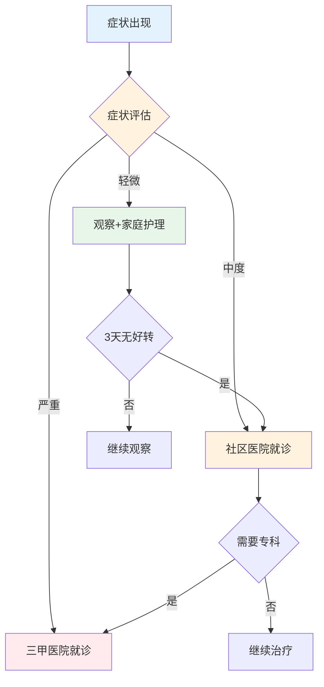
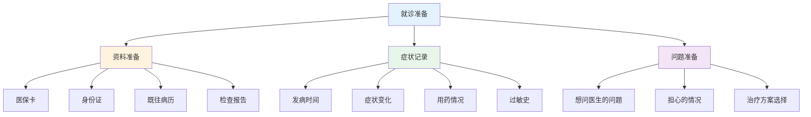
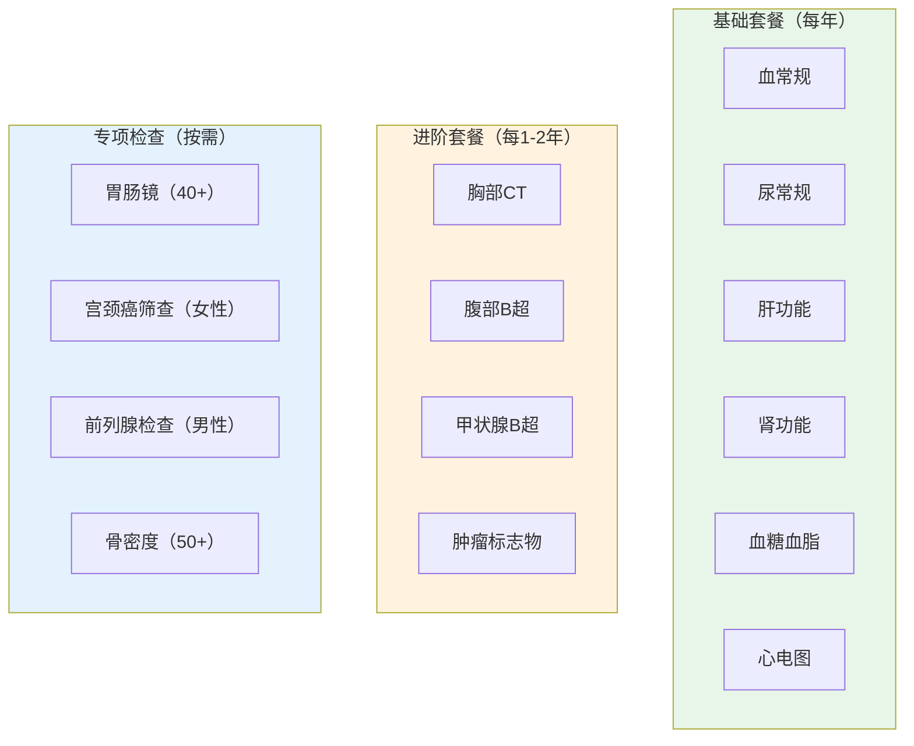
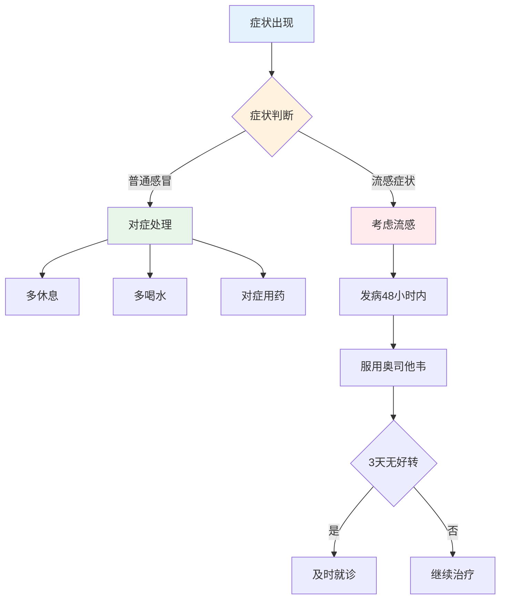
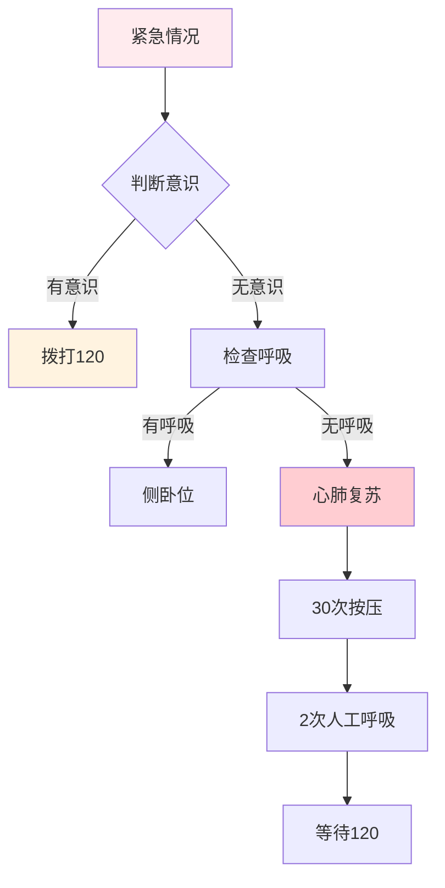
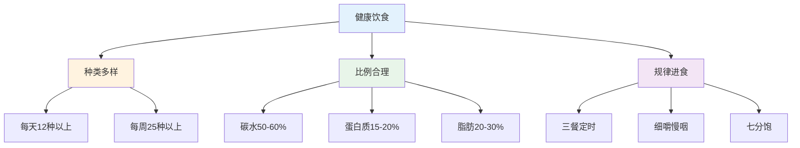
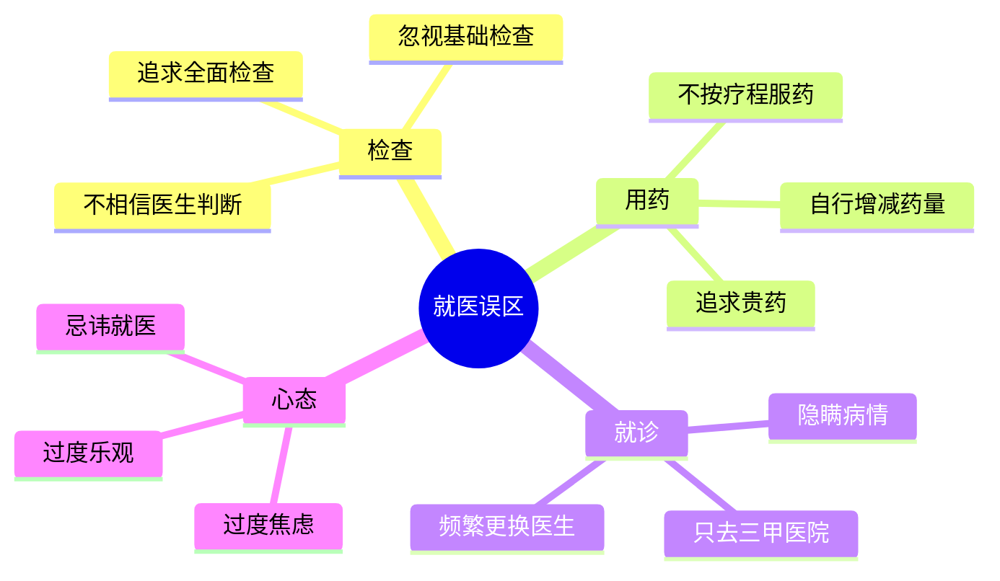

# 健康医疗 — 医生不会主动告诉你的事

> 90%的人不了解就医常识，导致延误治疗或浪费资源
> 目标：掌握就医流程、健康管理和常见疾病应对的核心知识

---

## 一、就医核心规律

### 1.1 就医决策流程

### 1.2 什么情况必须去三甲医院

| 症状 | 外行做法 | 内行做法 |
|------|----------|----------|
| 发烧>39°C持续3天 | 忍着/乱吃药 | 立即就诊 |
| 剧烈头痛伴呕吐 | 继续观察 | 立即急诊 |
| 胸痛/呼吸困难 | 犹豫不决 | 立即急诊 |
| 便血/尿血 | 害羞不说 | 尽快就诊 |
| 外伤大量出血 | 自行包扎 | 立即急诊 |

---

## 二、就诊准备

### 2.1 就诊前准备清单

### 2.2 高效沟通技巧

**外行沟通：** "医生，我肚子疼"
**内行沟通：** "医生，我右下腹疼了2天，昨天开始发烧38.5°C，今天疼得更厉害了，没有呕吐，也没有腹泻"

| 维度 | 外行做法 | 内行做法 |
|------|----------|----------|
| 描述症状 | "不舒服" | 具体位置+持续时间+变化 |
| 用药史 | "吃过药" | 具体药名+剂量+效果 |
| 既往史 | "没什么病" | 列出所有诊断过的疾病 |
| 家族史 | 不提 | 提供直系亲属病史 |
| 过敏史 | "不过敏" | 详细说明过敏物质 |

---

## 三、体检认知

### 3.1 体检项目选择

### 3.2 体检报告解读

| 指标 | 正常范围 | 临界值含义 | 需就医标准 |
|------|----------|------------|------------|
| 血压 | <120/80mmHg | 120-140/80-90 | ≥140/90 |
| 空腹血糖 | 3.9-6.1mmol/L | 6.1-7.0 | ≥7.0 |
| 总胆固醇 | <5.2mmol/L | 5.2-6.2 | ≥6.2 |
| 甘油三酯 | <1.7mmol/L | 1.7-2.3 | ≥2.3 |
| 尿酸 | 男<420，女<360 | 轻度升高 | >480 |

---

## 四、常见疾病应对

### 4.1 感冒/流感处理

### 4.2 常见用药误区

| 误区 | 正确做法 |
|------|----------|
| 感冒就用抗生素 | 细菌感染才用抗生素 |
| 头疼就吃止疼药 | 明确原因后再用药 |
| 症状好转就停药 | 按疗程完成 |
| 多种药物一起吃 | 咨询医生/药师 |
| 网上自行买药 | 尽量医院就诊 |

### 4.3 急救常识

---

## 五、健康生活方式

### 5.1 睡眠管理

| 维度 | 外行做法 | 内行做法 |
|------|----------|----------|
| 时间 | 熬夜后补觉 | 固定作息时间 |
| 环境 | 开灯玩手机 | 黑暗+安静+凉爽 |
| 习惯 | 周末睡懒觉 | 每天同一时间起床 |
| 饮品 | 睡前喝茶/咖啡 | 下午2点后不摄入咖啡因 |

### 5.2 饮食原则

### 5.3 运动建议

| 年龄段 | 每周运动 | 运动类型 | 注意事项 |
|--------|----------|----------|----------|
| 18-30 | 150分钟 | 有氧+力量 | 循序渐进 |
| 30-50 | 150分钟 | 有氧+柔韧 | 注意关节 |
| 50-65 | 120分钟 | 太极/快走 | 避免剧烈 |
| 65+ | 90分钟 | 散步/太极 | 安全第一 |

---

## 六、就医避坑指南

### 6.1 常见误区

### 6.2 保险与就医

| 情况 | 外行做法 | 内行做法 |
|------|----------|----------|
| 小病 | 不报销不看 | 趁健康买好保险 |
| 住院 | 担心费用 | 了解医保报销比例 |
| 用药 | 要求用好药 | 咨询医保目录内用药 |
| 住院天数 | 越短越好 | 按医生建议 |

---

## 七、落地清单

### 健康管理第一步

- [ ] 体检：每年做一次基础体检
- [ ] 建档：建立个人健康档案
- [ ] 保险：配齐医疗险+重疾险
- [ ] 运动：每周至少150分钟运动
- [ ] 睡眠：保证7-8小时优质睡眠

### 就医准备清单

- [ ] 资料：带好医保卡、身份证、病历
- [ ] 记录：提前记录症状和用药史
- [ ] 问题：列出想问医生的问题
- [ ] 陪同：必要时家人陪同
- [ ] 心态：保持平和心态

---

## 八、推荐阅读

- 《你是你吃出来的》— 营养学入门
- 《睡眠革命》— 睡眠管理
- 《运动改造大脑》— 运动与健康
- 《医生的修炼》— 理解医疗
- 《中国居民膳食指南》— 饮食指导
