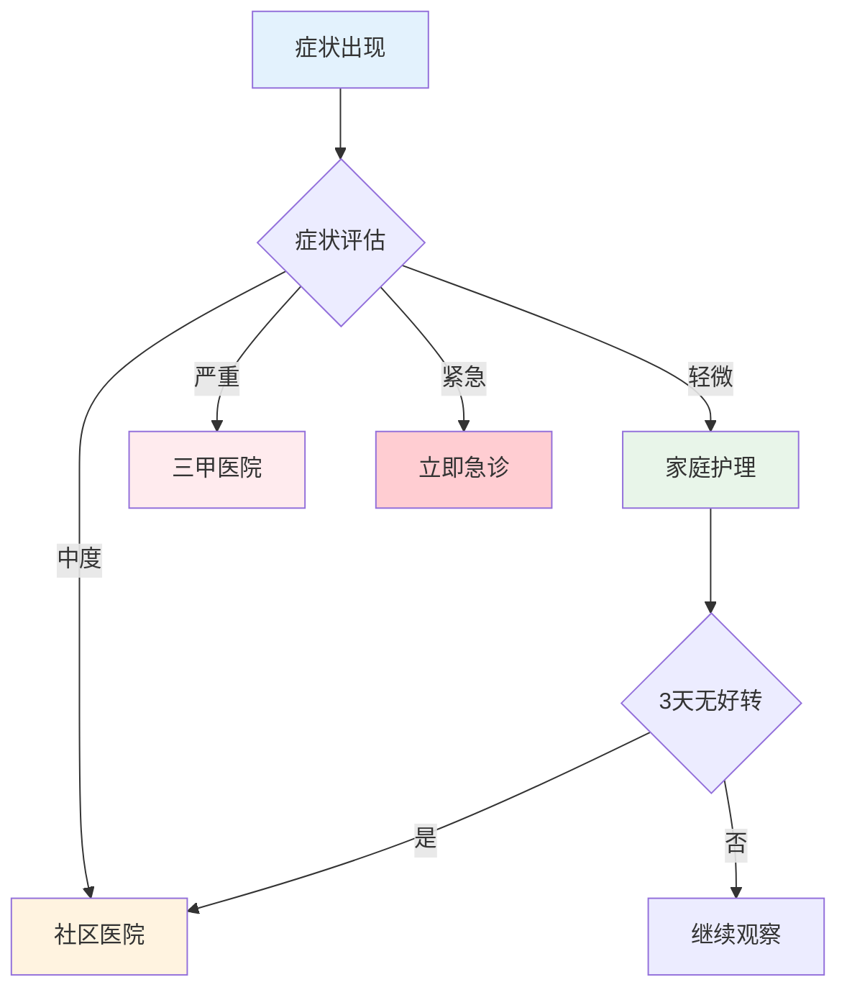
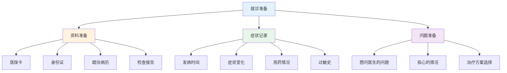

# 就医实战指南 — 高效就医的核心方法

> 90%的人不懂如何高效就医，导致延误治疗或浪费资源

---

## 一、就医决策流程

### 1.1 何时就医判断



### 1.2 紧急情况识别

| 症状 | 紧急程度 | 处理方式 |
|------|----------|----------|
| 胸痛/呼吸困难 | ⭐⭐⭐⭐⭐ | 立即急诊 |
| 剧烈头痛伴呕吐 | ⭐⭐⭐⭐⭐ | 立即急诊 |
| 大量出血 | ⭐⭐⭐⭐⭐ | 立即急诊 |
| 高烧>39°C持续3天 | ⭐⭐⭐⭐ | 尽快就诊 |
| 意识模糊 | ⭐⭐⭐⭐ | 立即急诊 |

---

## 二、就诊准备

### 2.1 就诊前准备清单



### 2.2 高效沟通技巧

**错误问法：**
- "医生，我肚子疼"
- "我感觉不舒服"

**正确问法：**
```
医生，我右下腹疼了2天，昨天开始发烧38.5°C，
今天疼得更厉害了，没有呕吐，也没有腹泻。
```

---

## 三、检查与用药

### 3.1 常见检查解读

| 检查项目 | 正常范围 | 异常含义 |
|----------|----------|----------|
| 血常规-白细胞 | 4-10×10^9 | 感染/炎症 |
| 血常规-血红蛋白 | 男120-160，女110-150 | 贫血 |
| 血糖 | 3.9-6.1mmol/L | 糖尿病风险 |
| 肝功能-转氨酶 | <40U/L | 肝损伤 |
| 尿常规-尿蛋白 | 阴性 | 肾脏问题 |

### 3.2 用药安全原则

| 原则 | 说明 |
|------|------|
| 遵医嘱 | 按医生开的剂量服用 |
| 按疗程 | 不要症状好转就停药 |
| 不混用 | 多种药物咨询医生 |
| 记录 | 记录用药情况 |
| 过敏 | 告知医生过敏史 |

---

## 四、就医避坑指南

### 4.1 常见误区

| 误区 | 正确做法 |
|------|----------|
| 什么都做CT | 根据需要选择检查 |
| 要求开好药 | 适合的才是最好的 |
| 频繁换医生 | 给医生足够时间 |
| 隐瞒病情 | 如实告知医生 |
| 自行停药 | 按疗程完成 |

### 4.2 保险与就医

| 情况 | 正确做法 |
|------|----------|
| 小病 | 趁健康买好保险 |
| 住院 | 了解医保报销比例 |
| 用药 | 咨询医保目录内用药 |

---

## 五、行动清单

### 就医前

- [ ] 带好医保卡、身份证
- [ ] 记录症状和用药史
- [ ] 列出想问医生的问题
- [ ] 了解医院挂号流程

### 就医中

- [ ] 如实描述病情
- [ ] 询问检查目的
- [ ] 了解用药注意事项
- [ ] 索取病历和检查报告

### 就医后

- [ ] 按医嘱用药
- [ ] 定期复查
- [ ] 记录治疗效果
- [ ] 保存好病历资料

---

> **记住：就医是技术活，准备越充分，效果越好。**
