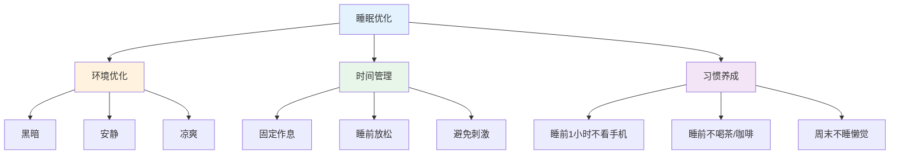
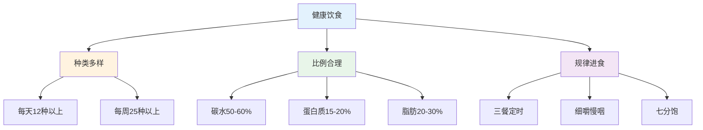
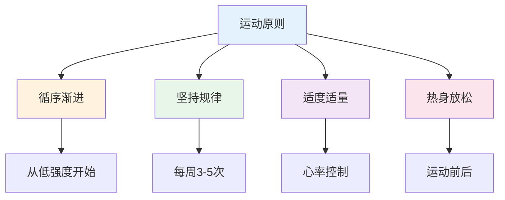
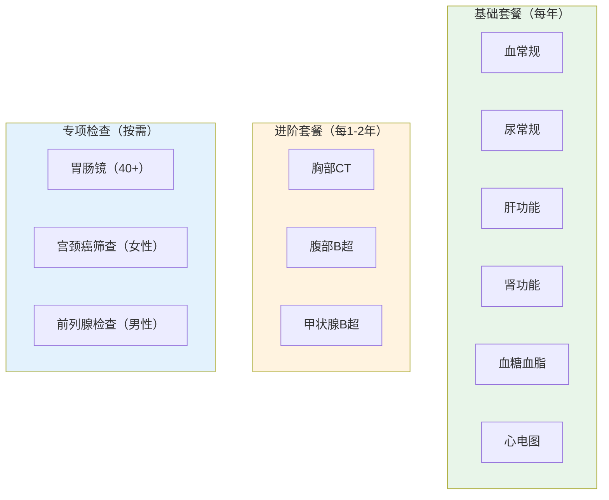
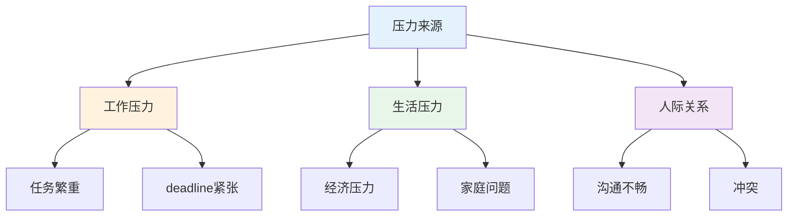
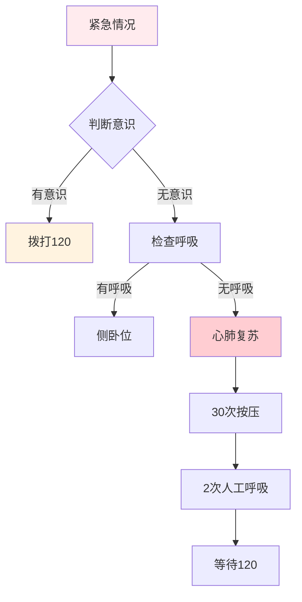

# 健康管理实战 — 预防疾病的高效方法

> 治未病比治已病更重要，健康管理是最好的投资

---

## 一、睡眠优化

### 1.1 睡眠质量公式

```
睡眠质量 = 时长 × 深度 × 规律性
```

### 1.2 睡眠优化方法



### 1.3 睡眠检查清单

- [ ] 卧室足够黑暗
- [ ] 温度适宜（18-22°C）
- [ ] 固定作息时间
- [ ] 睡前1小时不看手机
- [ ] 下午2点后不摄入咖啡因

---

## 二、饮食管理

### 2.1 健康饮食原则



### 2.2 饮食避坑

| 误区 | 正确做法 |
|------|----------|
| 不吃主食 | 适量摄入优质碳水 |
| 只吃素 | 荤素搭配 |
| 不吃早餐 | 三餐规律 |
| 暴饮暴食 | 七分饱 |
| 高油高盐 | 清淡饮食 |

---

## 三、运动规划

### 3.1 运动建议

| 年龄段 | 每周运动 | 运动类型 | 注意事项 |
|--------|----------|----------|----------|
| 18-30 | 150分钟 | 有氧+力量 | 循序渐进 |
| 30-50 | 150分钟 | 有氧+柔韧 | 注意关节 |
| 50-65 | 120分钟 | 太极/快走 | 避免剧烈 |
| 65+ | 90分钟 | 散步/太极 | 安全第一 |

### 3.2 运动原则



---

## 四、体检管理

### 4.1 体检项目选择



### 4.2 体检报告解读

| 指标 | 正常范围 | 临界值 | 就医标准 |
|------|----------|--------|----------|
| 血压 | <120/80mmHg | 120-140/80-90 | ≥140/90 |
| 空腹血糖 | 3.9-6.1mmol/L | 6.1-7.0 | ≥7.0 |
| 尿酸 | 男<420，女<360 | 轻度升高 | >480 |

---

## 五、心理健康

### 5.1 压力管理



### 5.2 情绪调节方法

| 方法 | 说明 | 适用场景 |
|------|------|----------|
| 深呼吸 | 4-7-8呼吸法 | 焦虑紧张 |
| 运动 | 有氧运动释放压力 | 情绪低落 |
| 写作 | 写日记表达情绪 | 压力大 |
| 冥想 | 正念冥想 | 焦虑失眠 |
| 社交 | 找人倾诉 | 孤独感 |

---

## 六、急救常识

### 6.1 急救流程



### 6.2 常见急救处理

| 情况 | 处理方式 |
|------|----------|
| 烫伤 | 冷水冲洗15分钟 |
| 割伤 | 加压止血+消毒 |
| 骨折 | 固定+不要移动 |
| 中暑 | 阴凉处+补水 |
| 过敏 | 抗过敏药+就医 |

---

## 七、行动清单

### 每日

- [ ] 保证7-8小时睡眠
- [ ] 三餐规律
- [ ] 适量运动
- [ ] 保持好心情

### 每周

- [ ] 至少150分钟运动
- [ ] 多样化饮食
- [ ] 复盘健康状况

### 每年

- [ ] 做一次基础体检
- [ ] 更新健康档案
- [ ] 调整健康计划

---

> **记住：健康不是一切，但没有健康就没有一切。**
