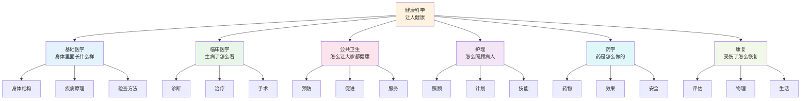
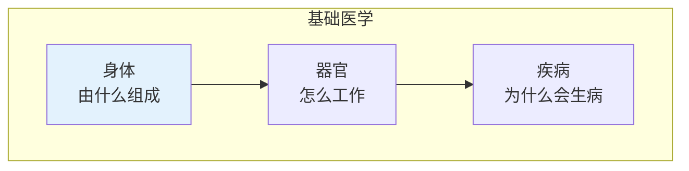
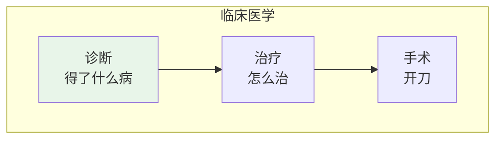
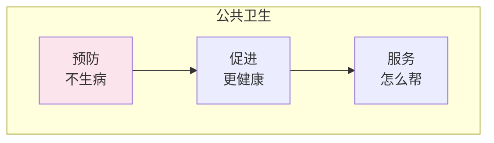
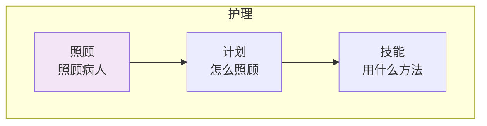
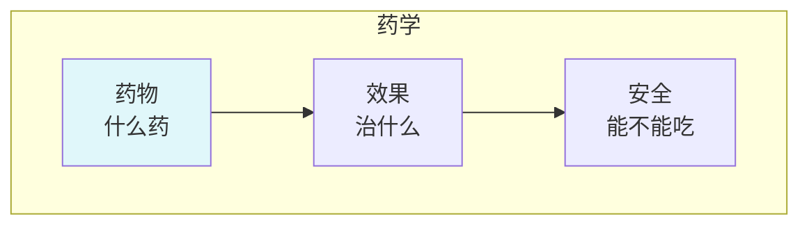
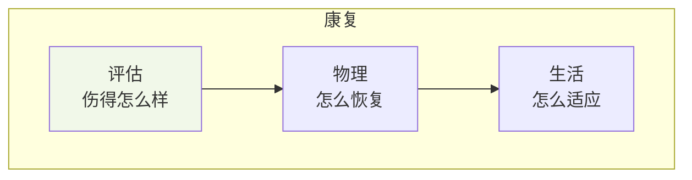
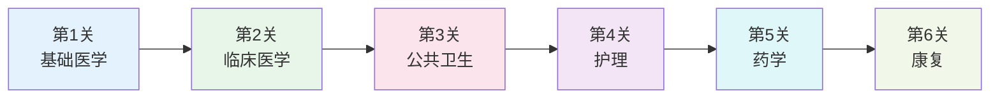

# 健康科学

> **费曼学习法**：健康就是"不生病、精神好"的学问！

---

## 🎯 一句话理解健康科学

**健康科学就是研究"怎么不生病、生病了怎么治"的学问！**

为什么人会生病？为什么会痛？怎么才能健康？健康科学就是回答这些问题的！

---

## 🏗️ 健康科学的"积木塔"

---

## 📚 每个积木块详解

### 🔬 基础医学（身体里面长什么样）

**用小学生的话说**：基础医学就是研究"身体里面长什么样"的学问！

| 积木块 | 小学生版解释 | 生活中的例子 |
|--------|--------------|--------------|
| 身体 | 由什么组成 | 头、手、脚 |
| 器官 | 怎么工作 | 心脏跳、肺呼吸 |
| 疾病 | 为什么会生病 | 感冒、发烧 |

---

### 🏥 临床医学（生病了怎么看）

**用小学生的话说**：临床医学就是研究"生病了怎么看、怎么治"的学问！

| 积木块 | 小学生版解释 | 生活中的例子 |
|--------|--------------|--------------|
| 诊断 | 得了什么病 | 医生看、做检查 |
| 治疗 | 怎么治 | 吃药、打针 |
| 手术 | 开刀 | 切除阑尾 |

---

### 🌍 公共卫生（怎么让大家都健康）

**用小学生的话说**：公共卫生就是研究"怎么让大家都健康"的学问！

| 积木块 | 小学生版解释 | 生活中的例子 |
|--------|--------------|--------------|
| 预防 | 不生病 | 打疫苗、洗手 |
| 促进 | 更健康 | 多运动、吃蔬菜 |
| 服务 | 怎么帮 | 医院、社区卫生 |

---

### 👩‍⚕️ 护理（怎么照顾病人）

**用小学生的话说**：护理就是研究"怎么照顾病人"的学问！

| 积木块 | 小学生版解释 | 生活中的例子 |
|--------|--------------|--------------|
| 照顾 | 照顾病人 | 端水、喂药 |
| 计划 | 怎么照顾 | 安排吃药时间 |
| 技能 | 用什么方法 | 量体温、包扎 |

---

### 💊 药学（药是怎么做的）

**用小学生的话说**：药学就是研究"药是怎么做出来的"的学问！

| 积木块 | 小学生版解释 | 生活中的例子 |
|--------|--------------|--------------|
| 药物 | 什么药 | 感冒药、退烧药 |
| 效果 | 治什么 | 治感冒、退烧 |
| 安全 | 能不能吃 | 不能乱吃药 |

---

### 🏃 康复（受伤了怎么恢复）

**用小学生的话说**：康复就是研究"受伤了怎么恢复"的学问！

| 积木块 | 小学生版解释 | 生活中的例子 |
|--------|--------------|--------------|
| 评估 | 伤得怎么样 | 医生检查 |
| 物理 | 怎么恢复 | 按摩、运动 |
| 生活 | 怎么适应 | 学会用拐杖 |

---

## 🎮 健康科学闯关游戏

**闯关秘籍**：
1. **第1关**：学基础医学（了解身体）
2. **第2关**：学临床医学（了解治病）
3. **第3关**：学公共卫生（了解预防）
4. **第4关**：学护理（了解照顾）
5. **第5关**：学药学（了解药物）
6. **第6关**：学康复（了解恢复）

---

## 💡 给小学生的话

> 健康是最重要的！
> 
> 多运动、吃蔬菜、勤洗手！
> 
> 你也可以成为医生或护士！

---

**每个医学家都曾经是初学者！**