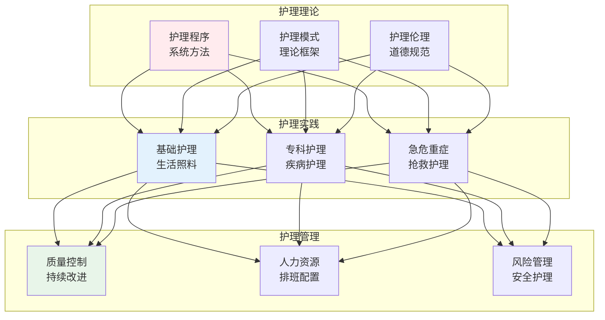
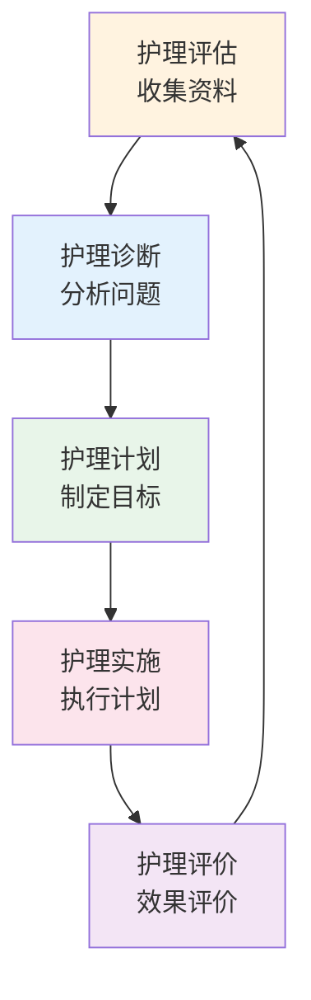
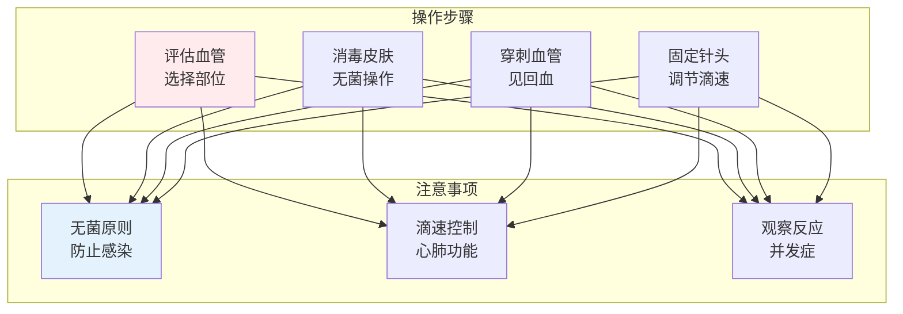
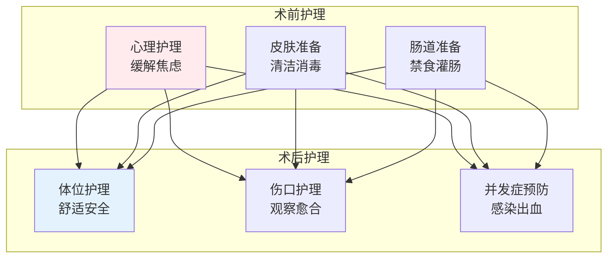

# 护理学

> **核心观点**：护理学是研究护理理论、实践和教育的学科，以促进健康、预防疾病、协助康复为目标。

---

## 📊 护理学体系



---

## 🔬 护理程序

### 五步骤



### 护理诊断

| 类型 | 描述 | 例子 |
|------|------|------|
| 现存诊断 | 现有问题 | 体温过高 |
| 风险诊断 | 潜在问题 | 皮肤完整性受损 |
| 健康促进 | 改善需求 | 活动无耐力 |

---

## 💉 基础护理技术

### 生命体征测量

| 项目 | 正常值 | 异常意义 |
|------|--------|----------|
| 体温 | 36-37℃ | 发热/低温 |
| 脉搏 | 60-100次/分 | 心动过速/过缓 |
| 呼吸 | 16-20次/分 | 呼吸困难 |
| 血压 | 90-140/60-90mmHg | 高血压/低血压 |

### 静脉输液



### 导尿术

| 步骤 | 内容 | 要点 |
|------|------|------|
| 准备 | 物品准备、解释 | 消除紧张 |
| 消毒 | 外阴消毒 | 无菌操作 |
| 插管 | 插入尿管 | 轻柔操作 |
| 固定 | 固定尿管 | 防止脱出 |

---

## 🏥 专科护理

### 内科护理

| 疾病 | 护理要点 |
|------|----------|
| 心力衰竭 | 限盐、监测体重、记录出入量 |
| 糖尿病 | 血糖监测、饮食控制、足部护理 |
| 肺炎 | 体位引流、翻身拍背、氧疗护理 |

### 外科护理



### 急危重症护理

| 急症 | 护理措施 |
|------|----------|
| 心脏骤停 | CPR、除颤、气管插管 |
| 休克 | 补液、升压、监测 |
| 呼吸衰竭 | 氧疗、机械通气 |
| 中毒 | 洗胃、解毒、支持 |

---

## ⚖️ 护理伦理

### 四大原则

```
护理伦理原则：
1. 尊重自主：尊重患者决定权
2. 不伤害：避免对患者造成伤害
3. 有利：为患者谋取最大利益
4. 公正：公平分配护理资源
```

### 护患关系

| 关系类型 | 特征 | 建立方法 |
|----------|------|----------|
| 治疗性关系 | 专业性 | 建立信任 |
| 沟通性关系 | 信息交流 | 有效沟通 |
| 教育性关系 | 知识传递 | 健康教育 |

---

## 🎯 核心结论

### 护理学的基本原则

1. **以患者为中心**：患者利益至上
2. **整体护理**：身心社灵全面护理
3. **循证护理**：基于最佳证据
4. **安全护理**：防止护理差错
5. **持续改进**：质量不断提升

### 护理职业价值

```
护理职业的意义：
1. 守护生命：照护患者
2. 促进健康：预防疾病
3. 减轻痛苦：缓解症状
4. 提供支持：心理关怀
5. 专业发展：终身学习
```

---

## 📚 参考文献

1. 《基础护理学》- 人民卫生出版社
2. 《内科护理学》- 人民卫生出版社
3. 《外科护理学》- 人民卫生出版社
4. 《妇产科护理学》- 人民卫生出版社
5. 《儿科护理学》- 人民卫生出版社
6. 《急危重症护理学》- 人民卫生出版社
7. 《护理伦理学》- 人民卫生出版社
8. 《护理管理学》- 人民卫生出版社