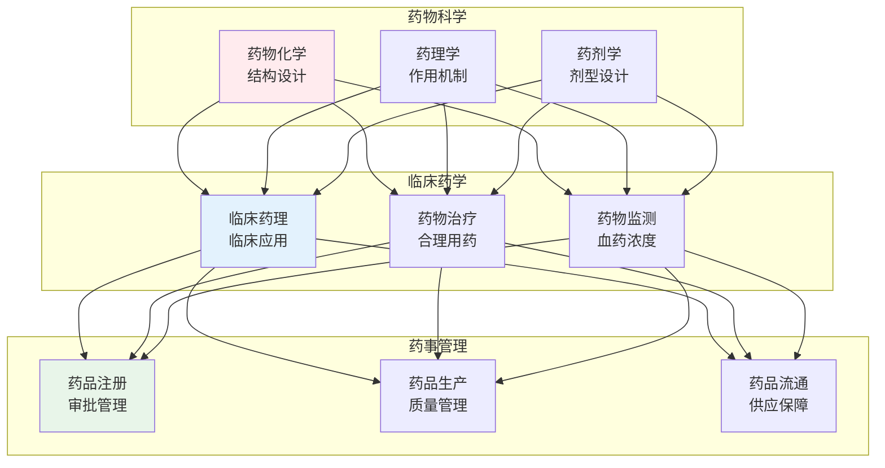
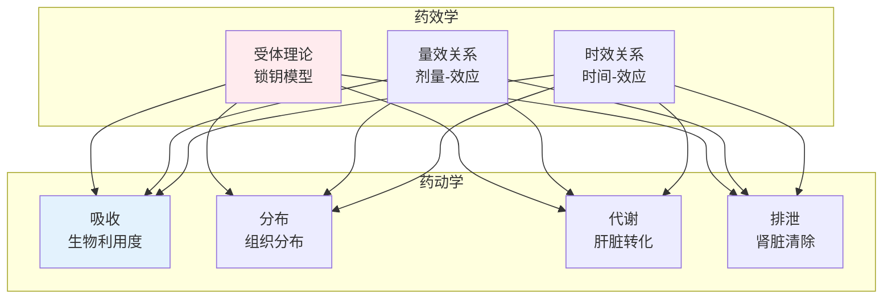
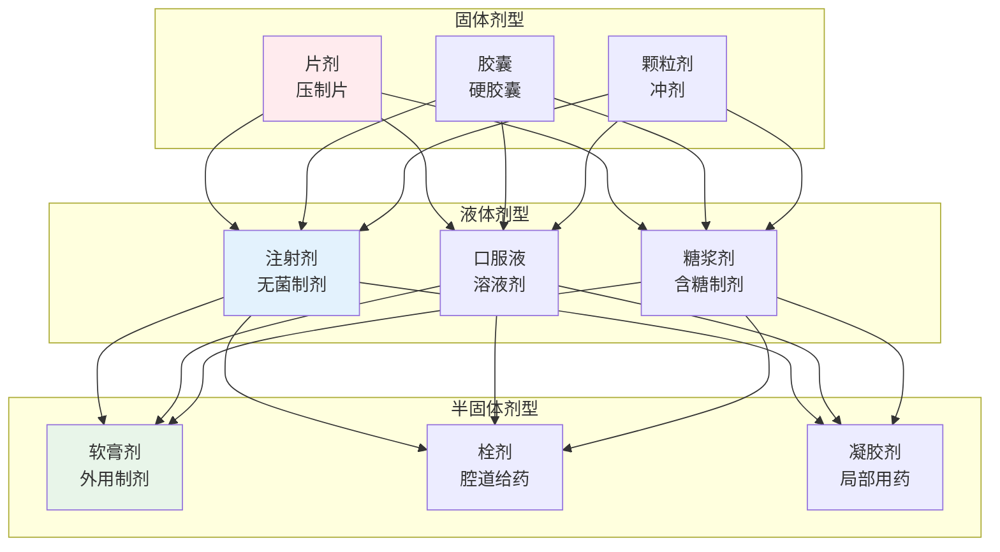
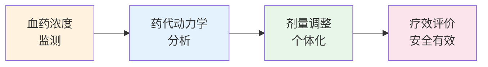

# 药学

> **核心观点**：药学是研究药物的发现、开发、生产、使用和管理的学科，以保障人类用药安全有效。

---

## 📊 药学体系



---

## 💊 药理学基础

### 药物作用原理



### 药物分类

| 类别 | 作用机制 | 代表药物 | 临床应用 |
|------|----------|----------|----------|
| 抗生素 | 杀灭/抑制细菌 | 青霉素、头孢 | 感染性疾病 |
| 降压药 | 调节血压 | ACEI、CCB | 高血压 |
| 降糖药 | 调节血糖 | 二甲双胍、胰岛素 | 糖尿病 |
| 抗肿瘤药 | 杀灭肿瘤细胞 | 化疗药、靶向药 | 癌症 |
| 镇痛药 | 抑制疼痛 | NSAIDs、阿片类 | 疼痛 |

### 药物不良反应

| 类型 | 描述 | 原因 |
|------|------|------|
| 副作用 | 治疗剂量下的非治疗作用 | 药理作用广泛 |
| 毒性反应 | 剂量过大导致的损害 | 剂量相关 |
| 过敏反应 | 免疫介导的异常反应 | 个体差异 |
| 后遗效应 | 停药后的残留作用 | 药物蓄积 |

---

## 🏭 药剂学

### 剂型分类



### 缓控释制剂

| 类型 | 特点 | 优点 |
|------|------|------|
| 缓释制剂 | 缓慢释放 | 减少给药次数 |
| 控释制剂 | 恒速释放 | 血药浓度稳定 |
| 靶向制剂 | 定位释放 | 提高疗效降低毒性 |

---

## 🏥 临床药学

### 合理用药原则

```
合理用药六要素：
1. 正确诊断：对症下药
2. 合理选药：安全有效
3. 适当剂量：个体化
4. 适当疗程：足够时间
5. 适当给药途径：方便吸收
6. 适当联合用药：协同增效
```

### 药物相互作用

| 类型 | 机制 | 例子 |
|------|------|------|
| 药动学相互作用 | 影响ADME | 酶诱导/抑制 |
| 药效学相互作用 | 协同/拮抗 | 增效/减效 |
| 药物-食物相互作用 | 影响吸收 | 牛奶影响吸收 |

### 治疗药物监测



---

## 📋 药事管理

### 药品注册管理

| 注册类型 | 内容 | 要求 |
|----------|------|------|
| 新药申请 | 创新药 | 临床试验 |
| 仿制药申请 | 仿制已上市 | 质量一致 |
| 进口药品 | 境外生产 | 注册审批 |

### 药品质量管理

```
药品质量管理GMP：
1. 人员资质：专业培训
2. 厂房设施：符合标准
3. 设备验证：定期校验
4. 物料管理：全程追溯
5. 生产过程：严格控制
6. 质量控制：检验放行
```

---

## 🎯 核心结论

### 药学的基本原则

1. **安全第一**：用药安全是底线
2. **有效为本**：治疗效果是目标
3. **合理用药**：避免药物滥用
4. **个体化治疗**：因人而异
5. **持续监测**：关注不良反应

### 药学的职业价值

```
药学如何服务健康：
1. 保障药品供应
2. 指导合理用药
3. 监测药物安全
4. 研发新药
5. 促进健康
```

---

## 📚 参考文献

1. 《药理学》- 人民卫生出版社
2. 《药物化学》- 人民卫生出版社
3. 《药剂学》- 人民卫生出版社
4. 《药物分析》- 人民卫生出版社
5. 《临床药学》- 人民卫生出版社
6. 《药事管理学》- 人民卫生出版社
7. 《生物药剂学与药物动力学》- 人民卫生出版社
8. 《药物不良反应与合理用药》- 人民卫生出版社