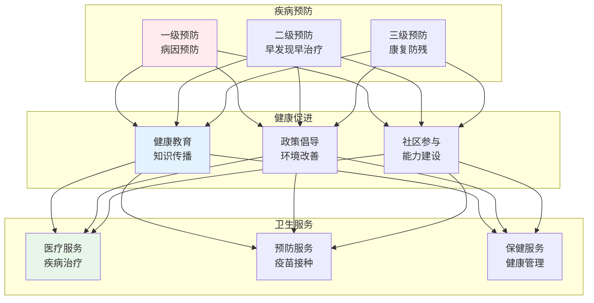
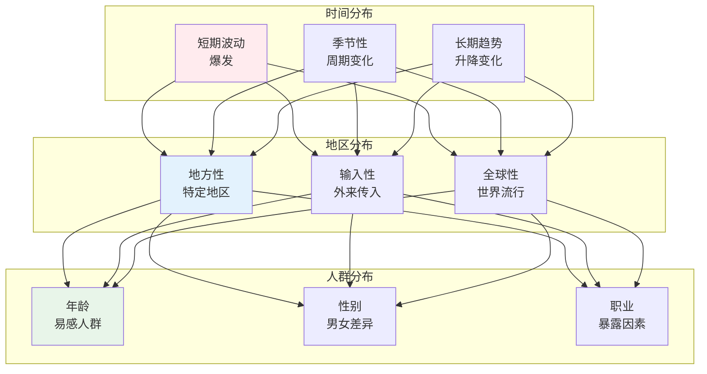
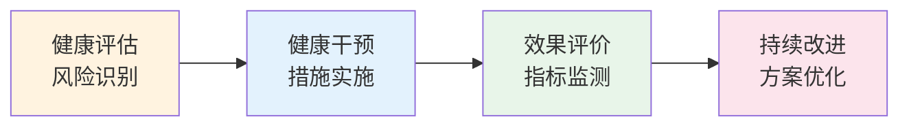

# 公共卫生

> **核心观点**：公共卫生是通过组织社会力量，预防疾病、延长寿命、促进健康的科学和艺术。

---

## 📊 公共卫生体系



---

## 🔬 流行病学

### 疾病频率指标

| 指标 | 计算公式 | 意义 |
|------|----------|------|
| 发病率 | 新病例/暴露人口×K | 疾病发生频率 |
| 患病率 | 现患病例/调查人口×K | 疾病存在频率 |
| 死亡率 | 死亡人数/平均人口×K | 人口死亡风险 |
| 病死率 | 死亡人数/病例数×K | 疾病严重程度 |

### 疾病分布



### 病因推断

| 标准 | 内涵 | 例子 |
|------|------|------|
| 关联强度 | 相对危险度 | 吸烟与肺癌 |
| 关联时间 | 因先于果 | 暴露先于发病 |
| 剂量反应 | 剂量相关 | 吸烟量与肺癌 |
| 生物合理性 | 科学解释 | 致癌机制 |

---

## 🏥 卫生服务

### 健康促进策略

```
健康促进五大领域：
1. 制定健康政策
2. 创造支持环境
3. 加强社区行动
4. 发展个人技能
5. 重新定向服务
```

### 疫苗接种

| 疫苗类型 | 特点 | 例子 |
|----------|------|------|
| 减毒活菌苗 | 活菌减毒 | 卡介苗 |
| 灭活菌苗 | 死菌 | 百日咳 |
| 亚单位疫苗 | 成分疫苗 | 乙肝 |
| mRNA疫苗 | 新型技术 | 新冠 |

### 健康管理



---

## 🎯 核心结论

### 公共卫生的基本原则

1. **预防为主**：一级预防最重要
2. **群体视角**：关注整个人群
3. **证据决策**：基于流行病学
4. **多部门协作**：社会参与
5. **公平可及**：人人享有健康

### 公共卫生价值

```
公共卫生如何改变世界：
1. 降低传染病负担
2. 提高人均寿命
3. 改善生活质量
4. 促进社会公平
5. 应对健康威胁
```

---

## 📚 参考文献

1. 《流行病学》- 人民卫生出版社
2. 《卫生统计学》- 人民卫生出版社
3. 《健康教育学》- 人民卫生出版社
4. 《卫生法规》- 人民卫生出版社
5. 《社会医学》- 人民卫生出版社
6. 《营养与食品卫生学》- 人民卫生出版社
7. 《环境卫生学》- 人民卫生出版社
8. 《职业卫生与职业医学》- 人民卫生出版社