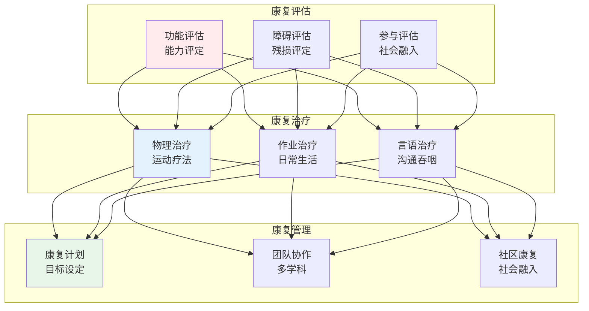
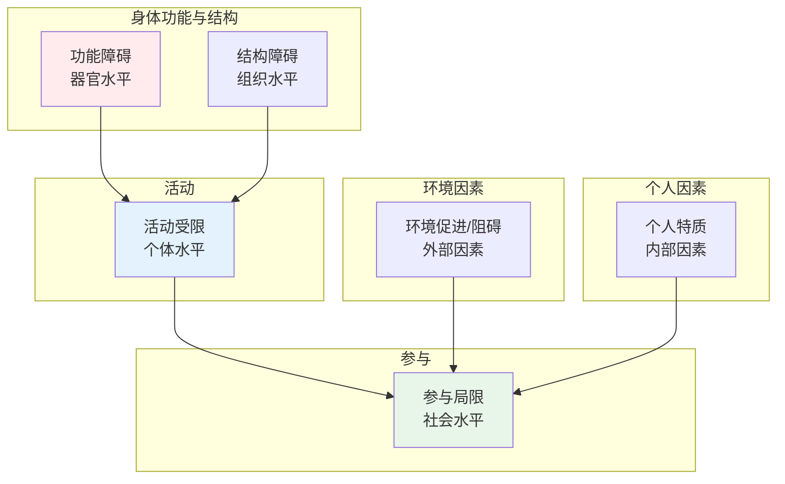
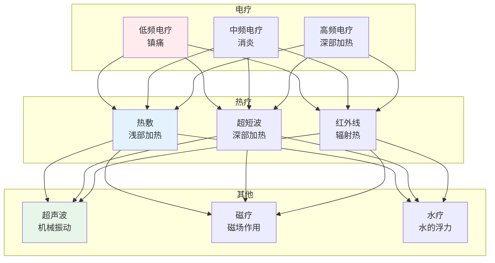
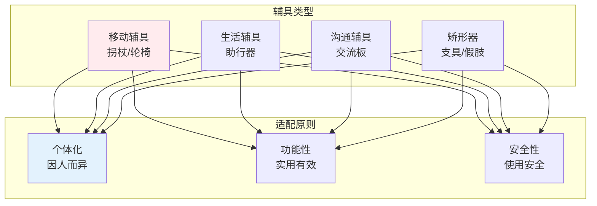
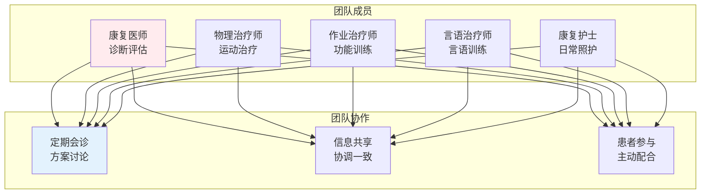

# 康复医学

> **核心观点**：康复医学是研究病、伤、残者康复的医学学科，以促进功能恢复、提高生活质量为目标。

---

## 📊 康复医学体系



---

## 🔬 康复评估

### 评估工具

| 评估内容 | 评估工具 | 评估目的 |
|----------|----------|----------|
| 运动功能 | Fugl-Meyer评估 | 运动能力 |
| 日常生活能力 | Barthel指数 | 生活自理 |
| 认知功能 | MMSE量表 | 认知状态 |
| 言语功能 | 波士顿诊断性失语症检查 | 言语能力 |
| 心理状态 | SAS/SDS量表 | 情绪状态 |

### ICF框架



---

## 💪 物理治疗

### 运动疗法

| 方法 | 目的 | 适用人群 |
|------|------|----------|
| 关节活动度训练 | 维持/增加活动度 | 关节挛缩 |
| 肌力训练 | 增强肌肉力量 | 肌力下降 |
| 平衡训练 | 提高平衡能力 | 平衡障碍 |
| 步态训练 | 改善行走能力 | 步态异常 |
| 心肺耐力训练 | 提高心肺功能 | 心肺疾病 |

### 物理因子治疗



---

## 🛠️ 作业治疗

### 训练内容

| 训练类型 | 内容 | 目标 |
|----------|------|------|
| 日常生活活动训练 | 穿衣、进食、洗漱 | 生活自理 |
| 手功能训练 | 精细动作、协调 | 手部功能 |
| 认知功能训练 | 注意力、记忆力 | 认知改善 |
| 职业能力训练 | 工作技能 | 就业准备 |
| 环境改造 | 辅具适配 | 环境适应 |

### 辅具适配



---

## 🗣️ 言语治疗

### 言语障碍类型

| 障碍类型 | 表现 | 治疗方法 |
|----------|------|----------|
| 失语症 | 语言理解/表达障碍 | 语言训练 |
| 构音障碍 | 发音不清 | 口部运动训练 |
| 吞咽障碍 | 吞咽困难 | 吞咽训练 |
| 嗓音障碍 | 嗓音异常 | 嗓音训练 |

### 治疗技术

```
言语治疗技术：
1. 语言训练：理解、表达、复述
2. 口部运动训练：唇、舌、下颌
3. 吞咽训练：冷刺激、吞咽手法
4. 嗓音训练：呼吸、发声、共鸣
```

---

## 🧠 康复管理

### 康复团队



### 社区康复

| 模式 | 特点 | 目标 |
|------|------|------|
| 社区为基础 | 就近康复 | 便利可及 |
| 家庭为基础 | 居家康复 | 融入生活 |
| 职业康复 | 就业准备 | 社会参与 |

---

## 🎯 核心结论

### 康复医学的基本原则

1. **早期康复**：尽早开始康复
2. **主动参与**：患者主动配合
3. **全面康复**：身心社灵全面
4. **团队协作**：多学科合作
5. **持续康复**：终身康复

### 康复医学的价值

```
康复医学如何改变生活：
1. 改善功能障碍
2. 提高生活自理
3. 促进社会参与
4. 提升生活质量
5. 减轻家庭负担
```

---

## 📚 参考文献

1. 《康复医学》- 人民卫生出版社
2. 《物理治疗学》- 人民卫生出版社
3. 《作业治疗学》- 人民卫生出版社
4. 《言语治疗学》- 人民卫生出版社
5. 《康复评定学》- 人民卫生出版社
6. 《临床康复学》- 人民卫生出版社
7. 《社区康复》- 人民卫生出版社
8. 《康复工程学》- 人民卫生出版社