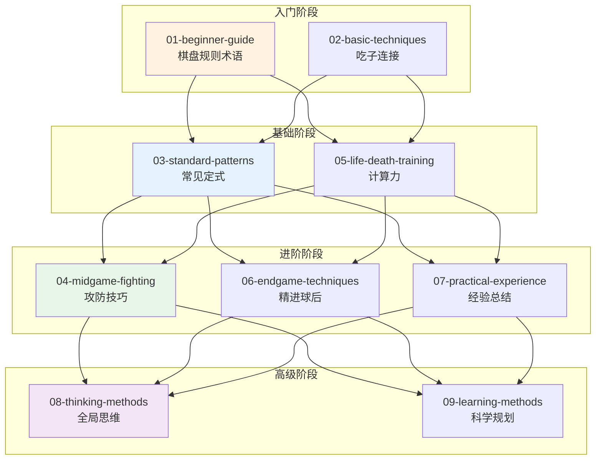
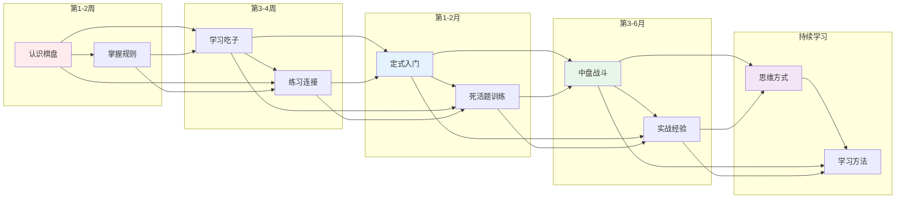
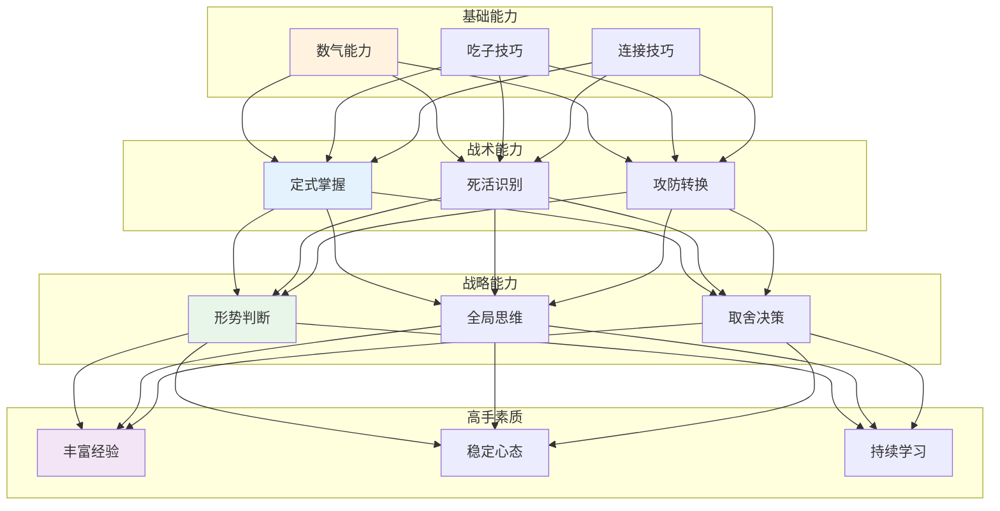
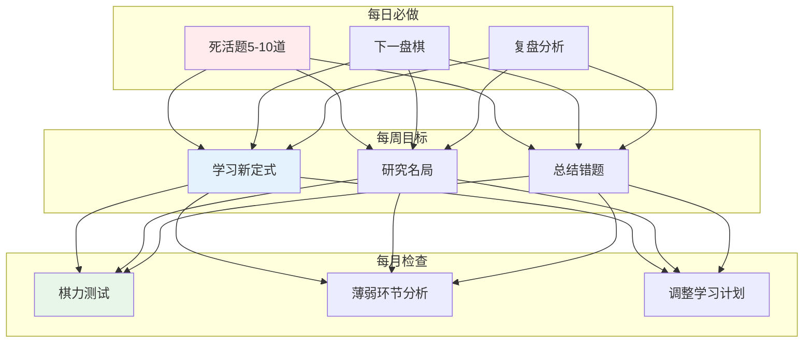

# 围棋知识库

> 从零基础到进阶，系统化学习围棋的完整路径。

---

## 📚 知识体系总览



---

## 🎯 学习路径图



---

## 📖 各主题概览

| 序号 | 主题 | 核心内容 | 文档 |
|------|------|----------|------|
| 1 | 新手入门 | 棋盘、规则、术语、第一局棋 | [01-beginner-guide.md](01-beginner-guide.md) |
| 2 | 基础技巧 | 5种吃子方法、4种连接技巧 | [02-basic-techniques.md](02-basic-techniques.md) |
| 3 | 定式入门 | 3个必学定式、布局原则 | [03-standard-patterns.md](03-standard-patterns.md) |
| 4 | 中盘战斗 | 攻击防守技巧、决策树 | [04-midgame-fighting.md](04-midgame-fighting.md) |
| 5 | 死活题训练 | 基本眼形、经典题型 | [05-life-death-training.md](05-life-death-training.md) |
| 6 | 官子技巧 | 官子计算、优先级 | [06-endgame-techniques.md](06-endgame-techniques.md) |
| 7 | 实战经验 | 开中收官经验、心态管理 | [07-practical-experience.md](07-practical-experience.md) |
| 8 | 思维方式 | 计算、判断、全局思维 | [08-thinking-methods.md](08-thinking-methods.md) |
| 9 | 学习方法 | 分阶段学习路径规划 | [09-learning-methods.md](09-learning-methods.md) |

---

## 🎓 核心概念关系图



---

## 📊 棋力等级与对应技能

```mermaid
xychart
    title "围棋技能成长曲线"
    x-axis [入门, 初级, 中级, 高级, 专业]
    y-axis "能力水平" 0 --> 100
    bar [10, 30, 55, 75, 90]
    line [5, 15, 35, 60, 85]
```

| 等级 | 描述 | 关键技能 |
|------|------|----------|
| 入门 (10级+) | 能完整下完一局 | 规则、数气、吃子 |
| 初级 (10-20级) | 理解基本概念 | 定式、死活基础 |
| 中级 (20-30级) | 初步棋感 | 中盘战斗、形势判断 |
| 高级 (30级+) | 系统提升 | 全局思维、官子精确 |
| 专业 | 形成风格 | 创新能力、理论深度 |

---

## 🔗 快速导航

### 按学习阶段
- **入门期**：[01-beginner-guide.md](01-beginner-guide.md) → [02-basic-techniques.md](02-basic-techniques.md)
- **基础期**：[03-standard-patterns.md](03-standard-patterns.md) → [05-life-death-training.md](05-life-death-training.md)
- **进阶期**：[04-midgame-fighting.md](04-midgame-fighting.md) → [06-endgame-techniques.md](06-endgame-techniques.md) → [07-practical-experience.md](07-practical-experience.md)
- **提高期**：[08-thinking-methods.md](08-thinking-methods.md) → [09-learning-methods.md](09-learning-methods.md)

### 按技能类型
- **基础知识**：[01-beginner-guide.md](01-beginner-guide.md)、[02-basic-techniques.md](02-basic-techniques.md)
- **定式战术**：[03-standard-patterns.md](03-standard-patterns.md)、[04-midgame-fighting.md](04-midgame-fighting.md)
- **计算训练**：[05-life-death-training.md](05-life-death-training.md)
- **收官技巧**：[06-endgame-techniques.md](06-endgame-techniques.md)
- **经验思维**：[07-practical-experience.md](07-practical-experience.md)、[08-thinking-methods.md](08-thinking-methods.md)
- **学习规划**：[09-learning-methods.md](09-learning-methods.md)

---

## 🌟 学习建议



---

**返回首页**：[体育科学](../index.md)