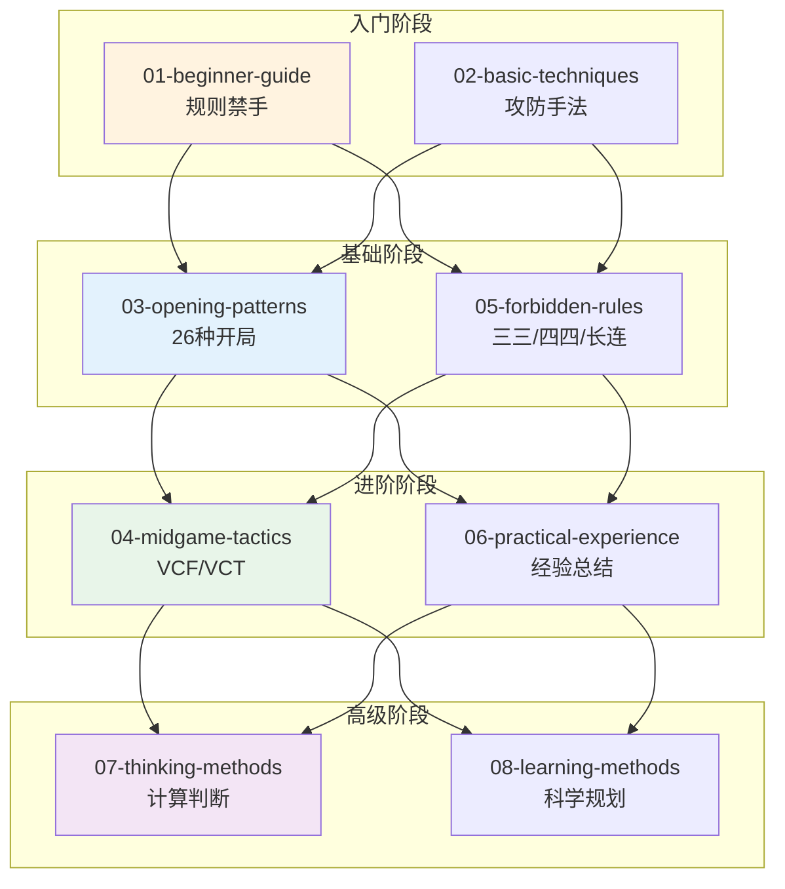
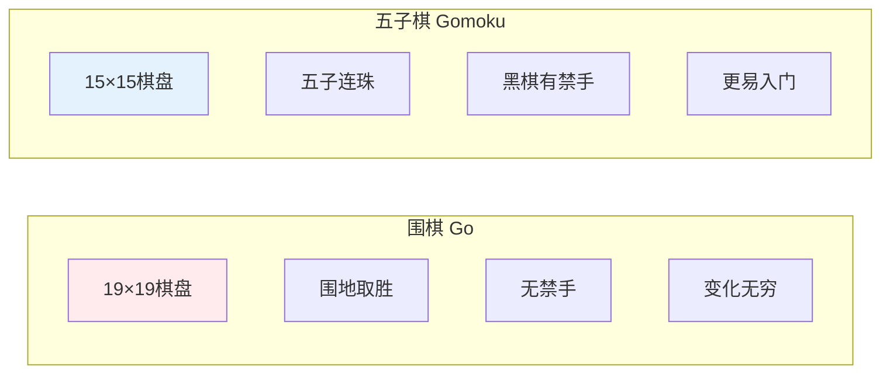
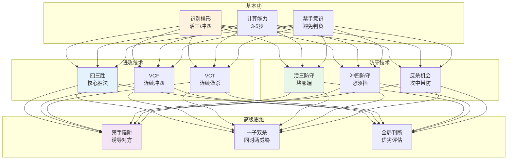
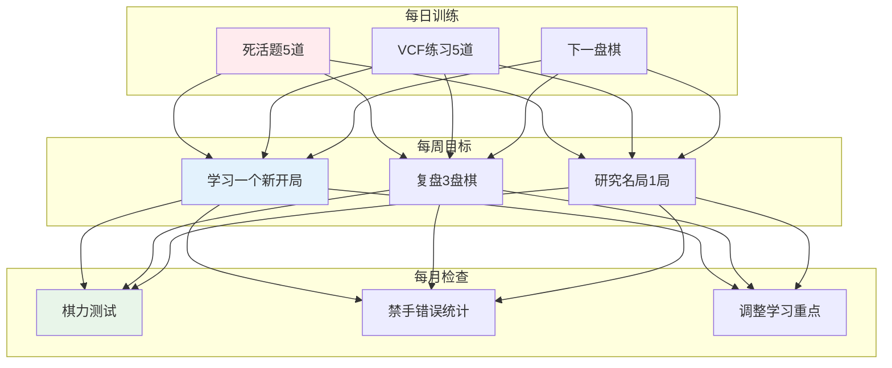

# 五子棋知识库

> 从零基础到进阶，系统化学习五子棋的完整路径。

---

## 📚 知识体系总览



---

## 🎯 五子棋 vs 围棋 对比



---

## 📖 各主题概览

| 序号 | 主题 | 核心内容 | 文档 |
|------|------|----------|------|
| 1 | 新手入门 | 15路棋盘、规则、禁手概念 | [01-beginner-guide.md](01-beginner-guide.md) |
| 2 | 基础技巧 | 活三冲四、四三胜、防守 | [02-basic-techniques.md](02-basic-techniques.md) |
| 3 | 开局定式 | 26种开局、云月浦月详解 | [03-opening-patterns.md](03-opening-patterns.md) |
| 4 | 中盘战术 | VCF/VCT、一子双杀 | [04-midgame-tactics.md](04-midgame-tactics.md) |
| 5 | 禁手规则 | 三三/四四/长连禁手详解 | [05-forbidden-rules.md](05-forbidden-rules.md) |
| 6 | 实战经验 | 开中收官经验、心态 | [06-practical-experience.md](06-practical-experience.md) |
| 7 | 思维方式 | 计算、判断、攻防思维 | [07-thinking-methods.md](07-thinking-methods.md) |
| 8 | 学习方法 | 分阶段学习路径规划 | [08-learning-methods.md](08-learning-methods.md) |

---

## 🎓 核心技能关系图



---

## 📊 学习进度图

```mermaid
xychart
    title "五子棋学习进度"
    x-axis [入门, 基础, 进阶, 提高, 精通]
    y-axis "掌握程度" 0 --> 100
    bar [15, 40, 65, 85, 95]
    line [10, 30, 55, 75, 90]
```

| 阶段 | 目标 | 关键指标 |
|------|------|----------|
| 入门 (0-15级) | 掌握规则，能完整对局 | 不犯禁手错误 |
| 基础 (15-25级) | 理解定式，会四三胜 | 能识别基本杀法 |
| 进阶 (25-35级) | 掌握VCF/VCT | 能计算5-10步 |
| 提高 (35级+) | 形成个人风格 | 稳定的胜率 |

---

## 🔗 快速导航

### 按学习阶段
- **入门期**：[01-beginner-guide.md](01-beginner-guide.md) → [02-basic-techniques.md](02-basic-techniques.md)
- **基础期**：[03-opening-patterns.md](03-opening-patterns.md) → [05-forbidden-rules.md](05-forbidden-rules.md)
- **进阶期**：[04-midgame-tactics.md](04-midgame-tactics.md) → [06-practical-experience.md](06-practical-experience.md)
- **提高期**：[07-thinking-methods.md](07-thinking-methods.md) → [08-learning-methods.md](08-learning-methods.md)

### 按技能类型
- **规则知识**：[01-beginner-guide.md](01-beginner-guide.md)、[05-forbidden-rules.md](05-forbidden-rules.md)
- **基础技巧**：[02-basic-techniques.md](02-basic-techniques.md)
- **开局定式**：[03-opening-patterns.md](03-opening-patterns.md)
- **战术组合**：[04-midgame-tactics.md](04-midgame-tactics.md)
- **实战应用**：[06-practical-experience.md](06-practical-experience.md)
- **思维方法**：[07-thinking-methods.md](07-thinking-methods.md)、[08-learning-methods.md](08-learning-methods.md)

---

## 🌟 学习建议



---

**返回首页**：[体育科学](../index.md)