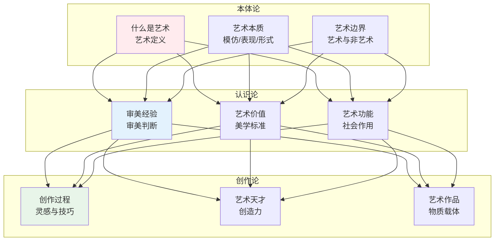
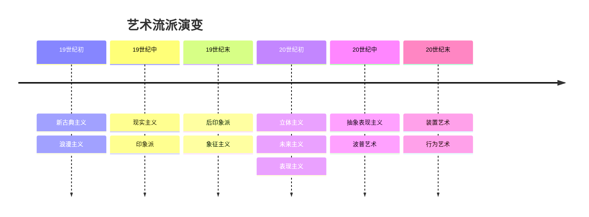
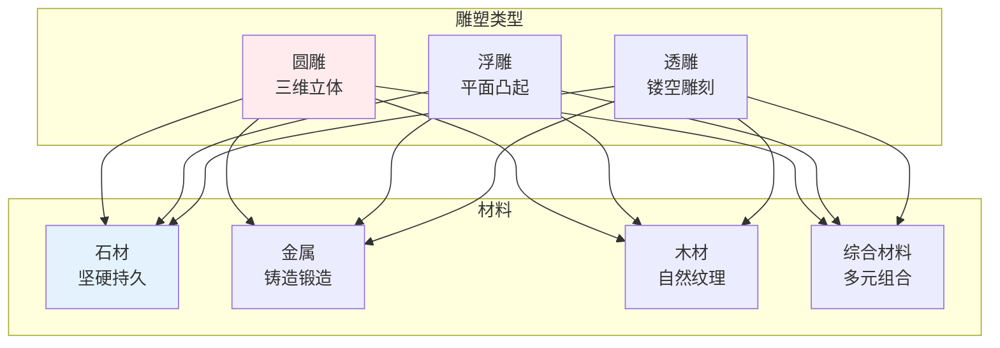
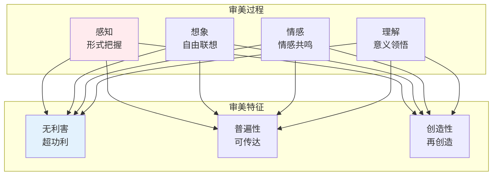
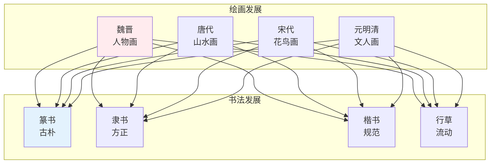

# 艺术知识体系

> **核心观点**：艺术是人类以审美方式把握世界的活动，是情感与形式的统一。

---

## 📊 艺术哲学框架



---

## 🎨 艺术流派

### 古典艺术

| 流派 | 时期 | 特征 | 代表人物 |
|------|------|------|----------|
| 古希腊 | 公元前5世纪 | 和谐、理想 | 菲狄亚斯 |
| 文艺复兴 | 14-16世纪 | 人文主义 | 达芬奇、米开朗基罗 |
| 巴洛克 | 17世纪 | 华丽、动感 | 鲁本斯 |

### 近现代艺术



### 当代艺术

| 类型 | 特征 | 代表人物 |
|------|------|----------|
| 装置艺术 | 空间、体验 | 杜尚 |
| 行为艺术 | 身体、过程 | 小野洋子 |
| 数字艺术 | 技术、交互 | Refik Anadol |
| 观念艺术 | 概念、思想 | 约瑟夫·科苏斯 |

---

## 🖼️ 艺术门类

### 绘画

| 类型 | 特征 | 技法 |
|------|------|------|
| 油画 | 色彩丰富 | 厚涂、薄涂 |
| 水彩 | 透明轻盈 | 湿画法、干画法 |
| 国画 | 笔墨情趣 | 工笔、写意 |
| 版画 | 复数性 | 木刻、铜版 |

### 雕塑



### 建筑

| 风格 | 特征 | 代表作品 |
|------|------|----------|
| 古典 | 对称、柱式 | 帕特农神庙 |
| 哥特 | 尖拱、飞扶壁 | 巴黎圣母院 |
| 现代 | 功能、简洁 | 包豪斯 |
| 后现代 | 隐喻、装饰 | AT&T大厦 |

### 音乐

| 类型 | 特征 | 代表人物 |
|------|------|----------|
| 古典音乐 | 结构严谨 | 贝多芬、莫扎特 |
| 爵士乐 | 即兴、摇摆 | 迈尔斯·戴维斯 |
| 摇滚乐 | 节奏强烈 | 甲壳虫乐队 |
| 电子音乐 | 合成、实验 | Aphex Twin |

---

## 🔬 美学理论

### 美的本质

| 理论 | 核心观点 | 代表人物 |
|------|----------|----------|
| 客观论 | 美在对象本身 | 柏拉图 |
| 主观论 | 美在主观感受 | 休谟 |
| 主客统一 | 美在关系中 | 康德 |
| 实践论 | 美是人的本质力量 | 马克思 |

### 艺术定义

```
艺术定义的困难：
1. 本质主义的失败
2. 历史语境的变化
3. 制度理论的兴起
4. 概念艺术的挑战
```

### 审美经验



---

## 📚 艺术史

### 西方艺术史

| 时期 | 风格 | 关键转折 |
|------|------|----------|
| 古代 | 模仿自然 | 写实传统 |
| 中世纪 | 宗教象征 | 神圣表现 |
| 文艺复兴 | 人文主义 | 透视法 |
| 19世纪 | 印象革命 | 光影捕捉 |
| 20世纪 | 现代主义 | 抽象实验 |

### 中国艺术史



---

## 🎯 核心结论

### 艺术的基本发现

1. **艺术是审美的**：以美为追求
2. **艺术是创造的**：创新是本质
3. **艺术是情感的**：情感是动力
4. **艺术是文化的**：反映时代精神
5. **艺术是跨界的**：打破边界

### 艺术学习路径

```
艺术学习四步骤：
1. 鉴赏训练：培养审美眼光
2. 技法学习：掌握表现技巧
3. 创作实践：表达个人感受
4. 理论学习：理解艺术本质
```

---

## 📚 参考文献

1. 柏拉图《理想国》
2. 亚里士多德《诗学》
3. 康德《判断力批判》
4. 黑格尔《美学》
5. 尼采《悲剧的诞生》
6. 杜威《艺术即经验》
7. 丹托《艺术的终结》
8. 李泽厚《美的历程》