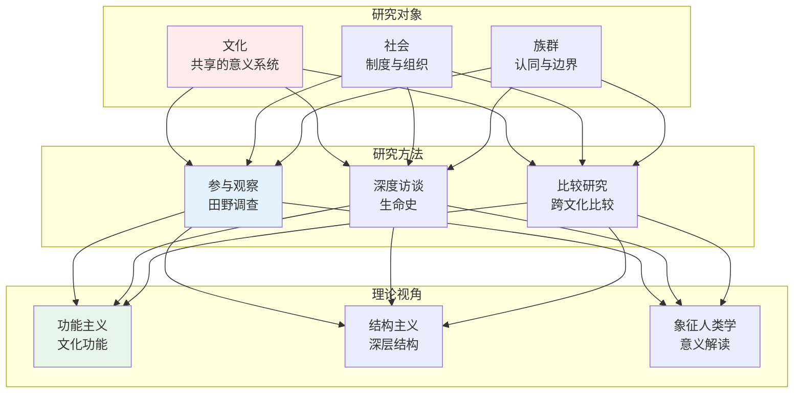
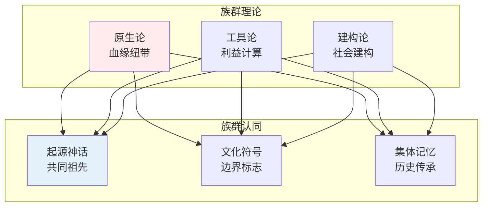
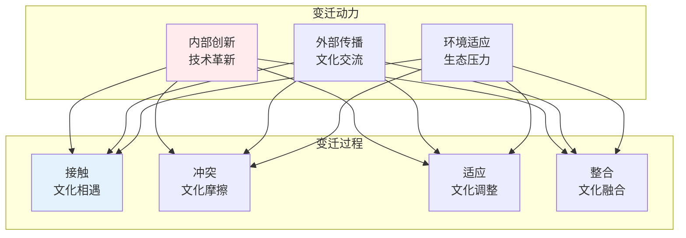

# 民族学知识体系

> **核心观点**：民族学是研究人类社会文化多样性的学科，通过比较研究理解不同文化。

---

## 📊 民族学框架



---

## 🔬 核心概念

### 文化

| 概念 | 内涵 | 分析维度 |
|------|------|----------|
| 文化要素 | 物质/制度/精神 | 三个层面 |
| 文化特征 | 习得性、共享性 | 基本属性 |
| 文化变迁 | 创新、传播、涵化 | 动态过程 |
| 文化模式 | 核心价值观 | 整体结构 |

### 族群



### 社会组织

| 组织类型 | 特征 | 功能 |
|----------|------|------|
| 亲属制度 | 血缘纽带 | 身份认同 |
| 婚姻制度 | 两性关系 | 家庭组建 |
| 政治组织 | 权力分配 | 社会控制 |
| 经济组织 | 生产分配 | 生计维持 |

---

## 📚 理论流派

### 古典进化论

**核心观点**：文化从简单到复杂、从低级到高级发展。

| 代表人物 | 核心观点 | 贡献 |
|----------|----------|------|
| 摩尔根 | 社会进化三阶段 | 历史方法 |
| 泰勒 | 文化进化论 | 文化定义 |

### 传播论

**核心观点**：文化通过传播从中心向四周扩散。

```
传播论核心主张：
1. 文化创新是少数
2. 文化传播是主要
3. 文化圈理论
4. 泛埃及论
```

### 功能主义

| 代表人物 | 核心观点 | 分析焦点 |
|----------|----------|----------|
| 马林诺夫斯基 | 文化功能 | 满足需求 |
| 拉德克利夫-布朗 | 社会功能 | 社会结构 |

### 结构主义

**核心观点**：文化现象背后存在普遍的深层结构。

| 代表人物 | 核心观点 | 分析方法 |
|----------|----------|----------|
| 列维-斯特劳斯 | 二元对立 | 神话分析 |
| 涂尔干 | 集体意识 | 社会事实 |

---

## 🌍 文化多样性

### 文化区域

| 区域 | 特征 | 代表文化 |
|------|------|----------|
| 东亚 | 儒家文化 | 中华文明 |
| 南亚 | 印度教 | 印度文明 |
| 中东 | 伊斯兰教 | 阿拉伯文明 |
| 欧洲 | 基督教 | 西方文明 |
| 非洲 | 传统宗教 | 非洲文明 |

### 文化变迁



### 文化遗产保护

| 类型 | 内涵 | 保护方式 |
|------|------|----------|
| 物质遗产 | 建筑、器物 | 修复保护 |
| 非物质遗产 | 传统、技艺 | 活态传承 |
| 自然遗产 | 遗址、景观 | 整体保护 |

---

## 🔬 研究方法

### 田野调查


### 比较研究

| 比较类型 | 描述 | 目的 |
|----------|------|------|
| 跨文化比较 | 不同文化对比 | 发现普遍规律 |
| 跨区域比较 | 不同地区对比 | 理解区域特征 |
| 历史比较 | 不同时期对比 | 理解变迁过程 |

---

## 🎯 核心结论

### 民族学的基本发现

1. **文化多样性**：人类文化丰富多彩
2. **文化相对性**：每种文化都有价值
3. **文化整体性**：文化要素相互关联
4. **文化适应性**：文化适应环境
5. **文化变迁性**：文化处于变化中

### 民族学的实践价值

```
民族学如何帮助我们：
1. 理解文化差异
2. 促进跨文化沟通
3. 保护文化多样性
4. 反思文化中心主义
5. 理解全球化影响
```

---

## 📚 参考文献

1. 马林诺夫斯基《西太平洋的航海者》
2. 列维-斯特劳斯《忧郁的热带》
3. 克利福德·格尔茨《文化的解释》
4. 费孝通《乡土中国》
5. 林耀华《金翼》
6. 庄孔韶《人类学概论》
7. 王铭铭《社会人类学与中国研究》
8. 罗康隆《文化人类学论纲》