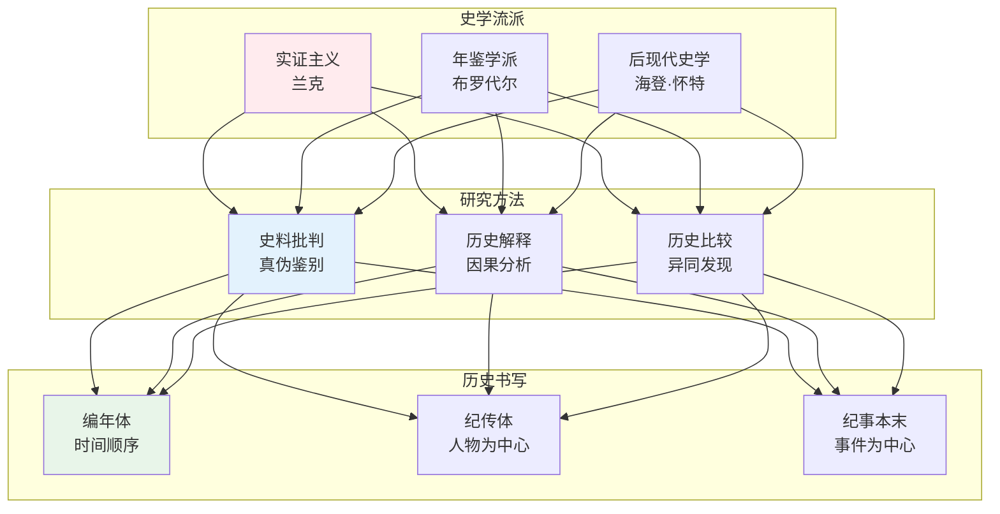
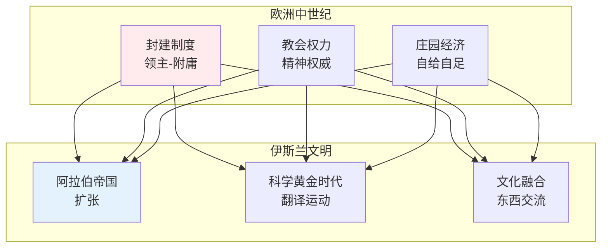
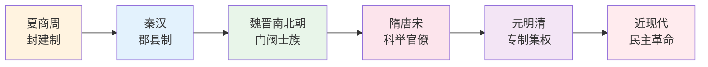
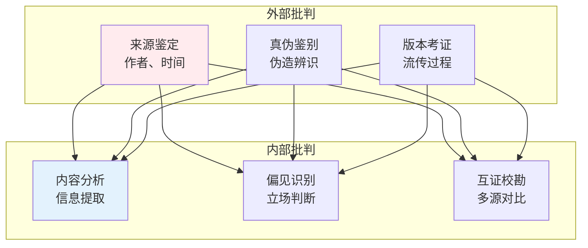

# 历史学知识体系

> **核心观点**：历史学是研究人类社会过去事件、人物和现象的学科，帮助我们理解现在、预见未来。

---

## 📊 史学理论框架



---

## 🔬 史学流派

### 实证主义史学

**核心观点**：历史学应像自然科学一样客观，追求"如实直书"。

| 特征 | 内涵 | 方法 |
|------|------|------|
| 客观性 | 还原历史真相 | 史料批判 |
| 实证性 | 有史料支撑 | 文献考证 |
| 描述性 | 再现历史过程 | 编年叙述 |

### 年鉴学派

**核心观点**：历史是长时段、中时段、短时段的综合。

| 时段 | 特征 | 例子 |
|------|------|------|
| 长时段 | 地理环境、心态结构 | 气候变化 |
| 中时段 | 社会经济、制度变迁 | 人口增长 |
| 短时段 | 政治事件、个人行动 | 战争革命 |

### 后现代史学

**核心观点**：历史是叙事建构，不存在客观历史。

```
后现代史学的核心主张：
1. 历史是文本建构
2. 叙事决定意义
3. 历史与文学的界限模糊
4. 多元声音的合法性
```

---

## 📜 世界历史分期

### 古代文明

| 文明 | 时间 | 特征 | 成就 |
|------|------|------|------|
| 两河流域 | 公元前3500年 | 城市文明 | 楔形文字 |
| 古埃及 | 公元前3100年 | 法老统治 | 金字塔 |
| 古印度 | 公元前2500年 | 种姓制度 | 佛教 |
| 古中国 | 公元前2000年 | 王朝更替 | 儒家思想 |

### 中世纪



### 近现代

| 时期 | 特征 | 关键事件 |
|------|------|----------|
| 文艺复兴 | 人文主义兴起 | 但丁、达芬奇 |
| 启蒙运动 | 理性主义 | 伏尔泰、卢梭 |
| 工业革命 | 机械化生产 | 蒸汽机 |
| 两次世界大战 | 全球冲突 | 国际秩序重建 |

---

## 🏛️ 中国历史

### 王朝演变



### 历史转型

| 转型 | 特征 | 影响 |
|------|------|------|
| 周秦之变 | 封建→郡县 | 官僚国家形成 |
| 唐宋变革 | 贵族→科举 | 社会流动增强 |
| 明清转型 | 开放→封闭 | 近代落后根源 |
| 晚清变局 | 传统→现代 | 被迫现代化 |

---

## 📚 历史研究方法

### 史料批判



### 历史解释模式

| 模式 | 核心思想 | 例子 |
|------|----------|------|
| 因果解释 | 寻找原因 | 革命的起因 |
| 功能解释 | 分析作用 | 制度的功能 |
| 结构解释 | 结构决定 | 经济基础决定 |
| 意义解释 | 理解动机 | 行动者意图 |

---

## 🎯 核心结论

### 历史学的基本发现

1. **历史是建构的**：历史书写受立场影响
2. **历史有规律**：长时段趋势可识别
3. **历史是复杂的**：多因素相互作用
4. **历史是连续的**：现在是过去的延续
5. **历史是多元的**：不同视角不同叙事

### 历史思维能力

```
历史思维三要素：
1. 时空定位：将事件置于背景
2. 证据意识：用史料说话
3. 批判精神：质疑既定叙事
```

---

## 📚 参考文献

1. 兰克《拉丁民族史》
2. 布罗代尔《地中海与菲利普二世时代的地中海世界》
3. 海登·怀特《元历史》
4. 钱穆《国史大纲》
5. 黄仁宇《万历十五年》
6. 费正清《剑桥中国史》
7. 许倬云《万古江河》
8. 王笛《茶馆》