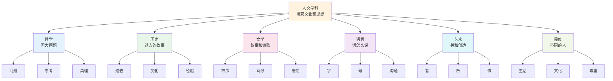
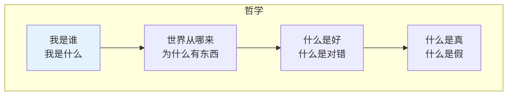
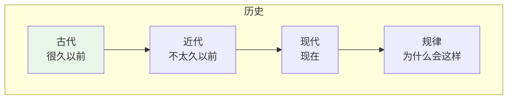
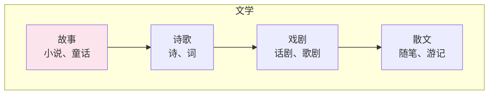
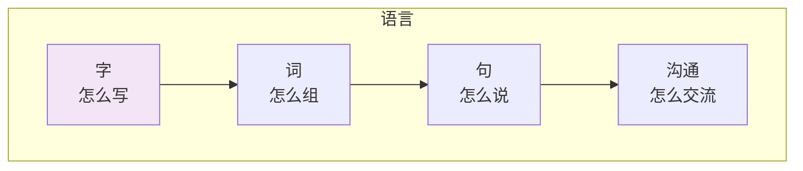
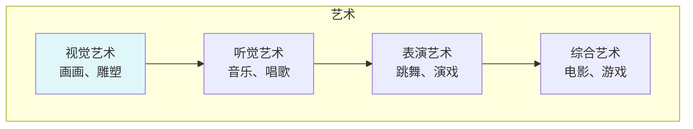
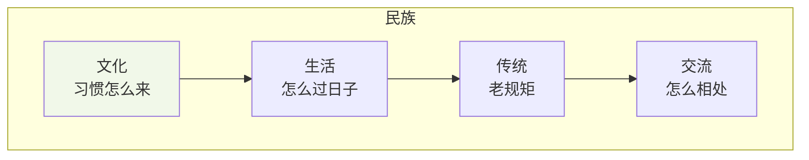
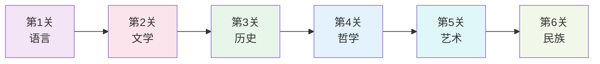

# 人文学科

## 🗂️ 内容导航

| 名称 | 说明 | 链接 |
|------|------|------|
| 艺术知识体系 | 理解艺术的本质、流派与创作 | [进入](art/index.md) |
| 民族学知识体系 | 理解文化多样性与人类社会发展 | [进入](ethnology/index.md) |
| 历史学知识体系 | 理解历史发展规律与史学研究方法 | [进入](history/index.md) |
| 人际沟通 | 掌握沟通核心技能，解决人际问题 | [进入](interpersonal-communication/index.md) |
| 语言学知识体系 | 理解语言的结构、功能与发展 | [进入](linguistics/index.md) |
| 文学知识体系 | 理解文学的本质、理论与创作 | [进入](literature/index.md) |
| 哲学知识体系 | 对最基本问题的反思与追问 | [进入](philosophy/index.md) |

---

> **费曼学习法**：人文学科就是研究"人怎么创造文化"的学问！

---

## 🎯 一句话理解人文学科

**人文学科就是研究人创造的文化和思想！**

为什么要有故事？为什么要有历史？为什么要有哲学？人文学科就是回答这些问题的！

---

## 🏗️ 人文学科的"积木塔"

---

## 📚 每个积木块详解

### 🤔 哲学（问大问题）

**用小学生的话说**：哲学就是问"为什么"的学问！

| 积木块 | 小学生版解释 | 生活中的例子 |
|--------|--------------|--------------|
| 我是谁 | 我是什么 | 我是谁？我从哪来？ |
| 世界从哪来 | 为什么有东西 | 天地是怎么形成的？ |
| 什么是好 | 什么是对错 | 打人对不对？ |
| 什么是真 | 什么是假 | 这是真的还是假的？ |

---

### 📜 历史（过去的故事）

**用小学生的话说**：历史就是研究"以前发生了什么"的学问！

| 积木块 | 小学生版解释 | 生活中的例子 |
|--------|--------------|--------------|
| 古代 | 很久以前 | 秦始皇、唐朝 |
| 近代 | 不太久以前 | 战争、革命 |
| 现在 | 现在 | 今天发生的事 |
| 规律 | 为什么会这样 | 历史为什么会重演 |

---

### 📖 文学（故事和诗歌）

**用小学生的话说**：文学就是用"文字"讲故事的学问！

| 积木块 | 小学生版解释 | 生活中的例子 |
|--------|--------------|--------------|
| 故事 | 小说、童话 | 《西游记》、《白雪公主》 |
| 诗歌 | 诗、词 | 《静夜思》、《春晓》 |
| 戏剧 | 话剧、歌剧 | 《哈姆雷特》 |
| 散文 | 随笔、游记 | 《背影》 |

---

### 💬 语言（话怎么说）

**用小学生的话说**：语言就是研究"字怎么写、话怎么说"的学问！

| 积木块 | 小学生版解释 | 生活中的例子 |
|--------|--------------|--------------|
| 字 | 怎么写 | 汉字、拼音 |
| 词 | 怎么组 | 词语、成语 |
| 句 | 怎么说 | 句子、语法 |
| 沟通 | 怎么交流 | 说话、写信 |

---

### 🎨 艺术（美和创造）

**用小学生的话说**：艺术就是"创造美"的学问！

| 积木块 | 小学生版解释 | 生活中的例子 |
|--------|--------------|--------------|
| 视觉艺术 | 画画、雕塑 | 画画、手工 |
| 听觉艺术 | 音乐、唱歌 | 唱歌、听音乐 |
| 表演艺术 | 跳舞、演戏 | 跳舞、话剧 |
| 综合艺术 | 电影、游戏 | 看电影、玩游戏 |

---

### 🌍 民族（不同的人）

**用小学生的话说**：民族就是研究"不同地方的人怎么生活"的学问！

| 积木块 | 小学生版解释 | 生活中的例子 |
|--------|--------------|--------------|
| 文化 | 习惯怎么来 | 过年吃饺子 |
| 生活 | 怎么过日子 | 住哪里、吃什么 |
| 传统 | 老规矩 | 端午节吃粽子 |
| 交流 | 怎么相处 | 不同民族交朋友 |

---

## 🎮 人文学科闯关游戏

**闯关秘籍**：
1. **第1关**：学语言（学会沟通）
2. **第2关**：学文学（学会讲故事）
3. **第3关**：学历史（了解过去）
4. **第4关**：学哲学（学会思考）
5. **第5关**：学艺术（发现美）
6. **第6关**：学民族（尊重差异）

---

## 💡 给小学生的话

> 文化就像空气，无处不在！
> 
> 多读书、多看、多听、多想！
> 
> 人文学科让你更有"文化"！

---

**每个人文学家都曾经是初学者！**