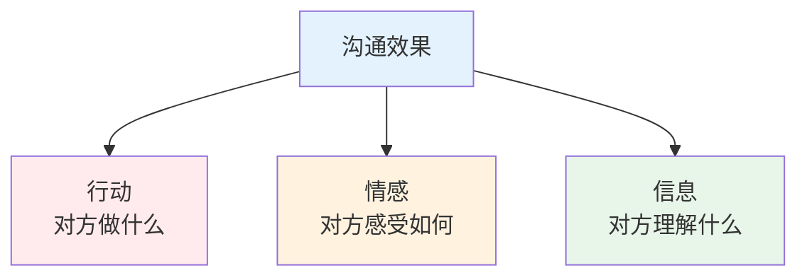
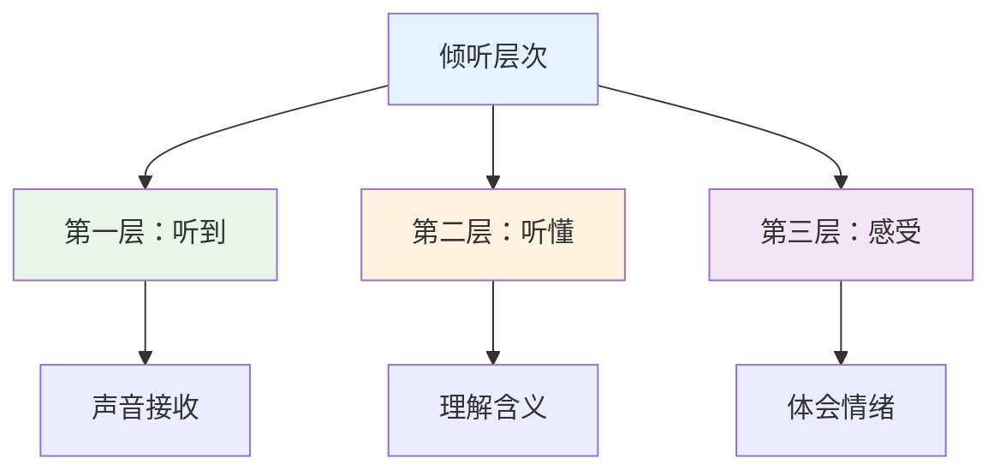
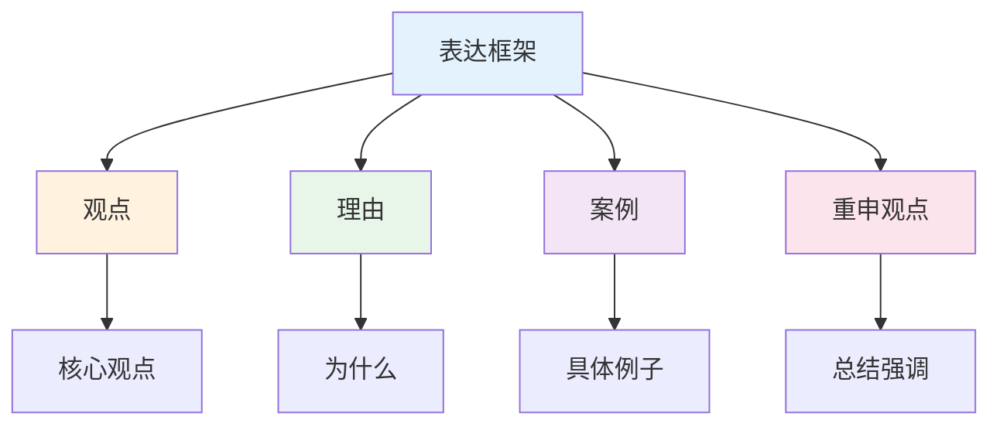
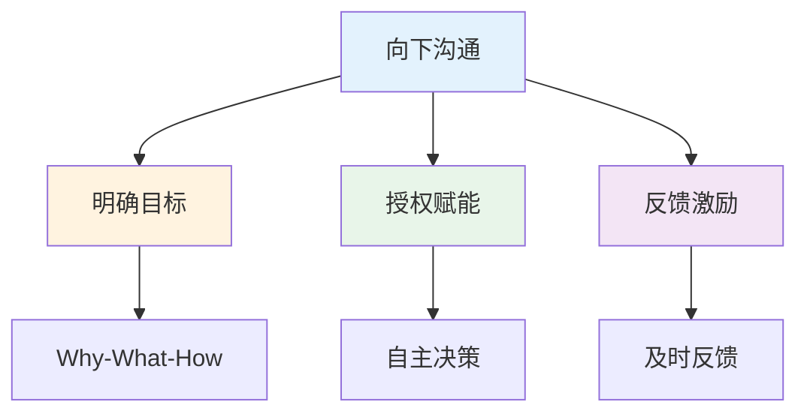
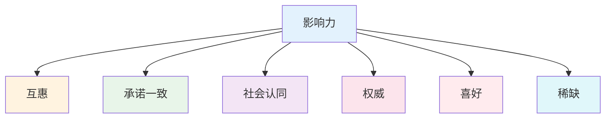

# 高效沟通实战 — 让沟通事半功倍

> 80%的问题是沟通问题，20%的技巧解决80%的困扰

---

## 一、沟通效果公式

```
沟通效果 = 信息清晰度 × 情感共鸣度 × 行动导向性
```

### 沟通金字塔



---

## 二、倾听技巧

### 2.1 倾听三层次



### 2.2 倾听技巧

| 技巧 | 说明 | 示例 |
|------|------|------|
| 专注 | 放下手机，眼神接触 | "我在听" |
| 回应 | 点头、简短回应 | "嗯""然后呢" |
| 复述 | 确认理解 | "你是说..." |
| 提问 | 深入了解 | "能具体说说吗" |
| 共情 | 理解感受 | "我理解你的感受" |

---

## 三、表达技巧

### 3.1 表达框架



### 3.2 表达模板

**汇报工作：**
```
【结论】一句话说清楚
【过程】关键节点+数据
【问题】遇到的困难
【方案】解决方案
【请求】需要的支持
```

**提出建议：**
```
【现象】我观察到...
【分析】我认为原因是...
【建议】我建议...
【预期】这样做的好处是...
```

---

## 四、向上沟通

### 4.1 领导沟通要点

| 场景 | 错误做法 | 正确做法 |
|------|----------|----------|
| 汇报进展 | 流水账 | 三点核心+数据 |
| 争取资源 | 强调困难 | 强调ROI |
| 项目延期 | 推卸责任 | 主动预警+方案 |
| 提出建议 | 直接说想法 | 分析利弊+建议 |

### 4.2 汇报模板

```
【事项】一句话说清楚
【进展】目前状态+关键数据
【问题】遇到的障碍+已尝试的方案
【请求】需要的支持+预期收益
【时间】需要回复的deadline
```

---

## 五、向下沟通

### 5.1 团队沟通框架



### 5.2 反馈技巧

| 类型 | 错误做法 | 正确做法 |
|------|----------|----------|
| 表扬 | "做得好" | 具体行为+影响 |
| 批评 | "你怎么回事" | 事实+影响+期望 |
| 建议 | "你应该..." | "我建议...因为..." |

---

## 六、影响力

### 6.1 影响力六原则



### 6.2 说服框架

```
建立信任 → 理解需求 → 提供价值 → 促成行动
```

---

## 七、行动清单

### 提升倾听

- [ ] 专注听对方说完
- [ ] 放下手机
- [ ] 眼神接触
- [ ] 适当回应
- [ ] 复述确认

### 提升表达

- [ ] 结论先行
- [ ] 逻辑清晰
- [ ] 举例说明
- [ ] 控制时间
- [ ] 确认理解

### 提升影响力

- [ ] 先付出
- [ ] 建立信任
- [ ] 理解需求
- [ ] 提供价值
- [ ] 促成行动

---

> **记住：沟通不是说话，而是让对方听懂并行动。**
