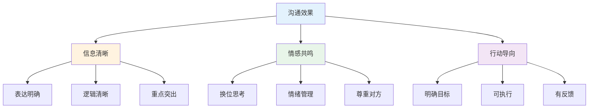
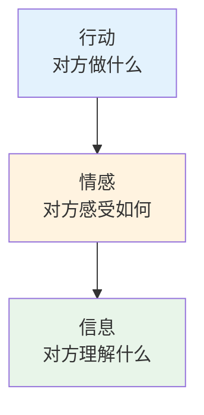
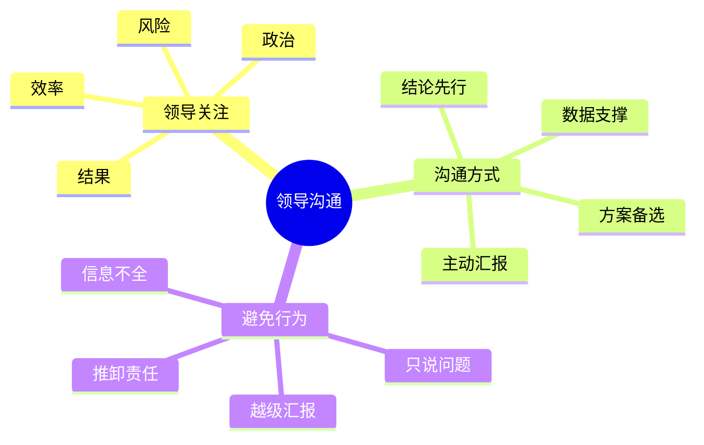
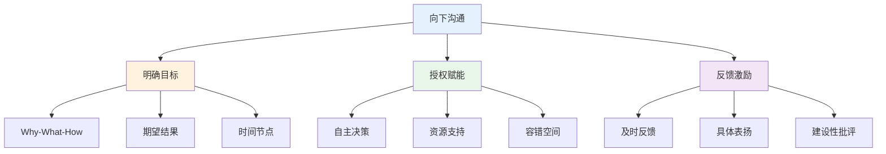
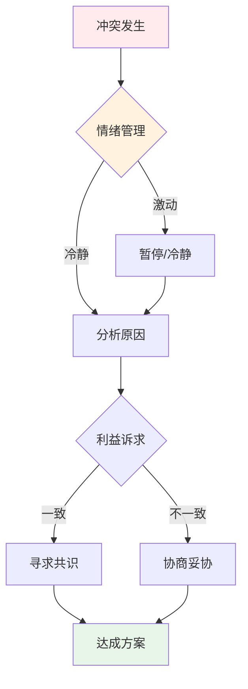
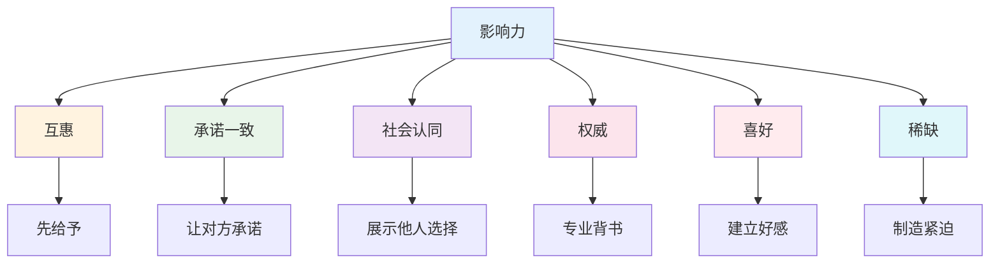
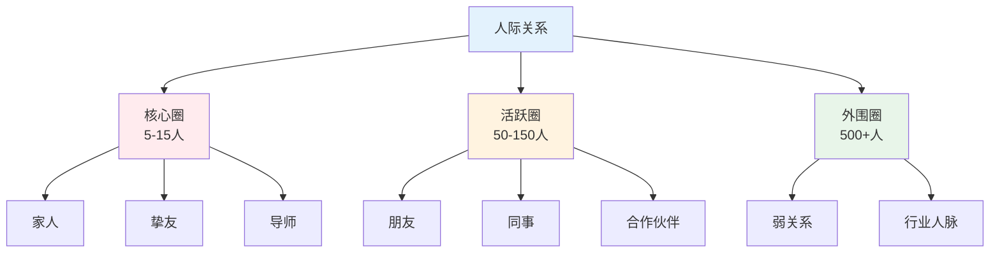
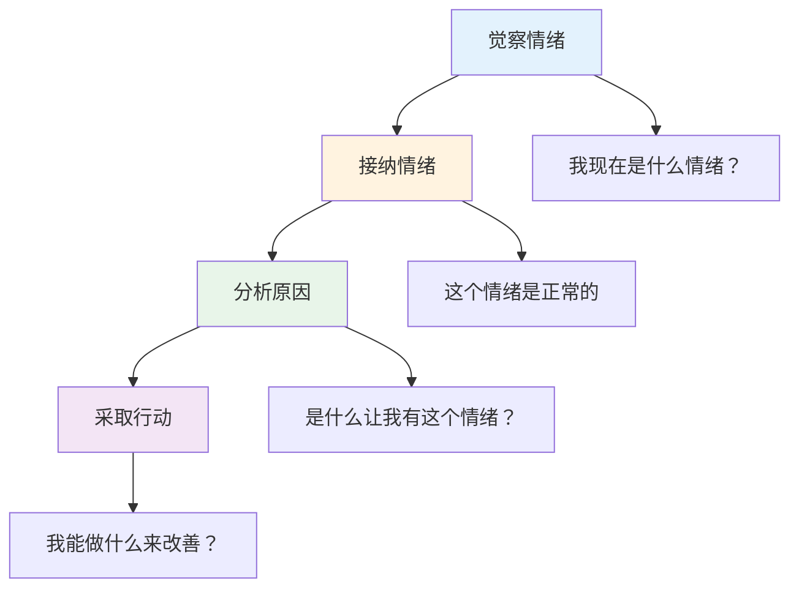

# 人际关系与沟通 — 高情商的底层逻辑

> 80%的问题是沟通问题，20%的沟通技巧解决80%的人际困扰
> 目标：掌握高效沟通和人际关系的核心规律

---

## 一、沟通核心规律

### 1.1 沟通效果公式

**沟通效果 = 信息清晰度 × 情感共鸣度 × 行动导向性**

### 1.2 沟通效果金字塔

**外行做法：** 只关注信息传递
**内行做法：** 同时关注信息、情感、行动

---

## 二、向上沟通

### 2.1 领导沟通要点

### 2.2 向上沟通模板

| 场景 | 外行做法 | 内行做法 |
|------|----------|----------|
| 汇报进展 | 流水账 | 三点核心+数据 |
| 争取资源 | 强调困难 | 强调ROI |
| 项目延期 | 推卸责任 | 主动预警+方案 |
| 提出建议 | 直接说想法 | 分析利弊+建议 |
| 请求支持 | 等领导问 | 主动沟通 |

---

## 三、向下沟通

### 3.1 团队沟通框架

### 3.2 反馈技巧

| 类型 | 外行做法 | 内行做法 |
|------|----------|----------|
| 表扬 | "做得好" | 具体行为+影响 |
| 批评 | "你怎么回事" | 事实+影响+期望 |
| 建议 | "你应该..." | "我建议...因为..." |
| 认可 | 不说 | 及时、公开、具体 |

---

## 四、冲突处理

### 4.1 冲突处理模型

### 4.2 冲突处理策略

| 策略 | 适用场景 | 具体做法 |
|------|----------|----------|
| 回避 | 不重要的事 | 暂时搁置 |
| 迁就 | 关系重要时 | 主动让步 |
| 竞争 | 紧急重要时 | 坚持立场 |
| 妥协 | 双方对等时 | 各退一步 |
| 合作 | 双赢可能时 | 共同解决 |

---

## 五、说服技巧

### 5.1 影响力六原则

### 5.2 说服框架

**外行说服：** 直接讲道理
**内行说服：** 建立信任→理解需求→提供价值→促成行动

| 阶段 | 外行做法 | 内行做法 |
|------|----------|----------|
| 开场 | 直入主题 | 建立连接 |
| 陈述 | 只说自己 | 先理解对方 |
| 论证 | 讲大道理 | 讲故事+数据 |
| 收尾 | 等对方决定 | 明确下一步 |

---

## 六、社交技巧

### 6.1 人际关系分层

### 6.2 社交能力提升

| 维度 | 外行做法 | 内行做法 |
|------|----------|----------|
| 主动性 | 等别人联系 | 主动链接 |
| 价值感 | 只索取 | 先付出 |
| 持续性 | 用完就忘 | 长期维护 |
| 真诚度 | 功利社交 | 真诚交友 |

---

## 七、情绪管理

### 7.1 情绪管理四步法

### 7.2 常见情绪陷阱

| 陷阱 | 外行表现 | 内行应对 |
|------|----------|----------|
| 愤怒 | 冲动反应 | 暂停10秒 |
| 焦虑 | 过度担忧 | 专注当下 |
| 沮丧 | 放弃尝试 | 调整预期 |
| 嫉妒 | 诋毁他人 | 转化动力 |
| 愧疚 | 过度自责 | 接纳不完美 |

---

## 八、落地清单

### 沟通能力提升

- [ ] 练习：每天复盘一次沟通
- [ ] 倾听：专注听对方说完
- [ ] 提问：多问少说
- [ ] 反馈：及时给予具体反馈
- [ ] 记录：重要沟通做记录

### 人际关系维护

- [ ] 分层：区分核心/活跃/外围圈
- [ ] 主动：定期联系重要的人
- [ ] 价值：思考能提供什么帮助
- [ ] 真诚：建立真实连接
- [ ] 边界：保持适当距离

---

## 九、推荐阅读

- 《非暴力沟通》— 沟通入门
- 《关键对话》— 高难度沟通
- 《影响力》— 说服技巧
- 《人性的弱点》— 人际关系
- 《情绪智力》— 情商管理
