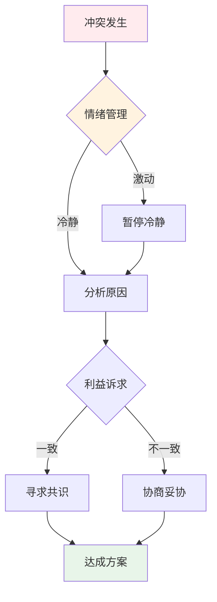
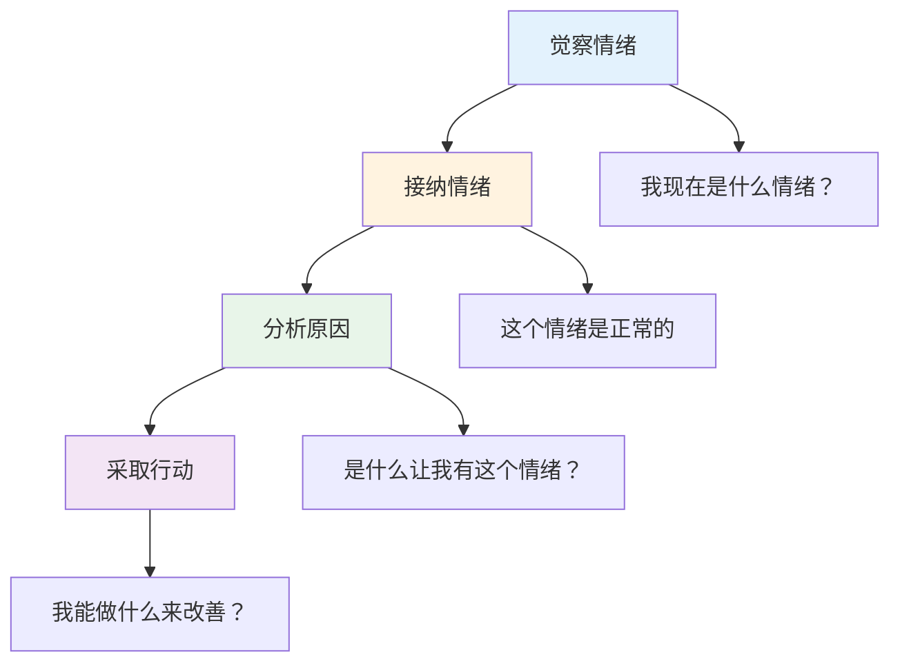
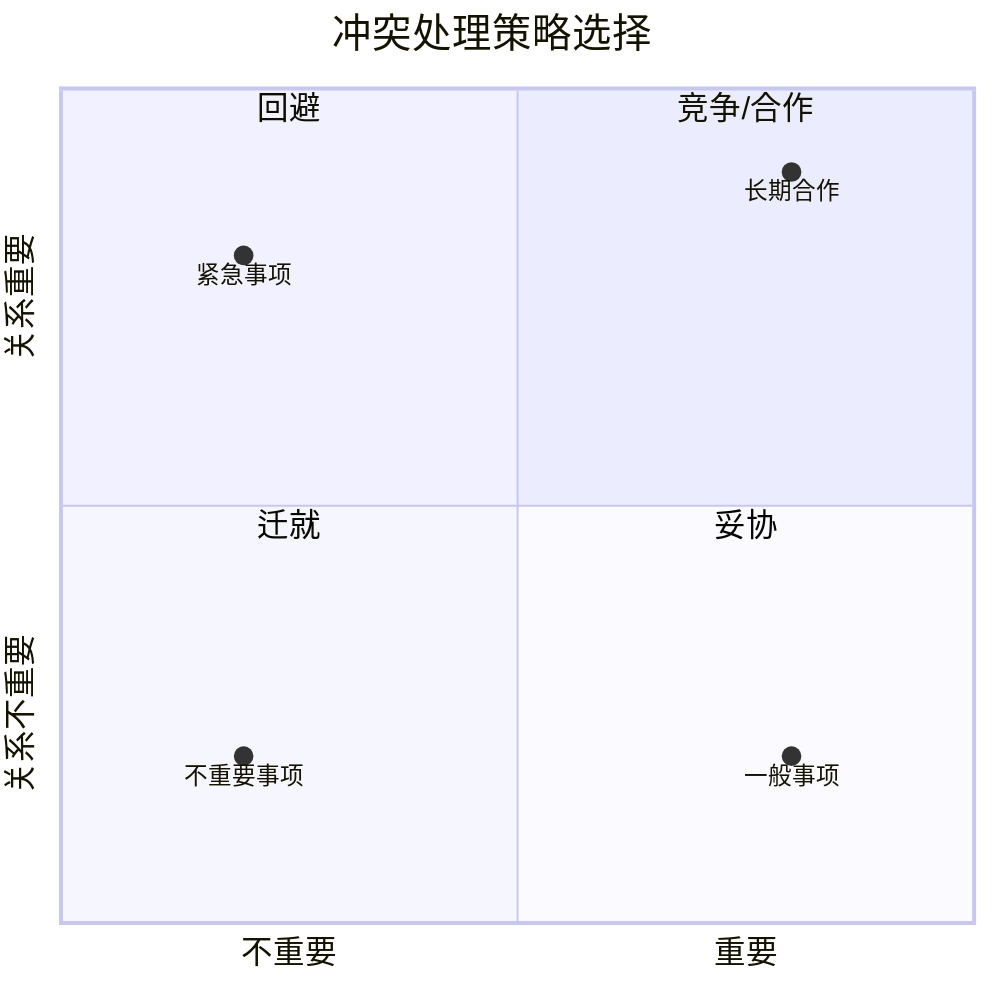
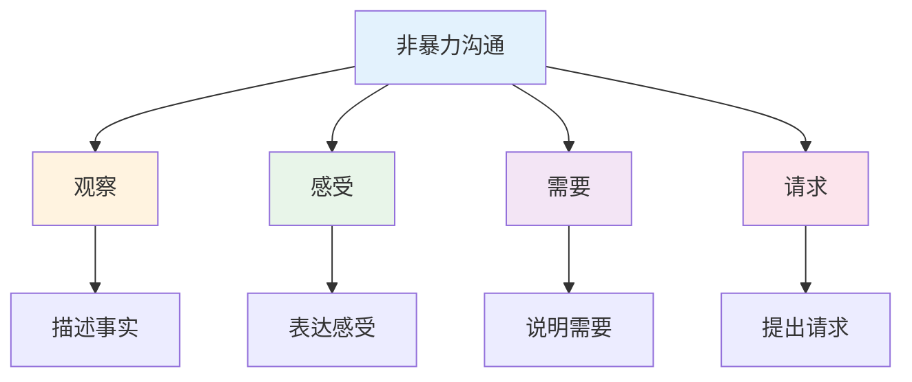

# 冲突处理实战 — 化解矛盾的方法

> 冲突不可怕，可怕的是不会处理冲突

---

## 一、冲突处理模型

### 1.1 冲突处理流程



### 1.2 情绪管理四步法



---

## 二、冲突处理策略

### 2.1 五种策略

| 策略 | 适用场景 | 具体做法 |
|------|----------|----------|
| 回避 | 不重要的事 | 暂时搁置 |
| 迁就 | 关系重要时 | 主动让步 |
| 竞争 | 紧急重要时 | 坚持立场 |
| 妥协 | 双方对等时 | 各退一步 |
| 合作 | 双赢可能时 | 共同解决 |

### 2.2 策略选择矩阵



---

## 三、冲突沟通技巧

### 3.1 非暴力沟通



### 3.2 话术模板

**表达不满：**
```
【观察】当我看到/听到...
【感受】我感到...
【需要】因为我需要...
【请求】你是否愿意...
```

**处理对方不满：**
```
【倾听】我理解你的感受
【确认】你是说...
【解释】我的想法是...
【协商】我们能否...
```

---

## 四、案例复盘

### 4.1 成功案例：项目冲突化解

**背景：** 两个部门争夺项目资源

**处理方法：**
1. 先分开沟通，了解各自诉求
2. 找到共同目标
3. 寻找双赢方案
4. 达成共识

**结果：** 资源共享，双方都满意

**启示：**
1. 先处理情绪，再处理问题
2. 找到共同目标
3. 寻找双赢方案

### 4.2 失败案例：冲突升级

**背景：** 工作分歧演变成人身攻击

**错误做法：**
1. 情绪化
2. 人身攻击
3. 公开争吵
4. 不肯让步

**结果：** 关系破裂，两败俱伤

**教训：**
1. 控制情绪
2. 对事不对人
3. 私下沟通
4. 适时让步

---

## 五、行动清单

### 冲突前预防

- [ ] 建立信任关系
- [ ] 明确共同目标
- [ ] 提前沟通预期
- [ ] 建立沟通机制

### 冲突中处理

- [ ] 控制情绪
- [ ] 倾听对方
- [ ] 表达自己
- [ ] 寻找共识

### 冲突后修复

- [ ] 总结经验
- [ ] 修复关系
- [ ] 建立预案
- [ ] 持续跟进

---

> **记住：冲突是常态，处理冲突是能力。**
