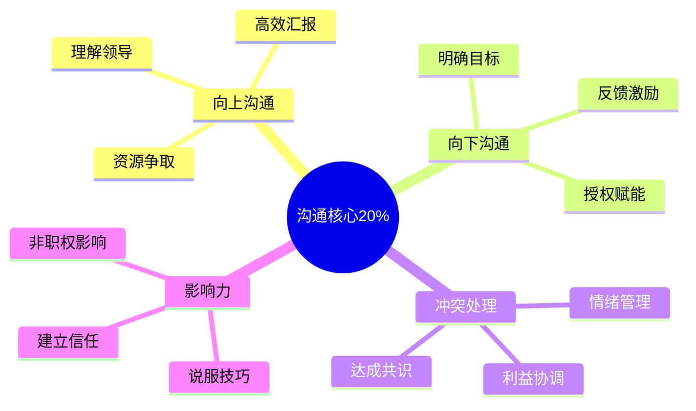

# 人际沟通 — 深入实战指南

> 掌握沟通核心的20%知识，解决80%的人际问题

---

## 核心知识地图

---

## 子目录导航

| 主题 | 文件 | 核心问题 |
|------|------|----------|
| 高效沟通 | [01-高效沟通实战.md](01-高效沟通实战.md) | 如何有效沟通？ |
| 冲突处理 | [02-冲突处理实战.md](02-冲突处理实战.md) | 如何处理冲突？ |

---

## 一句话总结

> **沟通的本质是交换信息和情感，达成共识和行动。**
